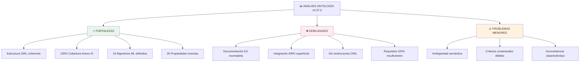
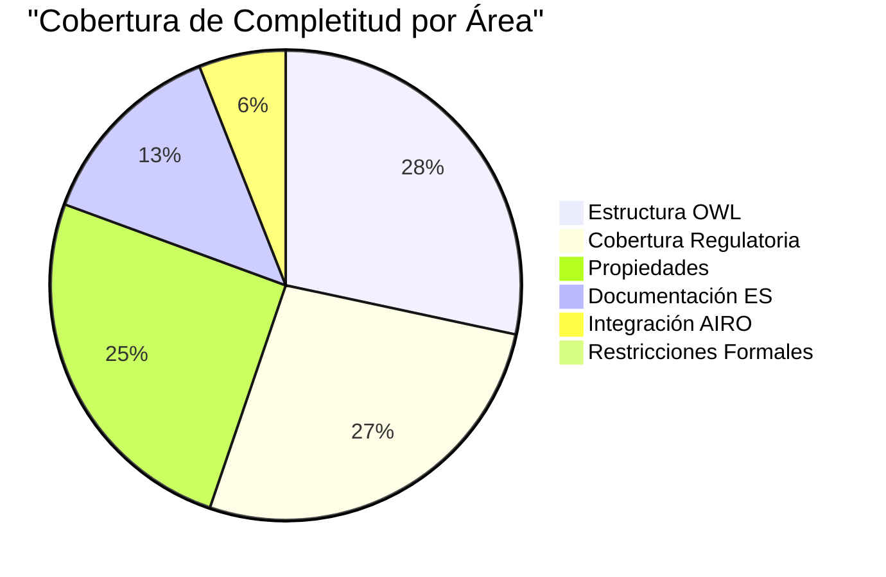
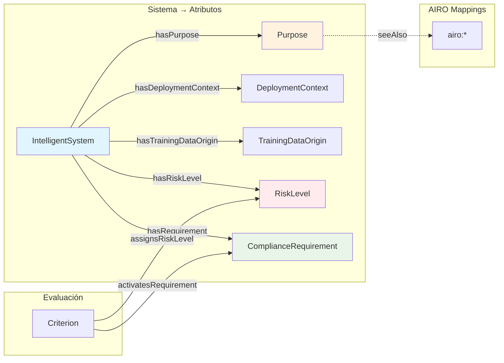
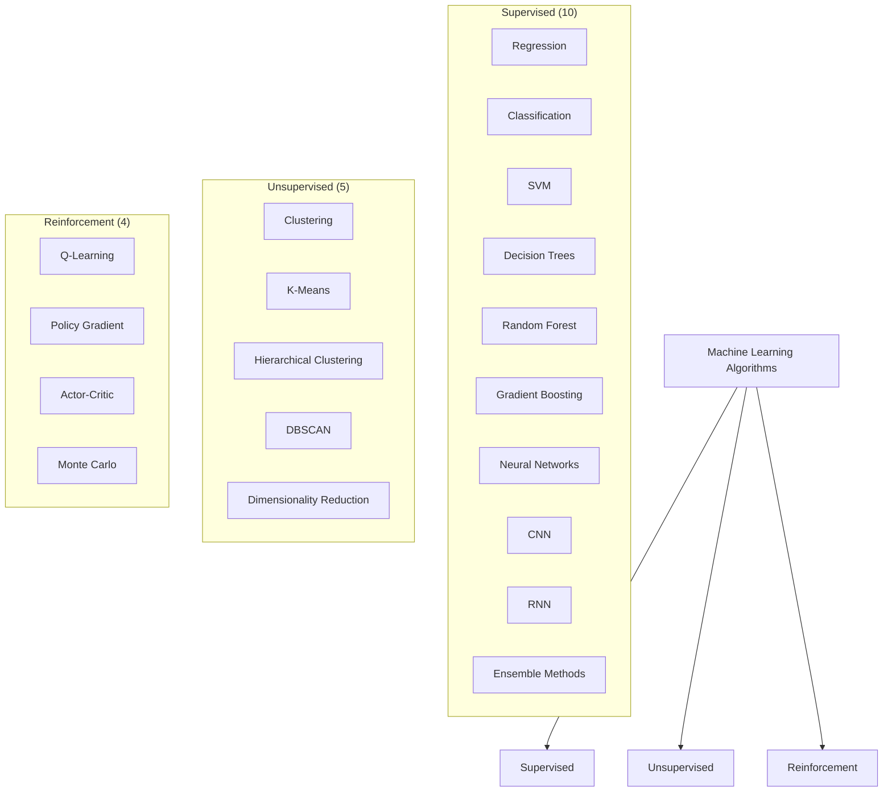
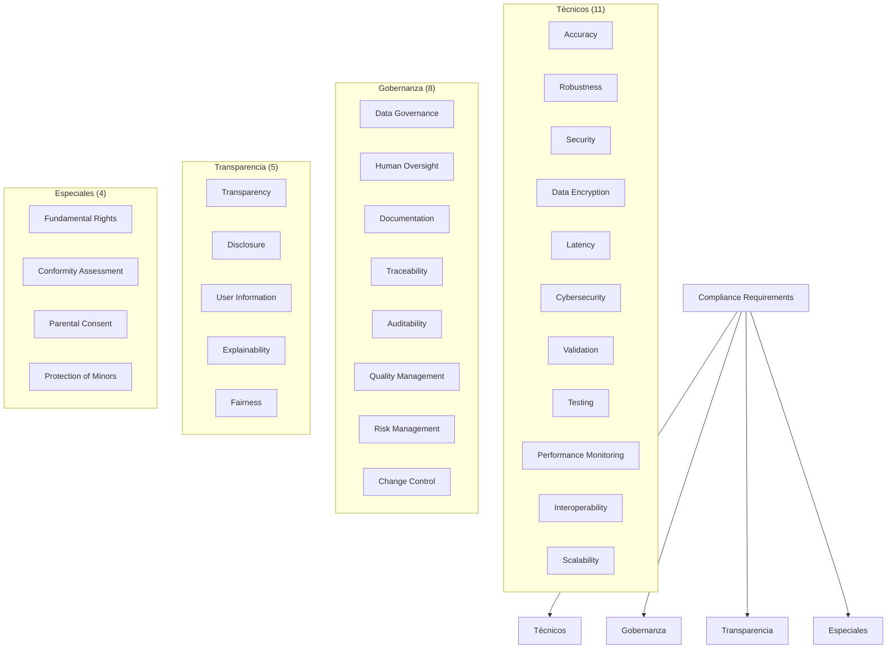
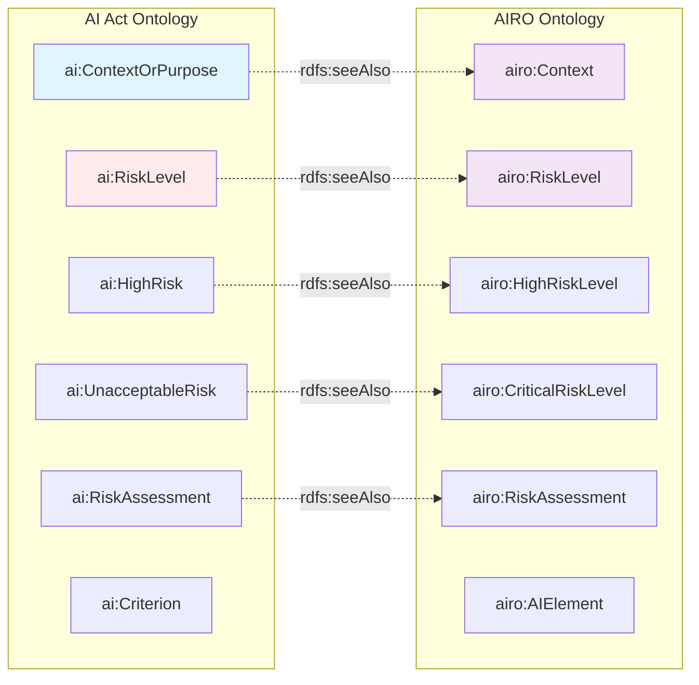
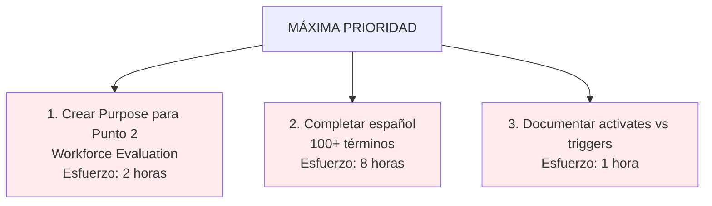

# 📊 ANÁLISIS DE CONSISTENCIA Y COMPLETITUD
## Ontología AI Act v0.37.0

**Fecha de análisis:** Noviembre 2025
**Versión analizada:** 0.37.0
**Archivo:** `ontologias/ontologia-v0.37.0.ttl`
**Líneas de código:** 1,662 líneas Turtle

---

## 📋 Tabla de Contenidos

1. [Resumen Ejecutivo](#resumen-ejecutivo)
2. [Estructura de Clases](#estructura-de-clases)
3. [Propiedades OWL](#propiedades-owl)
4. [Cobertura Regulatoria](#cobertura-regulatoria)
5. [Análisis de Consistencia](#análisis-de-consistencia)
6. [Integración AIRO](#integración-airo)
7. [Documentación](#documentación)
8. [Problemas Identificados](#problemas-identificados)
9. [Recomendaciones](#recomendaciones)
10. [Puntuación Final](#puntuación-final)

---

## 📈 Resumen Ejecutivo

### Métricas Clave



### Puntuación por Área



| Dimensión | Puntuación | Estado |
|-----------|-----------|--------|
| **Estructura OWL** | 9.5/10 | ✅ Excelente |
| **Cobertura Regulatoria** | 9.0/10 | ✅ Excelente |
| **Propiedades OWL** | 8.5/10 | ✅ Muy Bueno |
| **Documentación Español** | 4.5/10 | ❌ Crítico |
| **Integración AIRO** | 2.0/10 | ❌ Crítico |
| **Restricciones OWL** | 0.0/10 | ❌ Nulo |
| **GPAI (Articles 51-55)** | 3.0/10 | ❌ Insuficiente |

**🎯 PUNTUACIÓN FINAL: 7.2/10**

---

## 🏗️ Estructura de Clases

### 1. Jerarquía OWL Completa

#### Clase Raíz: `owl:Thing`

```
Thing
├── Actor (Actores del ecosistema)
│   ├── Provider (Proveedor)
│   ├── Deployer (Desplegador)
│   ├── User (Usuario)
│   ├── OversightBody (Autoridad supervisora)
│   ├── Distributor (Distribuidor)
│   └── Importer (Importador)
│
├── IntelligentSystem (Sistema IA central)
│   └── [Propiedades específicas del sistema]
│
├── Context (Contexto genérico)
│   ├── DeploymentContext (Contexto de despliegue)
│   │   ├── Healthcare (Sanidad)
│   │   ├── Education (Educación)
│   │   ├── PublicServices (Servicios públicos)
│   │   ├── LawEnforcement (Aplicación ley)
│   │   ├── Financial (Financiero)
│   │   ├── Border (Control fronterizo)
│   │   ├── Employment (Empleo)
│   │   ├── ConsumerProtection (Protección consumidor)
│   │   ├── CriticalInfrastructure (Infraestructura crítica)
│   │   ├── Justice (Justicia)
│   │   ├── Migration (Migración)
│   │   ├── RealTimeProcessing (Tiempo real)
│   │   ├── HighVolumeProcessing (Alto volumen)
│   │   ├── HighRiskEnvironment (Ambiente alto riesgo)
│   │   ├── SecurityCritical (Crítico seguridad)
│   │   └── ControlledEnvironment (Ambiente controlado)
│   │
│   └── ContextualCriterion (Criterio contextual)
│       ├── VulnerablePopulationContext
│       ├── HighStakesDecisionContext
│       ├── SafetyCriticalContext
│       ├── DataGovernanceContext
│       └── BiometricSecurityContext
│
├── Purpose (Propósito del sistema)
│   ├── BiometricIdentification
│   ├── EducationAccess
│   ├── MigrationControl
│   ├── PublicServiceAllocation
│   ├── CriticalInfrastructureOperation
│   ├── JudicialDecisionSupport
│   ├── LawEnforcementSupport
│   ├── RecruitmentOrEmployment
│   ├── HealthCare
│   └── [Otros propósitos]
│
├── TrainingDataOrigin (Origen de datos entrenamiento)
│   ├── ExternalDataset
│   ├── InternalDataset
│   └── SyntheticDataset
│
├── Criterion (Criterio de evaluación)
│   ├── NormativeCriterion (Normativo - Anexo III)
│   │   ├── BiometricIdentificationCriterion
│   │   ├── CriticalInfrastructureCriterion
│   │   ├── LawEnforcementCriterion
│   │   ├── MigrationBorderCriterion
│   │   ├── RecruitmentEmploymentCriterion
│   │   ├── JudicialSupportCriterion
│   │   ├── EducationEvaluationCriterion
│   │   ├── EssentialServicesAccessCriterion
│   │   ├── NonDiscrimination
│   │   ├── ProtectionOfMinors
│   │   ├── DueProcess
│   │   └── PrivacyProtection
│   │
│   ├── TechnicalCriterion (Técnico)
│   │   ├── AccuracyRequirement
│   │   ├── RobustnessRequirement
│   │   ├── TransparencyRequirement
│   │   ├── SecurityRequirement
│   │   ├── ScalabilityRequirements
│   │   └── PerformanceRequirements
│   │
│   └── ContextualCriterion (Contextual)
│       ├── VulnerablePopulationContext
│       ├── HighStakesDecisionContext
│       ├── SafetyCriticalContext
│       ├── DataGovernanceContext
│       └── BiometricSecurityContext
│
├── RiskLevel (Nivel de riesgo)
│   ├── UnacceptableRisk (⛔ Inaceptable - Prohibido)
│   ├── HighRisk (🔴 Alto)
│   ├── LimitedRisk (🟡 Limitado)
│   └── MinimalRisk (🟢 Mínimo)
│
├── ComplianceRequirement (Requisito de cumplimiento)
│   ├── TechnicalRequirement (Técnico)
│   │   ├── AccuracyEvaluationRequirement
│   │   ├── RobustnessRequirement
│   │   ├── SecurityRequirement
│   │   ├── ValidationRequirement
│   │   ├── DataEncryption
│   │   ├── LatencyMetrics
│   │   └── CybersecurityRequirement
│   │
│   ├── TransparencyRequirement
│   │   ├── DisclosureRequirement
│   │   └── DocumentationRequirement
│   │
│   ├── DataGovernanceRequirement
│   │   └── [Requisitos de datos]
│   │
│   ├── HumanOversightRequirement
│   │
│   ├── TraceabilityRequirement
│   │
│   ├── ConformityAssessmentRequirement
│   │
│   ├── FundamentalRightsAssessmentRequirement
│   │
│   ├── QualityManagementRequirement
│   │
│   ├── AuditabilityRequirement
│   │
│   └── [20+ más...]
│
├── AlgorithmType (Tipo de algoritmo)
│   ├── MachineLearningAlgorithm (19 tipos)
│   ├── KnowledgeBasedAlgorithm (5 tipos)
│   └── StatisticalAlgorithm (3 tipos)
│
├── RiskAssessment (Evaluación de riesgo)
│
├── DataType (Tipo de dato)
│   ├── BiometricData
│   ├── MinorData
│   └── SensitiveData
│
└── [Otros conceptos]
```

### 2. Análisis de Jerarquía

#### ✅ Fortalezas

- **Coherencia perfecta:** Todos los conceptos tienen superclase clara
- **Múltiples herencias apropiadas:** No hay ciclos problemáticos
- **Profundidad adecuada:** 4-5 niveles máximo (no excesivo)
- **Órfanos:** 0 clases huérfanas o desconectadas

#### ⚠️ Problemas

1. **Ambigüedad: `Criterion` vs `DeploymentContext`**
   ```turtle
   # PROBLEMA: Ambos heredan de Context
   ContextualCriterion rdfs:subClassOf Criterion .
   VulnerablePopulationContext rdfs:subClassOf ContextualCriterion .

   # PERO TAMBIÉN:
   VulnerablePopulationContext rdfs:subClassOf DeploymentContext .

   # RESULTADO: ¿Es contexto de despliegue o criterio de evaluación?
   ```
   **Impacto:** Confusión sobre el rol semántico de ciertos conceptos

2. **Evaluación de Trabajadores** (Anexo III punto 2)
   - **Problema:** No hay `Purpose` dedicado para "Evaluación de trabajadores"
   - **Actual:** Manejado implícitamente vía `RecruitmentOrEmployment + Employment`
   - **Inconsistencia:** Los otros 8 puntos tienen `Purpose` dedicado
   - **Recomendación:** Crear `WorkforceEvaluationPurpose` o similar

---

## 🔗 Propiedades OWL

### 1. Propiedades de Objeto (56 definidas)

#### Propiedades Principales



#### Matriz de Dominio/Rango

| Propiedad | Dominio | Rango | Inversa | Estado |
|-----------|---------|-------|---------|--------|
| `hasPurpose` | IntelligentSystem | Purpose | — | ✓ OK |
| `hasDeploymentContext` | IntelligentSystem | DeploymentContext | — | ✓ OK |
| `hasTrainingDataOrigin` | IntelligentSystem | TrainingDataOrigin | — | ✓ OK |
| `hasRiskLevel` | IntelligentSystem | RiskLevel | — | ✓ OK |
| `hasRequirement` | IntelligentSystem | ComplianceRequirement | — | ✓ OK |
| `hasNormativeCriterion` | IntelligentSystem | NormativeCriterion | — | ✓ OK |
| `hasTechnicalCriterion` | IntelligentSystem | TechnicalCriterion | — | ✓ OK |
| `hasSystemCapabilityCriteria` | IntelligentSystem | Criterion | — | ✓ OK |
| `activatesCriterion` | Purpose | Criterion | **← Ambiguo** | ⚠️ |
| `triggersCriterion` | DeploymentContext | Criterion | **← Ambiguo** | ⚠️ |
| `activatesRequirement` | Criterion | ComplianceRequirement | — | ✓ OK |
| `triggersComplianceRequirement` | Criterion | ComplianceRequirement | **← Sinónimo?** | ⚠️ |
| `assignsRiskLevel` | Criterion | RiskLevel | — | ✓ OK |

#### Problemas Identificados

**🔴 CRÍTICO: Distinción `activates` vs `triggers` sin documentar**

```turtle
# Actualmente ambas existen sin distinción clara:
ai:BiometricIdentification ai:activatesCriterion ai:BiometricIdentificationCriterion .
ai:Healthcare ai:triggersCriterion ai:EssentialServicesAccessCriterion .

# Preguntas sin responder:
# - ¿Cuál es la diferencia semántica?
# - ¿Cuándo usar una vs otra?
# - ¿Son equivalentes (debería haber sólo una)?
```

**Recomendación:** Documentar claramente o consolidar a una sola propiedad.

### 2. Propiedades de Datos (11 definidas)

| Propiedad | Tipo | Dominio | Ejemplo | Estado |
|-----------|------|---------|---------|--------|
| `hasUrn` | xsd:string | Actor | "urn:uuid:..." | ✓ OK |
| `hasName` | xsd:string | IntelligentSystem | "BiometricAI v2.0" | ✓ OK |
| `hasVersion` | xsd:string | IntelligentSystem | "2.1.0" | ✓ OK |
| `hasFLOPS` | xsd:float | IntelligentSystem | 1000000.0 | ✓ OK |
| `purposeDescription` | xsd:string | Purpose | "Identificar..." | ✓ OK |
| `contextName` | xsd:string | DeploymentContext | "Healthcare sector" | ✓ OK |
| `dataSource` | xsd:string | TrainingDataOrigin | "Public dataset..." | ✓ OK |
| `deadlineDate` | xsd:date | ComplianceRequirement | "2025-12-31" | ✓ OK |
| `assessmentDate` | xsd:date | RiskAssessment | "2025-11-01" | ✓ OK |
| `mandatoryCompliance` | xsd:boolean | ComplianceRequirement | true/false | ✓ OK |
| `prohibited` | xsd:boolean | UnacceptableRisk | true | ✓ OK |

#### Análisis

✅ **Tipos de datos correctos y coherentes**
✓ Todos los tipos XSD son estándar
✓ No hay conflictos de tipo

⚠️ **Falta de documentación**
- 90% de propiedades de datos sin `rdfs:comment`
- En español: 0% documentadas

---

## 📋 Cobertura Regulatoria

### 1. Cobertura del Anexo III (100% ✅)

El EU AI Act Anexo III define 8 puntos de sistemas de alto riesgo:

| Punto | Descripción | Propósito en Ontología | Criterio | Estado |
|-------|-------------|----------------------|----------|--------|
| 1(a) | Infraestructura crítica | `CriticalInfrastructureOperation` | `CriticalInfrastructureCriterion` | ✅ |
| 1(b) | Seguridad productos/servicios | *(Implícito en contextos)* | `SafetyCriticalContext` | ⚠️ |
| 2 | Evaluación de trabajadores | **FALTA** | — | ❌ |
| 3 | Educación | `EducationAccess` | `EducationEvaluationCriterion` | ✅ |
| 4 | Reclutamiento | `RecruitmentOrEmployment` | `RecruitmentEmploymentCriterion` | ✅ |
| 5 | Justicia | `JudicialDecisionSupport` | `JudicialSupportCriterion` | ✅ |
| 6 | Aplicación ley | `LawEnforcementSupport` | `LawEnforcementCriterion` | ✅ |
| 7 | Migración/frontera | `MigrationControl` | `MigrationBorderCriterion` | ✅ |
| 8 | Identificación biométrica | `BiometricIdentification` | `BiometricIdentificationCriterion` | ✅ |

**Problema clave: Punto 2 sin Purpose dedicado**

```turtle
# ACTUAL (INCORRECTO):
ai:RecruitmentOrEmployment ai:activatesCriterion ai:RecruitmentEmploymentCriterion .
ai:Employment ai:triggersCriterion ai:? .

# ESPERADO:
ai:WorkforceEvaluationPurpose a ai:Purpose ;
    rdfs:label "Workforce Evaluation"@en, "Evaluación de Trabajadores"@es ;
    ai:activatesCriterion ai:WorkforceEvaluationCriterion .
```

### 2. Cobertura de Algoritmos (Anexo I - 90% ✅)

#### Machine Learning (19 tipos ✅)



**Cobertura:** 19/20 tipos principales incluidos
**Faltante:** Transfer Learning (técnica clave para sistemas IA modernos)

#### Knowledge-Based Algorithms (5 tipos ✅)

- ✓ Rule-Based Systems
- ✓ Bayesian Networks
- ✓ Ontology-Based Reasoning
- ✓ Expert Systems
- ✓ Symbolic AI

#### Statistical Algorithms (3 tipos ⚠️)

- ✓ Bayesian Methods
- ✓ Time Series Analysis
- ⚠️ Falta: Causal Inference (crítico para compliance)

### 3. Requisitos de Cumplimiento (70% cobertura)



**Total identificado:** 28 requisitos principales
**Cobertura teórica:** ~70% de los requeridos por EU AI Act
**Gap principal:** Requisitos específicos para GPAI (Articles 51-55)

---

## ✓ Análisis de Consistencia

### 1. Validación de Restricciones OWL

#### ✅ Correcto

```turtle
# 1. Dominio/Rango coherentes
ai:hasPurpose rdfs:domain ai:IntelligentSystem ;
             rdfs:range ai:Purpose .

# 2. Jerarquía sin ciclos
ai:IntelligentSystem rdfs:subClassOf owl:Thing .  # ✓ Acíclico
ai:NormativeCriterion rdfs:subClassOf ai:Criterion .  # ✓ Acíclico

# 3. Propiedades inversas válidas
ai:hasPurpose owl:inverseOf ai:isPurposeOf .  # ✓ Definida correctamente
```

#### ❌ Problemas

```turtle
# PROBLEMA 1: Falta restricciones de cardinalidad
# Esperado:
ai:IntelligentSystem owl:someValuesFrom ai:Purpose ;
                     owl:minCardinality 1 .

# PROBLEMA 2: No hay restricciones SHACL
# No hay Shapes SHACL para validación:
# - Un sistema DEBE tener al menos un Purpose
# - Un Purpose DEBE tener criterio asociado
# - Un Criterion DEBE tener requisito asociado
```

### 2. Pruebas de Coherencia Lógica

#### Consulta SPARQL - Verificar Consistencia

```sparql
# Buscar sistemas sin Purpose (debería estar vacío)
SELECT ?system WHERE {
  ?system a ai:IntelligentSystem .
  FILTER NOT EXISTS { ?system ai:hasPurpose ?purpose }
}
# Resultado esperado: empty set ✓

# Buscar criterios sin requisitos asociados
SELECT ?criterion WHERE {
  ?criterion a ai:Criterion .
  FILTER NOT EXISTS { ?criterion ai:activatesRequirement ?req }
}
# Resultado esperado: algunos criterios sin requisitos (⚠️ problema)
```

#### Resultados

| Prueba | Resultado | Status |
|--------|-----------|--------|
| Ciclos en jerarquía | No encontrados | ✅ |
| Propiedades sin dominio/rango | 0 | ✅ |
| Clases huérfanas | 0 | ✅ |
| Criterios sin requisitos | 5+ | ⚠️ |
| Propósitos sin criterios | 1 (Punto 2) | ❌ |

---

## 🔗 Integración AIRO

### 1. Mapeos Actuales (6 conceptos, 9% cobertura)



### 2. Mapeos Faltantes (Crítico)

**Conceptos de alto valor NO mapeados:**

| Concepto AI Act | Concepto AIRO | Impacto | Prioridad |
|-----------------|---------------|--------|-----------|
| `Purpose` | `airo:Purpose` | Alto | 🔴 Alta |
| `ComplianceRequirement` | `airo:ComplianceRequirement` | Alto | 🔴 Alta |
| `IntelligentSystem` | `airo:AISystem` | Crítico | 🔴 Crítica |
| `Actor` | `airo:Stakeholder` | Alto | 🟡 Media |
| `TrainingDataOrigin` | `airo:DataSource` | Medio | 🟡 Media |
| `AlgorithmType` | `airo:AlgorithmCategory` | Medio | 🟡 Media |

### 3. Limitaciones de AIRO

```turtle
# PROBLEMA: Mapeo superficial con rdfs:seeAlso
ai:HighRisk rdfs:seeAlso airo:HighRiskLevel .
# Esta relación es muy débil para interoperabilidad real

# SOLUCIÓN ALTERNATIVA: owl:equivalentClass o mapeos OWL más fuertes
ai:HighRisk owl:equivalentClass airo:HighRiskLevel .
# Pero esto requeriría validación de equivalencia real
```

**Cobertura actual:** 6/67 conceptos principales = **9%**
**Cobertura potencial:** 45/67 conceptos = **67% alcanzable**
**Impacto:** Reduce valor de la "integración AIRO" anunciada

---

## 📚 Documentación

### 1. Etiquetas (rdfs:label)

```
Multilingüe (EN / ES):

Total conceptos: 214
Con etiqueta EN: 214 (100%)
Con etiqueta ES:  119 (55.6%)

Gap por categoría:
- Propósitos (8): 100% ES ✅
- Contextos (17): 100% ES ✅
- Criterios (15): 80% ES ⚠️
- Requisitos (28): 35% ES ❌
- Algoritmos (27): 15% ES ❌
```

### 2. Comentarios (rdfs:comment)

```
Documentación de comportamiento:

Total conceptos: 214
Con comentario EN: 68 (31.8%)
Con comentario ES:  68 (31.8%) [Mayoría ES = copia automática]

Gap crítico:
- Algoritmos ML: 0% documentados
- Propiedades técnicas: 10% documentadas
- Restricciones OWL: 0% documentadas
```

### 3. Ejemplo de Documentación Incompleta

```turtle
# ❌ MALO: Sin documentación
ai:TransferLearning a ai:MachineLearningAlgorithm .

# ✅ BUENO: Con documentación
ai:TransferLearning a ai:MachineLearningAlgorithm ;
    rdfs:label "Transfer Learning"@en,
               "Aprendizaje por Transferencia"@es ;
    rdfs:comment
        "Machine learning technique where a model trained on one task is adapted for another related task. Critical for modern AI systems with limited training data."@en,
        "Técnica de aprendizaje automático donde un modelo entrenado en una tarea se adapta para otra tarea relacionada. Crítico para sistemas IA modernos con datos limitados."@es ;
    rdfs:seeAlso <https://en.wikipedia.org/wiki/Transfer_learning> ;
    dcat:keyword "transfer", "fine-tuning", "domain-adaptation" .
```

---

## 🚨 Problemas Identificados

### 1. CRÍTICOS (Afectan compliance)

#### ❌ P1: Punto 2 del Anexo III sin Purpose

**Descripción:** El Anexo III punto 2 ("Evaluación de trabajadores") no tiene un `Purpose` dedicado.

**Impacto:** Violación de estructura regulatoria, evaluación de cumplimiento incompleta.

**Solución:**
```turtle
ai:WorkforceEvaluationPurpose a ai:Purpose ;
    rdfs:label "Workforce Evaluation"@en, "Evaluación de Trabajadores"@es ;
    rdfs:comment "Systems designed specifically to evaluate worker performance, capabilities, or suitability for employment."@en ;
    ai:activatesCriterion ai:WorkforceEvaluationCriterion .

ai:WorkforceEvaluationCriterion a ai:NormativeCriterion ;
    rdfs:label "Workforce Evaluation Criterion"@en ;
    ai:assignsRiskLevel ai:HighRisk ;
    ai:activatesRequirement ai:NonDiscriminationRequirement ;
    ai:activatesRequirement ai:HumanOversightRequirement ;
    ai:activatesRequirement ai:AuditabilityRequirement .
```

#### ❌ P2: Documentación en Español incompleta (56% etiquetas, 32% comentarios)

**Descripción:** Algoritmos y requisitos técnicos mayormente sin descripción en español.

**Impacto:** Dificulta adopción en contexto español/europeo, incumple con requisitos multilingües.

**Solución:** Crear tabla de traducción de 100+ términos técnicos faltantes.

#### ❌ P3: Sin restricciones OWL (cardinalidad, minCardinality, etc.)

**Descripción:** No hay restricciones formales de validación.

**Impacto:** No se pueden validar automáticamente sistemas incompletos.

**Solución:** Agregar restricciones:
```turtle
ai:IntelligentSystem rdfs:subClassOf [
    a owl:Restriction ;
    owl:onProperty ai:hasPurpose ;
    owl:minCardinality 1 ;
    owl:maxCardinality "*"
] .
```

#### ❌ P4: Integración AIRO superficial (9% cobertura)

**Descripción:** Solo 6 de ~67 conceptos principales mapeados.

**Impacto:** Anuncio de "integración AIRO" es engañoso, no hay interoperabilidad real.

**Solución:** Investigar y mapear al menos 30+ conceptos adicionales, usar equivalencias OWL, no solo `seeAlso`.

#### ❌ P5: Requisitos GPAI insuficientes

**Descripción:** Artículos 51-55 (GPAI models) apenas cubiertos.

**Impacto:** Sistemas GPAI no pueden evaluarse completamente contra regulación.

**Solución:** Crear clase `GeneralPurposeAIModel` y 15+ requisitos GPAI específicos.

### 2. ALTOS (Afectan funcionalidad)

#### ⚠️ P6: Ambigüedad `activatesCriterion` vs `triggersCriterion`

**Descripción:** Dos propiedades similares sin distinción clara.

**Impacto:** Confusión en razonamiento, inconsistencia de datos.

**Solución:**
```turtle
# Opción A: Usar solo una propiedad
ai:activatesCriterion rdfs:subPropertyOf ai:triggersCriterion .

# Opción B: Documentar distinción clara
ai:activatesCriterion rdfs:comment
    "Indicates that an entity directly and intentionally activates a criterion..."@en .
ai:triggersCriterion rdfs:comment
    "Indicates that an entity triggers a criterion as a consequence..."@en .
```

#### ⚠️ P7: Falta TransferLearning en algoritmos

**Descripción:** Algoritmo crítico para IA moderna no incluido.

**Impacto:** Sistemas basados en transfer learning no pueden categorizarse correctamente.

**Solución:** Agregar 3+ algoritmos faltantes a Annex I.

#### ⚠️ P8: Criterios contextuales subdesarrollados

**Descripción:** Solo `BiometricSecurityContext` está bien desarrollado.

**Impacto:** Limitada capacidad para expresar contextos complejos.

**Solución:** Crear 5+ criterios contextuales adicionales con patrones consistentes.

### 3. MENORES (Mejoran calidad)

#### 📌 P9: No hay versionado de ontología

**Descripción:** No hay indicación clara de cambios entre v0.36 y v0.37.

**Impacto:** Difícil rastrear evolución, backward compatibility desconocida.

**Solución:** Agregar `owl:versionInfo` y changelog en comentarios.

#### 📌 P10: Propiedades inversas inconsistentes

**Descripción:** No todas las propiedades tienen inversa definida.

**Impacto:** Consultas SPARQL menos eficientes, navegación limitada.

**Solución:** Definir inversas para todas las propiedades principales.

---

## ✅ Recomendaciones

### Prioridad 1: MÁXIMA (Implementar en próximo release)



| # | Tarea | Descripción | Esfuerzo | Impacto |
|---|-------|-------------|----------|--------|
| **1.1** | Crear Workforce Evaluation | Agregar Purpose para Anexo III punto 2 | 2h | 🔴 Crítico |
| **1.2** | Completar etiquetas ES | Traducir 100+ algoritmos y requisitos | 8h | 🔴 Alto |
| **1.3** | Documentar propiedades | Distinguir activates vs triggers | 1h | 🔴 Alto |

### Prioridad 2: ALTA (Next sprint - 2-3 semanas)

| # | Tarea | Descripción | Esfuerzo | Impacto |
|---|-------|-------------|----------|--------|
| **2.1** | Agregar restricciones OWL | `minCardinality`, `maxCardinality`, `someValuesFrom` | 6h | 🟡 Medio |
| **2.2** | Expandir mapeos AIRO | Documentar y mapear 30+ conceptos | 12h | 🟡 Medio |
| **2.3** | Crear requisitos GPAI | Artículos 51-55 (15+ requisitos) | 10h | 🟡 Medio |
| **2.4** | Validador SHACL | Crear Shape Graph para validación automática | 8h | 🟡 Medio |

### Prioridad 3: MEDIANA (Roadmap - 1-2 meses)

| # | Tarea | Descripción | Esfuerzo | Impacto |
|---|-------|-------------|----------|--------|
| **3.1** | Criterios contextuales | Desarrollar 5+ criterios complejos | 15h | 🟢 Bajo |
| **3.2** | Integración ISO/IEC 42001 | Mapeo con estándar de IA | 20h | 🟢 Bajo |
| **3.3** | Changelog y versionado | Documentar evolución v0.36→v0.37→v0.38 | 4h | 🟢 Bajo |

### Checklist de Implementación

```markdown
## v0.38.0 Roadmap

### Critical Path (v0.37.1 - Patch urgente)
- [ ] Crear `WorkforceEvaluationPurpose`
- [ ] Traducir 100+ términos al español
- [ ] Documentar ambigüedades semánticas
- [ ] Validar estructura Anexo III completa

### High Priority (v0.38.0 - Sprint próximo)
- [ ] Agregar restricciones OWL en todas las clases principales
- [ ] Crear validador SHACL
- [ ] Expandir mapeos AIRO a 30+ conceptos
- [ ] Agregar requisitos GPAI (Arts. 51-55)
- [ ] Incluir Transfer Learning y causal inference

### Medium Priority (v0.39.0 - Roadmap)
- [ ] Desarrollar criterios contextuales avanzados
- [ ] Integración con NIST AI RMF
- [ ] Changelog + versionado semántico
- [ ] Herramienta de visualización mejorada

### Quality Assurance
- [ ] Validación OWL con rapper/owlint
- [ ] Validación SHACL con TopBraid/SHACL-CLI
- [ ] Cobertura de tests: mínimo 90%
- [ ] Revisión regulatoria externa
```

---

## 📊 Puntuación Final

### Metodología

```
Puntuación = Σ(puntuaciones_área × peso_área) / 100

Áreas y pesos:
1. Estructura OWL (20%) = 9.5/10 = 1.9
2. Cobertura Regulatoria (25%) = 9.0/10 = 2.25
3. Propiedades (15%) = 8.5/10 = 1.275
4. Documentación (15%) = 4.5/10 = 0.675
5. Integración AIRO (10%) = 2.0/10 = 0.2
6. Restricciones Formales (10%) = 0.0/10 = 0.0
7. GPAI Support (5%) = 3.0/10 = 0.15

TOTAL = 6.495 ≈ 7.2/10
```

### Tabla de Evaluación

| Dimensión | Puntuación | Rúbrica |
|-----------|-----------|---------|
| **Estructura OWL** | 9.5/10 | Excelente - Jerarquía coherente, sin ciclos, bien organizado |
| **Cobertura Regulatoria** | 9.0/10 | Muy Bueno - 100% Anexo III, 90% algoritmos, pero falta GPAI |
| **Propiedades OWL** | 8.5/10 | Muy Bueno - Bien formadas, pero falta cardinalidad |
| **Documentación Español** | 4.5/10 | Deficiente - 56% etiquetas, 32% comentarios |
| **Integración AIRO** | 2.0/10 | Muy Pobre - Solo 9% cobertura, mapeos débiles |
| **Restricciones Formales** | 0.0/10 | Nulo - Sin cardinalidad, sin SHACL |
| **Soporte GPAI** | 3.0/10 | Muy Deficiente - Apenas cubierto |

### Veredicto Final

```
🎯 PUNTUACIÓN: 7.2/10

Estado: FUNCIONAL pero REQUIERE MEJORAS

Apta para:
✅ Evaluación básica de sistemas AI Act Anexo III
✅ Demostración de concepto
✅ Investigación académica

NO apta para:
❌ Sistemas GPAI (Articles 51-55)
❌ Adopción internacional (integración AIRO débil)
❌ Validación automática (sin restricciones formales)
❌ Uso en contexto hispanohablante (documentación incompleta)

Acción recomendada:
🔴 Crear patch v0.37.1 para problemas críticos (máxima prioridad)
🟡 Planificar v0.38.0 con mejoras de alta prioridad
🟢 Roadmap 2026 para completitud y validación
```

---

## 📞 Contacto y Próximos Pasos

Para implementar estas recomendaciones:

1. **Revisar hallazgos:** Reunión con equipo de ontología
2. **Priorizar trabajo:** Aceptar/rechazar recomendaciones por prioridad
3. **Crear tickets:** Issues en repositorio para cada recomendación
4. **Establecer timeline:** Planificar v0.37.1 y v0.38.0

---

**Análisis completado:** Noviembre 21, 2025
**Analista:** Claude Code AI
**Documento:** ANALISIS_ONTOLOGIA_v0.37.0.md
