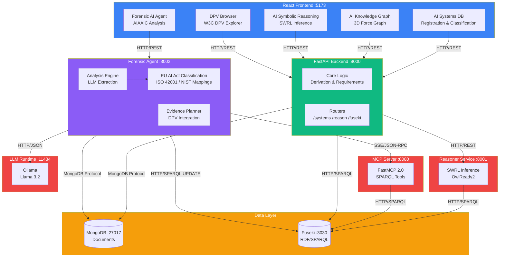
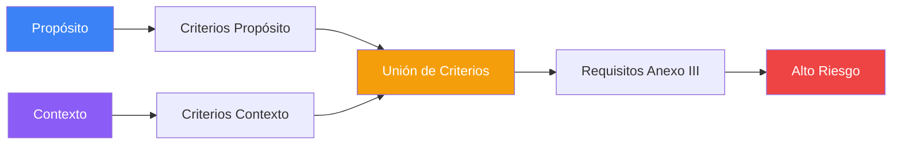

<p align="center">
  
</p>

<h1 align="center">SERAMIS v1.0</h1>

<h3 align="center">Semantic Reasoning and AI Management Intelligent System</h3>

<p align="center">
  <strong>Plataforma de evaluación semántica automatizada para el cumplimiento del Reglamento Europeo de Inteligencia Artificial (EU AI Act) </strong>
</p>

<p align="center">
  
  
  
  
  
  
</p>

---

## Trabajo Fin de Máster - UNIR

<p align="center">
  
</p>

Este proyecto ha sido desarrollado como **Trabajo Fin de Máster** del programa de **Máster en Inteligencia Artificial** de la **Universidad Internacional de La Rioja (UNIR)**.

### Equipo de Desarrollo

| Rol | Nombre |
|-----|--------|
| **Autores** | David Fernández González, Dr. Mariano Ortega de Mues |
| **Directora** | Dra. Xiomara Patricia Blanco Valencia |
| **Co-Director** | Dr. Sergio Castillo |

### Agradecimientos

Este proyecto utiliza datos del **[AIAAIC Repository](https://www.aiaaic.org/aiaaic-repository)** (AI, Algorithmic, and Automation Incidents and Controversies), una base de datos independiente que documenta incidentes de IA a nivel mundial. Agradecemos a **Charlie Pownall** y al equipo de AIAAIC por este recurso invaluable.

La ontología SERAMIS incorpora compatibilidad con **[AIRO (AI Risk Ontology)](https://w3id.org/airo)**, desarrollada por **Delaram Golpayegani** et al. en el ADAPT Centre, Dublin City University. Agradecemos al equipo de AIRO por su trabajo en la estandarización de conceptos de stakeholders para sistemas de IA.

La integración con **[W3C Data Privacy Vocabulary (DPV) 2.2](https://w3c.github.io/dpv/)** permite mapear requisitos del EU AI Act a medidas técnicas y organizativas estándar, facilitando la generación de planes de evidencia para cumplimiento normativo.

La integración con **[European Legislation Identifier (ELI)](https://eur-lex.europa.eu/eli-register/about.html)** proporciona URIs persistentes y desreferenciables para referenciar artículos específicos del AI Act en EUR-Lex, garantizando la interoperabilidad con el ecosistema legislativo europeo.

Este software fue parcialmente desarrollado empleando **Claude Sonnet** (Anthropic), asistente de IA utilizado para acelerar el desarrollo de código, y la documentación.

---

## Índice

- [1. Descripción](#1-descripción)
- [2. Arquitectura del Sistema](#2-arquitectura-del-sistema)
- [3. Instalación](#3-instalación)
- [4. Módulos del Frontend](#4-módulos-del-frontend)
- [5. Agente Forense](#5-agente-forense)
- [6. Ontología](#6-ontología)
  - [6.1 Article 2 Scope Determination](#61-article-2-scope-determination)
  - [6.2 Taxonomía de Incidentes Graves (Art. 3(49))](#62-taxonomía-de-incidentes-graves-art-349)
  - [6.3 Integración AIRO](#63-integración-airo-ai-risk-ontology)
  - [6.4 Integración DPV](#64-integración-dpv-data-privacy-vocabulary)
  - [6.5 Razonamiento sobre Affected Persons](#65-razonamiento-sobre-affected-persons-art-86)
  - [6.6 Integración ELI](#66-integración-eli-european-legislation-identifier)
  - [6.7 Integración ISO 42001](#67-integración-isoiec-420012023)
  - [6.8 Integración NIST AI RMF](#68-integración-nist-ai-rmf-10)
  - [6.9 Mappings Multi-Framework](#69-mappings-multi-framework-resumen)
- [7. Mecanismos de Inferencia](#7-mecanismos-de-inferencia)
- [8. Stack Tecnológico](#8-stack-tecnológico)
- [9. Estructura del Proyecto](#9-estructura-del-proyecto)
- [10. API Reference](#10-api-reference)
- [11. Referencias](#11-referencias)
- [12. Licencia](#12-licencia)

---

## 1. Descripción

SERAMIS implementa un **sistema de evaluación semántica automatizada** para sistemas de IA regulados por el EU AI Act. Combina una ontología formal OWL (v0.41.0) con reglas de inferencia SWRL para derivar automáticamente requisitos de cumplimiento, evaluaciones de riesgo y obligaciones regulatorias.

### Enfoque Ontology-First

SERAMIS implementa un **enfoque ontology-first** donde:
1. El LLM extrae conceptos semánticos directamente (no keywords)
2. El código Python valida contra clases definidas en la ontología
3. Se eliminaron ~150 keywords hardcodeadas en favor de IRIs ontológicas

Este enfoque garantiza que toda la lógica de clasificación está definida semánticamente en la ontología, haciendo el sistema más mantenible, auditable y extensible.

### Características Principales

- **Razonamiento Semántico Híbrido** (SWRL + SHACL) para clasificación automática de riesgo
- **Análisis Forense Post-Incidente** con extracción LLM de narrativas de incidentes
- **Cumplimiento Multi-Framework**: EU AI Act + ISO 42001 + NIST AI RMF + DPV
- **Evidence Planner**: Generación automática de planes de evidencia basados en gaps de cumplimiento
- **DPV Browser**: Explorador interactivo del W3C Data Privacy Vocabulary con taxonomías de riesgos, medidas y conceptos del AI Act
- **Visualización 3D** interactiva del grafo de conocimiento
- **Persistencia Dual**: MongoDB para documentos + Apache Jena Fuseki para RDF/SPARQL
- **Servidor MCP** (Model Context Protocol) para integración con agentes de IA

---

## 2. Arquitectura del Sistema



---

## 3. Instalación

### Prerrequisitos

- **Docker** & **Docker Compose**
- **Git**
- **Ollama** (para el agente forense LLM - usa llama3.2:3b)

### Inicio Rápido

```bash
# 1. Clonar repositorio

# 2. Iniciar todos los servicios
docker-compose up -d

# 3. Verificar despliegue
docker-compose ps
```

### Puntos de Acceso

| Servicio | URL | Descripción |
|----------|-----|-------------|
| **Frontend** | http://localhost:5173 | Interfaz web principal |
| **AI Systems DB** | http://localhost:5173/systems | Base de datos de sistemas de IA |
| **AI Knowledge Graph** | http://localhost:5173/graph | Visualización 3D de la ontología |
| **AI Symbolic Reasoning** | http://localhost:5173/reasoning | Razonamiento SWRL |
| **Forensic AI Agent** | http://localhost:5173/forensic | Análisis de incidentes AIAAIC |
| **DPV Browser** | http://localhost:5173/dpv | Explorador Data Privacy Vocabulary |
| **API Docs** | http://localhost:8000/docs | Documentación API (Swagger) |
| **API Forense** | http://localhost:8002/docs | Documentación API forense |
| **SPARQL Endpoint** | http://localhost:3030 | Consultas RDF/SPARQL |
| **MCP Server** | http://localhost:8080/mcp | Model Context Protocol |

---

## 4. Módulos del Frontend

El frontend de SERAMIS proporciona una interfaz web completa para la gestión y análisis de sistemas de IA:

| Módulo | Ruta | Descripción |
|--------|------|-------------|
| **Dashboard** | `/` | Panel principal con métricas y resumen del sistema |
| **AI Systems DB** | `/systems` | Base de datos de sistemas de IA con formulario de registro, clasificación de riesgo EU AI Act y gestión de requisitos |
| **AI Knowledge Graph** | `/graph` | Visualización 3D interactiva del grafo de conocimiento usando Force Graph y Three.js |
| **AI Symbolic Reasoning** | `/reasoning` | Interfaz para ejecutar razonamiento SWRL sobre sistemas registrados |
| **Forensic AI Agent** | `/forensic` | Análisis forense post-incidente de sistemas de IA usando datos AIAAIC |
| **DPV Browser** | `/dpv` | Explorador interactivo del W3C Data Privacy Vocabulary 2.2 |
| **Ontology Docs** | `/ontology` | Documentación de la ontología SERAMIS |

#### 4.1 Dashboard

El **Dashboard** (`/`) es la página de bienvenida que presenta una visión general del sistema SERAMIS. Incluye:

- **Descripción del sistema**: Muestra el contenido del archivo `Welcome2SERAMIS.md` renderizado como Markdown
- **Características principales**: Resumen de las funcionalidades clave de SERAMIS
- **Interoperabilidad ontológica**: Enlaces a ontologías integradas (AIRO, DPV, ELI, ISO 42001, NIST AI RMF)
- **Stack tecnológico**: Logos de las tecnologías utilizadas (React, Python, FastAPI, MongoDB, Jena Fuseki, Ollama)
- **Licencia**: Información de licenciamiento CC BY-SA 4.0

#### 4.2 AI Systems DB

El módulo **AI Systems DB** (`/systems`) proporciona un formulario completo de registro de sistemas de IA con 8 secciones estructuradas según el EU AI Act:

1. **System Identification**: Nombre y versión del sistema
2. **System Purposes**: Propósitos del sistema alineados con el Anexo III del EU AI Act
3. **Deployment Context**: Contextos de despliegue que activan requisitos regulatorios específicos
4. **Technical Factors**: Tipos de algoritmo, escala del modelo y origen de datos de entrenamiento
5. **System Capabilities**: Capacidades específicas que activan requisitos adicionales de cumplimiento
6. **Capability Metrics (GPAI)**: Indicadores para clasificación GPAI según Arts. 51-55 (parámetros, autonomía, aplicabilidad general)
7. **AIRO Stakeholders**: Identificación de stakeholders según AIRO y Art. 3 EU AI Act (Provider, Deployer, Developer, User, Affected Person)
8. **Article 5 - Prohibited Practices**: Prácticas prohibidas de riesgo inaceptable con excepciones legales y autorización judicial

Incluye:
- **Validación en tiempo real** de campos obligatorios
- **Vista previa** del sistema (SystemCard) antes de guardar
- **Filtros y paginación** para la lista de sistemas existentes
- **Acciones CRUD**: Crear, cargar, modificar y eliminar sistemas

#### 4.3 AI Knowledge Graph

El **AI Knowledge Graph** (`/graph`) proporciona una visualización 3D interactiva del grafo de conocimiento RDF almacenado en Apache Jena Fuseki utilizando `react-force-graph-3d` y Three.js:

- **Visualización 3D**: Renderizado WebGL con nodos esféricos y enlaces direccionales
- **Categorías de nodos**: Clasificación por colores según tipo (System, Purpose, Deployment, Technical, Capability, Compliance, AIRO)
- **Filtros interactivos**: Filtrado por categoría de nodo y búsqueda textual
- **Selección de sistema**: Selector desplegable para visualizar el grafo de un sistema específico
- **Controles de visualización**:
  - Ajuste de distancia entre nodos
  - Toggle de etiquetas de nodos y enlaces
  - Reset de vista
- **Interacción**:
  - Click en nodo: Enfocar cámara
  - Arrastrar nodo: Fijar posición
  - Right-click: Liberar nodo fijado
- **Panel de información**: Muestra detalles del sistema seleccionado (nombre, nivel de riesgo, propósitos, contextos, URN)
- **Estadísticas**: Contador de nodos y enlaces en tiempo real

#### 4.4 AI Symbolic Reasoning

El módulo **AI Symbolic Reasoning** (`/reasoning`) permite ejecutar inferencia semántica SWRL sobre sistemas de IA registrados:

- **Selector dual de sistemas**:
  - *Manual Systems*: Sistemas registrados manualmente en AI Systems DB
  - *Forensic Analyzed Systems*: Sistemas derivados del análisis forense de incidentes AIAAIC
- **Vista previa del sistema**: Muestra información relevante antes de ejecutar el razonamiento
- **Resultados de inferencia**:
  - Criterios normativos, técnicos y contextuales inferidos
  - Requisitos generales y técnicos derivados
  - Clasificación GPAI (si aplica)
  - Nivel de riesgo inferido
- **Exportación TTL**: Visualización del grafo RDF completo en formato Turtle

#### 4.5 Forensic AI Agent

El **Forensic AI Agent** (`/forensic`) proporciona análisis forense post-incidente de sistemas de IA utilizando datos del repositorio AIAAIC:

- **Carga de incidentes**: Importación desde el repositorio AIAAIC (2,139+ incidentes)
- **Filtros avanzados**: Por sector, país, año, tecnología y búsqueda textual
- **Selección múltiple**: Permite analizar varios incidentes en lote
- **Modos de análisis**:
  - *Pipeline Mode*: Flujo determinista de 7 pasos
  - *ReAct Agent Mode*: Agente autónomo con razonamiento iterativo (experimental)
- **Streaming en tiempo real**: Visualización paso a paso del proceso de análisis
- **Opciones de análisis**:
  - Con/sin plan de evidencias DPV
  - Selección de proveedor LLM (Ollama/Anthropic)
- **Resultados del análisis**:
  - Clasificación de riesgo EU AI Act
  - Clasificación de incidente grave Art. 3(49) (si aplica)
  - Indicador de obligación de notificación Art. 73
  - Requisitos aplicables
  - Gaps de cumplimiento
  - Mappings ISO 42001 y NIST AI RMF
  - Plan de evidencias DPV (opcional)
- **Gestión de sistemas analizados**: Lista de sistemas forenses persistidos con opciones de visualización y eliminación
- **Exportación PDF**: Generación de informes forenses en PDF

#### 4.6 DPV Browser

El **DPV Browser** (`/dpv`) es un explorador de planes de evidencia basados en el [W3C Data Privacy Vocabulary (DPV) 2.2](https://w3c.github.io/dpv/):

- **Carga de sistemas**: Muestra sistemas (forenses y manuales) que tienen planes de evidencia generados
- **Visualización de planes**: Para cada gap de cumplimiento identificado:
  - Requisito EU AI Act asociado
  - Prioridad (CRITICAL, HIGH, MEDIUM, LOW)
  - Medidas DPV recomendadas
  - Roles responsables (Deployer, Provider, DPO, Legal, Technical)
  - Plazos de implementación
- **Items de evidencia**: Para cada requisito:
  - Tipo de evidencia (Policy, Technical, Audit, Training, Assessment, Contractual)
  - Frecuencia de recolección
  - Plantillas de documentos sugeridas
  - Guía de implementación
- **Filtros**: Por prioridad, tipo de evidencia, rol responsable y búsqueda textual
- **Estadísticas**: Resumen por prioridad, tipo y rol
- **Recomendaciones**: Sugerencias automáticas basadas en los gaps identificados

#### 4.7 Ontology Docs

El módulo **Ontology Docs** (`/ontology`) proporciona acceso a la documentación de la ontología SERAMIS generada con WIDOCO:

- **Documentación multilingüe**: Soporte para inglés y español (detectado automáticamente)
- **Iframe integrado**: Visualización completa de la documentación HTML
- **Contenido**:
  - Descripción de clases OWL
  - Propiedades de objeto y datos
  - Individuos definidos
  - Axiomas y restricciones
  - Ejemplos de uso

---

## 5. Agente Forense

El **Agente Forense** es un microservicio potenciado por LLM para análisis de cumplimiento post-incidente. Extrae información estructurada de narrativas de incidentes y evalúa el cumplimiento contra múltiples frameworks.

📖 **Documentación completa:** [`forensic_agent/README.md`](forensic_agent/README.md)

### 5.1 Fuente de Datos: AIAAIC Repository

El agente utiliza datos del **AI, Algorithmic, and Automation Incidents and Controversies (AIAAIC) Repository**, una base de datos independiente que documenta incidentes relacionados con sistemas de IA a nivel mundial.

🔗 **AIAAIC Repository:** https://www.aiaaic.org/aiaaic-repository

### 5.2 Características

| Característica | Descripción |
|----------------|-------------|
| **Extracción LLM** | Usa Ollama (llama3.2:3b) o Anthropic para extraer datos estructurados |
| **Análisis Multi-Framework** | EU AI Act + ISO 42001 (15 mappings) + NIST AI RMF (18 mappings) + DPV 2.2 |
| **Clasificación de Riesgo** | Categorización automática según 8 categorías del Anexo III + GPAI |
| **Clasificación de Incidentes Graves** | Taxonomía Art. 3(49): muerte/salud, infraestructura crítica, derechos fundamentales, propiedad/medio ambiente |
| **Detección Art. 73** | Identifica automáticamente si el incidente requiere notificación obligatoria (15 días) |
| **Detección de Brechas** | Identifica requisitos faltantes y calcula ratio de cumplimiento |
| **Evidence Planner** | Genera planes de evidencia con 14 requisitos y ~40 items de evidencia |
| **Persistencia Dual** | Guarda en MongoDB + Fuseki RDF para consultas semánticas |

### 5.3 Ejemplo de Análisis

```bash
curl -X POST http://localhost:8002/forensic/analyze \
  -H "Content-Type: application/json" \
  -d '{
    "narrative": "Sistema de reconocimiento facial utilizado por fuerzas policiales para identificar manifestantes. El sistema mostró sesgo significativo contra minorías.",
    "source": "AIAAIC Repository",
    "metadata": {
      "aiaaic_id": "AIAAIC0042",
      "headline": "Sesgo en reconocimiento facial policial"
    }
  }'
```

---

## 6. Ontología

### 6.0 Versión: 0.41.0

| Propiedad | Valor |
|-----------|-------|
| **Namespace** | `http://ai-act.eu/ai#` |
| **Formato** | Turtle (.ttl) |
| **Clases** | 70+ |
| **Propiedades** | 55+ |
| **Individuos** | 130+ |
| **Tripletas** | ~2,200 |

### 6.0.1 Cobertura Regulatoria

- EU AI Act Anexo III (8/8 categorías de alto riesgo)
- **Artículo 2** (Ámbito de aplicación - exclusiones y overrides)
- **Artículo 3(49)** (Taxonomía de incidentes graves)
- **Artículo 5** (Prácticas Prohibidas - Riesgo Inaceptable)
- **Artículo 73** (Obligaciones de notificación de incidentes)
- Artículos 51-55 (requisitos GPAI)
- Taxonomía de algoritmos (Anexo I)
- Framework de gobernanza de datos
- Shapes SHACL de validación (15 shapes)
- Reglas de inferencia SWRL

### 6.1 Article 2 Scope Determination

La ontología modela semánticamente el **Artículo 2 (Ámbito de aplicación)** del EU AI Act, permitiendo determinar si un sistema está dentro del ámbito regulatorio mediante consultas SPARQL.

#### 6.1.1 Clases de Exclusión (ScopeExclusion)

| Clase | Artículo | Descripción |
|-------|----------|-------------|
| `ai:PersonalNonProfessionalUse` | Art. 2.10 | Uso personal no profesional |
| `ai:PureScientificResearch` | Art. 2.6 | Investigación científica pura |
| `ai:MilitaryDefenseUse` | Art. 2.3 | Uso militar/defensa nacional |
| `ai:EntertainmentWithoutRightsImpact` | Recital 12 | Entretenimiento sin impacto en derechos |
| `ai:ThirdCountryExclusion` | Art. 2.7 | Sistemas de terceros países |

#### 6.1.2 Contextos de Override (traen sistemas de vuelta al scope)

| Contexto | Efecto | Requisito Adicional |
|----------|--------|---------------------|
| `ai:CausesRealWorldHarmContext` | Anula exclusión de entretenimiento | FRIA (Art. 27) |
| `ai:VictimImpactContext` | Activa protección de víctimas | FRIA + medidas de protección |
| `ai:AffectsFundamentalRightsContext` | Activa Art. 27 | FRIA obligatoria |
| `ai:LegalConsequencesContext` | Activa supervisión humana | Human oversight (Art. 14) |
| `ai:MinorsAffectedContext` | Escrutinio reforzado | Protección de menores |
| `ai:BiometricProcessingContext` | Posible Art. 5 | Revisión de prohibiciones |

#### 6.1.3 Propiedades de Scope

```turtle
ai:mayBeExcludedBy      # Purpose → ScopeExclusion
ai:overridesExclusion   # DeploymentContext → ScopeExclusion
ai:hasScopeOverride     # IntelligentSystem → DeploymentContext
ai:isInEUAIActScope     # IntelligentSystem → boolean
ai:requiresFRIA         # Context → boolean (Art. 27)
```

### 6.2 Taxonomía de Incidentes Graves (Art. 3(49))

La ontología v0.41.0 modela la definición de **incidente grave** según el Artículo 3(49) del EU AI Act, permitiendo la clasificación automática de incidentes y la determinación de obligaciones de notificación según el Artículo 73.

#### 6.2.1 Jerarquía de Clases de Incidente Grave

```turtle
ai:SeriousIncident (clase base)
  ├── ai:DeathOrHealthHarm             [Art. 3(49)(a)]
  ├── ai:CriticalInfrastructureDisruption [Art. 3(49)(b)]
  ├── ai:FundamentalRightsInfringement   [Art. 3(49)(c)]
  └── ai:PropertyOrEnvironmentHarm       [Art. 3(49)(d)]
```

#### 6.2.2 Tipos de Incidente Grave

| Tipo | Artículo | Descripción | Keywords de Extracción |
|------|----------|-------------|------------------------|
| `ai:DeathOrHealthHarm` | Art. 3(49)(a) | Muerte de persona o daño grave a la salud | death, fatal, injury, hospitalized, casualties |
| `ai:CriticalInfrastructureDisruption` | Art. 3(49)(b) | Interrupción grave de infraestructura crítica | blackout, power grid, transport disruption |
| `ai:FundamentalRightsInfringement` | Art. 3(49)(c) | Violación de derechos fundamentales UE | discrimination, wrongful arrest, privacy breach |
| `ai:PropertyOrEnvironmentHarm` | Art. 3(49)(d) | Daño grave a propiedad o medio ambiente | property damage, environmental damage |

#### 6.2.3 Propiedades de Incidente

```turtle
ai:hasSeriousIncidentType    # IntelligentSystem → SeriousIncident
ai:indicatorKeywords         # SeriousIncident → xsd:string
ai:mapsToAIAAICType          # SeriousIncident → xsd:string (ground truth)
ai:triggersArticle73         # SeriousIncident → xsd:boolean
```

#### 6.2.4 Integración con DPV-Risk

La taxonomía de incidentes graves se integra con el vocabulario **DPV-Risk** mediante equivalencias semánticas:

| Tipo de Incidente SERAMIS | Concepto DPV-Risk |
|---------------------------|-------------------|
| `ai:FundamentalRightsInfringement` | `dpv-risk:RightsImpact` |
| `ai:DeathOrHealthHarm` | `dpv-risk:PhysicalHarm` |
| `ai:PropertyOrEnvironmentHarm` | `dpv-risk:MaterialDamage` |

#### 6.2.5 Artículo 73: Obligaciones de Notificación

Todos los tipos de incidente grave activan la propiedad `ai:triggersArticle73 = true`, lo que implica:

- **Plazo de notificación**: 15 días desde el conocimiento del incidente
- **Destinatario**: Autoridad de vigilancia del mercado competente
- **Contenido obligatorio**: Identificación del sistema, descripción del incidente, medidas adoptadas

**Inferencia automática:**
```
SI sistema tiene hasSeriousIncidentType con triggersArticle73 = true
   → Sistema requiere notificación obligatoria Art. 73
   → Plazo: 15 días
```

### 6.3 Integración AIRO (AI Risk Ontology)

La ontología SERAMIS incorpora compatibilidad con **AIRO** para la gestión de stakeholders según el EU AI Act:

| Propiedad SERAMIS | Clase AIRO | Artículo EU AI Act |
|-------------------|------------|-------------------|
| `ai:hasProvider` | `airo:AIProvider` | Art. 3.3 |
| `ai:hasDeployer` | `airo:AIDeployer` | Art. 3.4 |
| `ai:hasDeveloper` | `airo:AIDeveloper` | - |
| `ai:hasUser` | `airo:AIUser` | - |
| `ai:hasSubject` | `airo:AISubject` | Art. 86 (Affected Person) |
| `ai:hasOversightBody` | `airo:Regulator` | Art. 70 |

Esta integración permite:
- **Trazabilidad de responsabilidad**: Identificar claramente quién desarrolla, despliega y opera cada sistema
- **Análisis forense mejorado**: El Agente Forense extrae deployer/developer de incidentes AIAAIC
- **Interoperabilidad**: Compatible con otras ontologías que usen AIRO
- **Razonamiento sobre Affected Persons**: Inferencia automática de requisitos basados en personas afectadas

### 6.4 Integración DPV (Data Privacy Vocabulary)

SERAMIS integra el **[W3C Data Privacy Vocabulary (DPV) 2.2](https://w3c.github.io/dpv/)** para la generación de planes de evidencia de cumplimiento.

| Extensión DPV | Propósito | Uso en SERAMIS |
|---------------|-----------|----------------|
| **dpv:core** | Medidas técnicas y organizativas | Mapeo de requisitos a medidas |
| **dpv:ai** | Sistemas de IA, capacidades, riesgos | Clasificación de sistemas |
| **dpv:risk** | Gestión de riesgos | Evaluación de gaps |
| **dpv:legal/eu/aiact** | Conceptos específicos AI Act | Equivalencias semánticas |

#### 6.3.1 Tipos de Evidencia Definidos

El módulo `dpv-integration.ttl` define 6 tipos de evidencia:

| Tipo | Descripción | Ejemplo |
|------|-------------|---------|
| `PolicyEvidence` | Políticas y procedimientos | Human Oversight Policy |
| `TechnicalEvidence` | Documentación técnica | Model Card, System Architecture |
| `AuditEvidence` | Logs, tests, auditorías | Bias Audit Report |
| `TrainingEvidence` | Registros de formación | Operator Training Records |
| `AssessmentEvidence` | Evaluaciones de impacto | FRIA Report, DPIA |
| `ContractualEvidence` | Contratos y acuerdos | Data Processing Agreement |

#### 6.3.2 Mappings Requisito → Medida DPV

```turtle
ai:HumanOversightRequirement
    ai:mapsToDPVMeasure dpv:HumanInvolvement ;
    ai:requiresEvidence ai:HumanOversightPolicyEvidence,
                        ai:OverrideDecisionLogEvidence .

ai:FundamentalRightsAssessmentRequirement
    ai:mapsToDPVMeasure dpv:ImpactAssessment ;
    ai:requiresEvidence ai:FRIAReportEvidence .
```

### 6.5 Razonamiento sobre Affected Persons (Art. 86)

El reasoner implementa **4 reglas de inferencia** basadas en la identificación de "Affected Persons" (personas afectadas por decisiones del sistema de IA):

| Regla | Artículo | Condición | Inferencia |
|-------|----------|-----------|------------|
| **7** | Art. 86 | `hasSubject` + `HighRisk` | `requiresExplainability = true` |
| **8** | Art. 27 | Affected person en grupo vulnerable | `requiresFundamentalRightsAssessment = true` |
| **9** | Art. 26 | Propósito de empleo + affected persons | `requiresAffectedPersonNotification = true` |
| **10** | Art. 5 | Biométrico + espacio público + affected persons | `requiresProhibitionReview = true` |

**Grupos vulnerables detectados automáticamente:**
- Menores (Minor/Child)
- Personas mayores (Elderly)
- Personas con discapacidad (Disabled)
- Migrantes y solicitantes de asilo (Migrant/Asylum)

**Propiedades de inferencia añadidas:**
- `ai:requiresExplainability` - Requiere explicabilidad Art. 86
- `ai:requiresFundamentalRightsAssessment` - Requiere FRIA Art. 27
- `ai:requiresAffectedPersonNotification` - Requiere notificación Art. 26
- `ai:requiresProhibitionReview` - Requiere revisión prohibiciones Art. 5

**Requisitos de cumplimiento inferidos:**
- `ai:ExplainabilityRequirement`
- `ai:FundamentalRightsImpactAssessment`
- `ai:WorkerNotificationRequirement`
- `ai:Article5ProhibitionReview`

### 6.6 Integración ELI (European Legislation Identifier)

SERAMIS integra el **[European Legislation Identifier (ELI)](https://eur-lex.europa.eu/eli-register/about.html)** para proporcionar referencias persistentes y desreferenciables a la legislación oficial en EUR-Lex.

| Propiedad | Descripción |
|-----------|-------------|
| **Prefijo** | `eli: <http://data.europa.eu/eli/ontology#>` |
| **Propiedad** | `eli:cites` vincula conceptos a URIs EUR-Lex |
| **Base URI** | `http://data.europa.eu/eli/reg/2024/1689` |
| **Estándar** | Council Conclusions 2012/C 325/02 |

**Ejemplo de URI ELI:**
```turtle
ai:HumanOversightRequirement eli:cites <http://data.europa.eu/eli/reg/2024/1689/art_14/oj> .
```

Esta integración permite:
- **Trazabilidad normativa**: Enlaces directos al texto legal oficial
- **Persistencia**: URIs que sobreviven consolidaciones legislativas
- **Interoperabilidad**: Estándar EU para referencias legislativas
- **Auditoría**: Referencias verificables para compliance

### 6.7 Integración ISO/IEC 42001:2023

La ontología incluye **15 mappings bidireccionales** con el estándar de gestión de IA [ISO/IEC 42001:2023](https://www.iso.org/standard/81230.html), candidato a estándar armonizado bajo el EU AI Act.

| Requisito EU AI Act | Artículo | Control ISO 42001 | Sección |
|---------------------|----------|-------------------|---------|
| Risk Management | Art. 9 | Risk assessment and treatment | 8.1 |
| Data Governance | Art. 10 | Data management | 8.3 |
| Documentation | Art. 11-12 | Documentation and records | 8.4 |
| Transparency | Art. 13 | Transparency and explainability | 8.7 |
| Human Oversight | Art. 14 | Human oversight controls | 8.6 |
| Accuracy/Robustness | Art. 15 | Performance evaluation | 8.2 |
| Cybersecurity | Art. 15 | AI system security | 8.5.1 |
| Conformity Assessment | Art. 43 | Internal audit | 9.2 |
| Monitoring | Art. 72 | Monitoring and measurement | 9.1 |
| Incident Response | Art. 73 | Incident management | 10.1 |

**Propiedades de mapping:**
```turtle
ai:HumanOversightRequirement
    ai:equivalentToISOControl iso:Control_8_6 ;
    ai:isoSection "8.6" ;
    ai:mappingConfidence "HIGH" .
```

### 6.8 Integración NIST AI RMF 1.0

La ontología incluye **16 mappings** con el [NIST AI Risk Management Framework](https://www.nist.gov/itl/ai-risk-management-framework), cubriendo las 4 funciones principales:

| Función NIST | Categorías | Requisitos AI Act mapeados |
|--------------|------------|----------------------------|
| **GOVERN** | 1.1, 1.2, 1.3 | Derechos fundamentales, Gestión de riesgos, Documentación |
| **MAP** | 2.1, 2.2, 2.3 | Clasificación de riesgo, Gobernanza de datos, No discriminación |
| **MEASURE** | 3.1, 3.2, 3.3 | Precisión, Robustez, Evaluación de conformidad |
| **MANAGE** | 4.1, 4.2, 4.3, 4.4 | Supervisión humana, Monitoreo, Transparencia, Ciberseguridad |

**Propiedades de mapping:**
```turtle
ai:HumanOversightRequirement
    ai:equivalentToNISTFunction nist:MANAGE_4_1 ;
    ai:nistCategory "MANAGE-4.1" ;
    ai:nistApplicabilityContext "GLOBAL_INCIDENTS, COMPARATIVE_ANALYSIS" .
```

### 6.9 Mappings Multi-Framework (Resumen)

| Framework | Tipo | Mappings | Confianza |
|-----------|------|----------|-----------|
| **EU AI Act** | Regulación obligatoria | Base | - |
| **AIRO** | Ontología W3C | 30+ | Equivalencias OWL |
| **DPV 2.2** | Vocabulario W3C | 14 | - |
| **ELI** | Identificador EU | 20+ | URIs persistentes |
| **ISO 42001** | Estándar certificable | 15 | 87% HIGH |
| **NIST AI RMF** | Guía voluntaria | 16 | 100% HIGH |
| **Total** | Multi-framework | **95+** | **94% HIGH** |

---

## 7. Mecanismos de Inferencia

SERAMIS implementa **tres mecanismos de inferencia** basados en diferentes secciones del EU AI Act para la clasificación automática de sistemas de IA:

### 7.1 Inferencia por Propósito + Contexto (Anexo III)

Clasifica sistemas de IA como **Alto Riesgo** basándose en la combinación del propósito del sistema y su contexto de despliegue, según las 8 categorías del Anexo III del EU AI Act.



**Categorías cubiertas:**
- Biometría e identificación de personas
- Gestión de infraestructuras críticas
- Educación y formación profesional
- Empleo y gestión de trabajadores
- Acceso a servicios esenciales (crédito, seguros)
- Aplicación de la ley
- Migración, asilo y control fronterizo
- Administración de justicia y procesos democráticos

### 7.2 Inferencia por Experto Humano (Artículo 6.3)

Permite que un **experto humano** identifique manualmente **criterios de riesgo adicionales** para sistemas que no son capturados por las reglas automáticas de Propósito + Contexto. Esta evaluación experta complementa la inferencia automática.

En el interfaz **AI Systems DB**, la Sección 6 "Expert Evaluation" permite al evaluador:

```
Si experto identifica riesgos no detectados automáticamente
   → Añade criterios manualmente (hasManuallyIdentifiedCriterion)
   → Sistema reclasificado a HighRisk con criterios adicionales
```

**Campos disponibles en el formulario:**
- `hasManuallyIdentifiedCriterion`: Criterios de alto riesgo identificados por el experto
- Selección múltiple de criterios del catálogo del Anexo III
- Los criterios manuales se combinan con los criterios derivados automáticamente

**Aplicación del Art. 6.3:**
- Casos residuales no cubiertos por reglas automáticas
- Sistemas con riesgo contextual específico
- Evaluación caso por caso por experto cualificado

### 7.3 Inferencia para Modelos GPAI (Artículos 51-55)

Clasifica **Modelos de Propósito General** (GPAI) y detecta aquellos con **Riesgo Sistémico** basándose en capacidad computacional y otros indicadores.

```
Si modelo GPAI tiene FLOPS ≥ 10^25
   → Riesgo Sistémico (Art. 51)
   → Requisitos adicionales Arts. 52-55
```

**Criterios de Riesgo Sistémico:**
- Capacidad computacional ≥ 10²⁵ FLOPS de entrenamiento
- Capacidades de alto impacto determinadas por la Comisión
- Número significativo de usuarios registrados

### 7.4 Resumen de Mecanismos

| Mecanismo | Base Legal | Entrada | Salida |
|-----------|------------|---------|--------|
| **Propósito + Contexto** | Anexo III | Propósito, Contexto de despliegue | HighRisk / NotHighRisk + Criterios automáticos |
| **Experto Humano** | Art. 6.3 | `hasManuallyIdentifiedCriterion` | Criterios adicionales → HighRisk |
| **GPAI** | Arts. 51-55 | FLOPS, capacidades | SystemicRisk / GPAI estándar |

---

## 8. Stack Tecnológico

### 8.1 Backend
- Python 3.11
- FastAPI
- RDFLib (procesamiento RDF/OWL)
- OwlReady2 (razonamiento OWL)
- Motor (MongoDB async)
- FastMCP 2.0 (Model Context Protocol)

### 8.2 Frontend
- React 19
- TypeScript
- Vite
- TailwindCSS
- react-force-graph-3d (visualización 3D)
- Three.js (rendering WebGL)

### 8.3 AI/LLM
- Ollama (runtime LLM local)
- llama3.2:3b (modelo por defecto)

### 8.4 Infraestructura
- Docker & Docker Compose
- Apache Jena Fuseki
- MongoDB 6
- NGINX

---

## 9. Estructura del Proyecto

```
seramis/
├── backend/                    # FastAPI backend (8000)
│   ├── main.py
│   ├── derivation.py
│   ├── routers/
│   └── models/
├── frontend/                   # React + TypeScript UI (5173)
│   ├── src/
│   │   ├── pages/
│   │   │   ├── DashboardPage.tsx        # Panel principal
│   │   │   ├── SystemsPage.tsx          # AI Systems DB
│   │   │   ├── GraphView.tsx            # AI Knowledge Graph 3D
│   │   │   ├── ReasoningPage.tsx        # AI Symbolic Reasoning
│   │   │   ├── ForensicAgentPage.tsx    # Forensic AI Agent
│   │   │   ├── DPVPage.tsx              # DPV Browser
│   │   │   └── OntologyDocs.tsx         # Documentación ontología
│   │   ├── components/
│   │   │   └── Navbar.tsx
│   │   └── lib/
├── forensic_agent/            # Agente de Análisis Forense (8002)
│   ├── app/
│   │   ├── main.py
│   │   └── services/
│   │       ├── incident_extractor.py
│   │       ├── analysis_engine.py
│   │       ├── evidence_planner.py   # Evidence Planner (DPV)
│   │       ├── persistence.py
│   │       └── mcp_client.py
├── mcp-servers/               # Servidores MCP (ver README)
│   └── forensic-sparql/
│       ├── README.md          # Documentación servidor MCP SPARQL
│       └── server.py
├── reasoner_service/          # Microservicio de razonamiento SWRL (8001)
├── ontologias/                # Archivos de ontología
│   ├── versions/
│   │   ├── 0.41.0/            # Versión actual con Art. 3(49) taxonomy
│   │   └── ...
│   ├── queries/               # Consultas SPARQL (ver README)
│   │   ├── README.md          # Catálogo de 15 queries forenses
│   │   └── forensic-queries.sparql
│   ├── rules/                 # Reglas SWRL
│   ├── shacl/                 # 15 SHACL shapes
│   └── mappings/              # Mappings multi-framework (ver README)
│       ├── README.md          # Documentación de 45 mappings
│       ├── iso-42001-mappings.ttl
│       ├── nist-ai-rmf-mappings.ttl
│       └── dpv-integration.ttl      # DPV 2.2 integration
├── docker-compose.yml
└── README.md
```

---

## 10. API Reference

### 10.1 Sistemas

```http
GET    /systems              # Listar sistemas
POST   /systems              # Registrar sistema
GET    /systems/{urn}        # Obtener sistema
PUT    /systems/{urn}        # Actualizar sistema
DELETE /systems/{urn}        # Eliminar sistema
```

### 10.2 Razonamiento

```http
POST   /reasoning/system/{id}  # Ejecutar razonamiento SWRL
GET    /reasoning/rules        # Obtener reglas SWRL
GET    /reasoning/status       # Estado del servicio
```

### 10.3 Análisis Forense

```http
POST   /forensic/analyze                    # Analizar narrativa de incidente
POST   /forensic/analyze-with-evidence-plan # Analizar + generar plan de evidencias
POST   /forensic/evidence-plan              # Generar plan de evidencias desde gaps
GET    /forensic/systems                    # Listar sistemas analizados
GET    /forensic/systems/{urn}              # Obtener análisis específico
DELETE /forensic/systems/{urn}              # Eliminar análisis
```

### 10.4 MCP Tools

```python
query_ontology(query)           # Ejecutar consultas SPARQL
get_requirements_for_system()   # Obtener requisitos EU AI Act
determine_risk_level()          # Determinar nivel de riesgo
query_iso_mappings()            # Consultar mappings ISO 42001
query_nist_mappings()           # Consultar mappings NIST AI RMF
get_inference_rules()           # Obtener reglas de inferencia
get_ontology_stats()            # Estadísticas de la ontología
```

---

## 11. Referencias

- **EU AI Act:** https://eur-lex.europa.eu/legal-content/EN/TXT/?uri=CELEX:32024R1689
- **W3C Data Privacy Vocabulary (DPV) 2.2:** https://w3c.github.io/dpv/
- **AIAAIC Repository:** https://www.aiaaic.org/aiaaic-repository
- **AIRO (AI Risk Ontology):** https://w3id.org/airo
- **ISO/IEC 42001:2023:** https://www.iso.org/standard/81230.html
- **NIST AI RMF 1.0:** https://www.nist.gov/itl/ai-risk-management-framework
- **Apache Jena Fuseki:** https://jena.apache.org/documentation/fuseki2/
- **OWL 2 Web Ontology Language:** https://www.w3.org/TR/owl2-overview/
- **SHACL:** https://www.w3.org/TR/shacl/
- **Catálogo de Queries SPARQL Forenses:** [ontologias/queries/README.md](ontologias/queries/README.md)
- **Mappings Multi-Framework (ISO/NIST/DPV):** [ontologias/mappings/README.md](ontologias/mappings/README.md)

---

## 12. Licencia

Este proyecto utiliza la ontología EU AI Act licenciada bajo **Creative Commons Attribution 4.0 International (CC BY 4.0)**.

El código fuente está disponible bajo los términos definidos por UNIR para Trabajos Fin de Máster.

---

<p align="center">
  
</p>

<p align="center">
  <strong>Universidad Internacional de La Rioja</strong><br/>
  Máster en Inteligencia Artificial<br/>
  Curso 2024-2025
</p>

<p align="center">
  <sub>Versión 1.2.0 | Enero 2026</sub>
</p>
