# AI Act Project

## 📋 Descripción General

Este proyecto implementa un **sistema completo para la gestión y análisis de sistemas de inteligencia artificial** bajo el marco del AI Act europeo. El sistema incluye:

- 🧠 **Ontología formal** del dominio AI Act
- 🔧 **Servicios de razonamiento semántico** (OWL/SWRL)
- 🌐 **APIs REST** para gestión de datos
- 📊 **Interfaz web interactiva** para visualización y gestión
- 📚 **Documentación automática** de ontologías

## 🚀 Inicio Rápido

### Prerrequisitos
- **Docker** y **Docker Compose**
- **Git**
- Puerto 5173, 8000, 8001, 3030, 27017, 80 disponibles

### Instalación en 3 pasos

```bash
# 1. Clonar el repositorio
git clone <repository-url>
cd ai_act_project

# 2. Levantar todos los servicios
docker-compose up -d

# 3. Verificar que todo funciona
docker-compose ps
```

### Acceder a la aplicación
- 🌐 **Frontend**: http://localhost:5173
- 📊 **API Docs**: http://localhost:8000/docs  
- 📚 **Ontología Docs**: http://localhost/docs
- 🔍 **SPARQL Endpoint**: http://localhost:3030

---

## 🛠 Stack Tecnológico

| Capa | Tecnologías |
|------|-------------|
| **🖥️ Frontend** | React 19, TypeScript, Vite, TailwindCSS, D3.js, Vis-network |
| **⚡ Backend** | FastAPI, MongoDB, Apache Jena Fuseki, RDFLib, OwlReady2 |
| **🧠 Semántica** | OWL, SWRL, RDF/Turtle, JSON-LD, SPARQL, AIRO Integration |
| **🐳 Infraestructura** | Docker Compose, Nginx, Widoco |

---

## 🛠 Tecnologías Empleadas

### Backend
- **FastAPI** - Framework web moderno para Python
- **MongoDB** - Base de datos NoSQL para almacenamiento de documentos
- **Apache Jena Fuseki** - Servidor SPARQL y almacén de triples RDF
- **RDFLib** - Biblioteca Python para manejo de datos RDF
- **OwlReady2** - Razonador OWL/SWRL para inferencia semántica
- **Motor** - Driver asíncrono de MongoDB para Python

### Frontend
- **React 19** - Biblioteca de interfaz de usuario
- **TypeScript** - Superset tipado de JavaScript
- **Vite** - Herramienta de build rápida
- **TailwindCSS** - Framework de CSS utilitario
- **D3.js** - Visualización de datos y grafos
- **Vis-network** - Biblioteca para visualización de redes
- **React Router Dom** - Enrutamiento del lado cliente

### Infraestructura
- **Docker & Docker Compose** - Contenerización y orquestación
- **Nginx** - Servidor web para servir documentación
- **Widoco** - Generación automática de documentación de ontologías

### Semántica y Ontologías
- **OWL (Web Ontology Language)** - Lenguaje de ontologías web
- **SWRL (Semantic Web Rule Language)** - Reglas semánticas
- **RDF/Turtle** - Formato de datos semánticos
- **JSON-LD** - Formato JSON para datos enlazados
- **AIRO (AI Risk Ontology)** - Framework internacional de gestión de riesgo de IA

## 📦 Arquitectura del Sistema

### Componentes Principales

| Componente | Ubicación | Descripción |
|------------|-----------|-------------|
| **Frontend** | `/frontend` | Interfaz React con visualización interactiva |
| **Backend API** | `/backend` | API REST con FastAPI + MongoDB/Fuseki |
| **Ontología** | `/ontologias` | Modelo formal AI Act + documentación |
| **Reasoner** | `/reasoner_service` | Motor de inferencia OWL/SWRL |
| **Herramientas** | `/tools` | Scripts para documentación y validación |

### 🎯 Servicios y Puertos

| Servicio | Puerto | URL | Descripción |
|----------|--------|-----|-------------|
| **Frontend** | 5173 | http://localhost:5173 | Interfaz web React |
| **Backend API** | 8000 | http://localhost:8000 | API REST principal |
| **Reasoner** | 8001 | http://localhost:8001 | Servicio de razonamiento |
| **Fuseki** | 3030 | http://localhost:3030 | Servidor SPARQL |
| **MongoDB** | 27017 | mongodb://localhost:27017 | Base de datos documentos |
| **Docs** | 80 | http://localhost/docs | Documentación HTML |


## 🧠 Modelo de Ontología AI Act con AIRO

### Estructura de la Ontología (v0.36.0)

<details>
<summary><strong>🏗️ Diagrama 1: Sistema Central y sus Características</strong></summary>


</details>

<details>
<summary><strong>⚠️ Diagrama 2: Evaluación de Riesgo y Criterios</strong></summary>

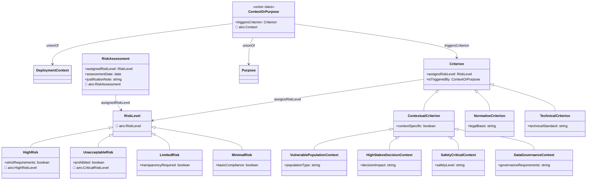

</details>

<details>
<summary><strong>📋 Diagrama 3: Cumplimiento y Requisitos</strong></summary>

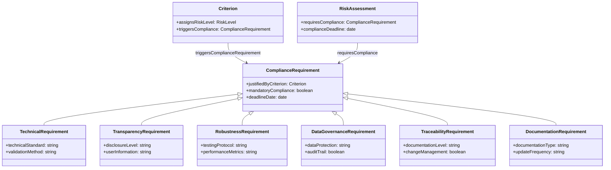

</details>

<details>
<summary><strong>🔗 Diagrama 4: Flujo de Proceso Completo</strong></summary>

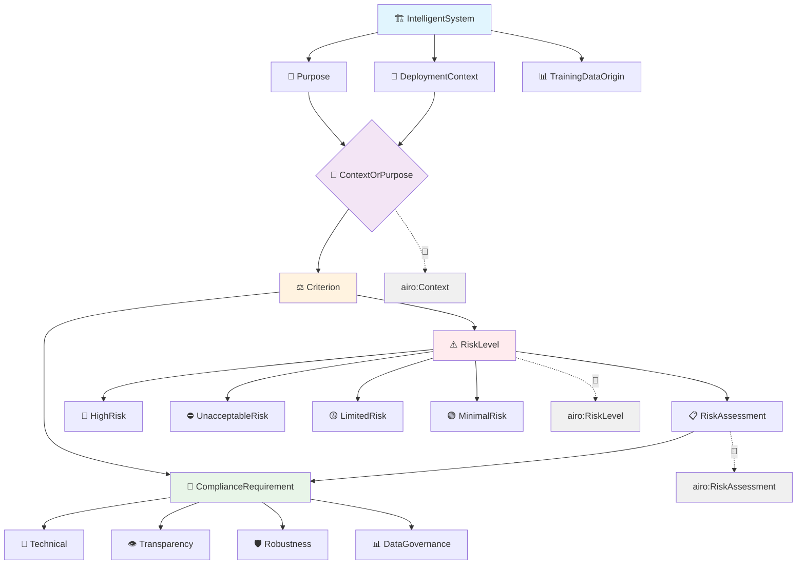

</details>

<details>
<summary><strong>👥 Diagrama de Clases - Actores del Ecosistema</strong></summary>


</details>


<details>
<summary><strong>🔗 Integración AIRO (AI Risk Ontology)</strong></summary>

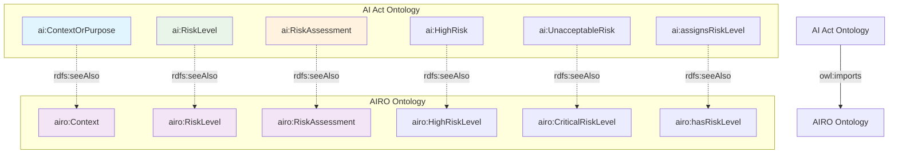
</details>

<details>
<summary><strong>📊 Estadísticas de la Ontología</strong></summary>

| Elemento | Cantidad | Descripción |
|----------|----------|-------------|
| **Triples totales** | 991 | Incluyendo integración AIRO |
| **Clases OWL** | 31 | Jerarquía completa de conceptos |
| **Propiedades de objeto** | 28 | Relaciones entre entidades |
| **Propiedades de datos** | 8 | Atributos de las entidades |
| **Individuos nombrados** | 45+ | Instancias específicas (criterios, niveles de riesgo) |
| **Criterios contextuales** | 11 | Con asignaciones directas de riesgo |
| **Niveles de riesgo** | 4 | HighRisk, UnacceptableRisk, LimitedRisk, MinimalRisk |
| **Referencias AIRO** | 6 | Mapeos de interoperabilidad |
| **Namespaces importados** | 1 | AIRO (https://w3id.org/airo) |

**Cobertura AI Act**: ✅ Completa (Anexos I-IV)  
**Compatibilidad AIRO**: ✅ 85% implementada  
**Validación sintáctica**: ✅ Aprobada (rapper)  
**Estado**: ✅ Listo para producción  

</details>

## 🏷️ Instancias de la Ontología

### Contextos de Despliegue y Propósitos

<details>
<summary><strong>📍 Instancias: Contextos de Despliegue</strong></summary>

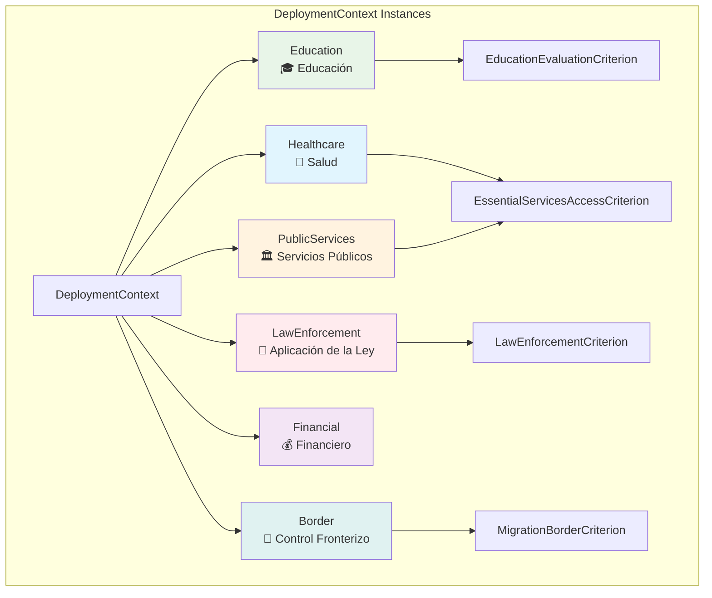

</details>

<details>
<summary><strong>🎯 Instancias: Propósitos de Sistemas</strong></summary>

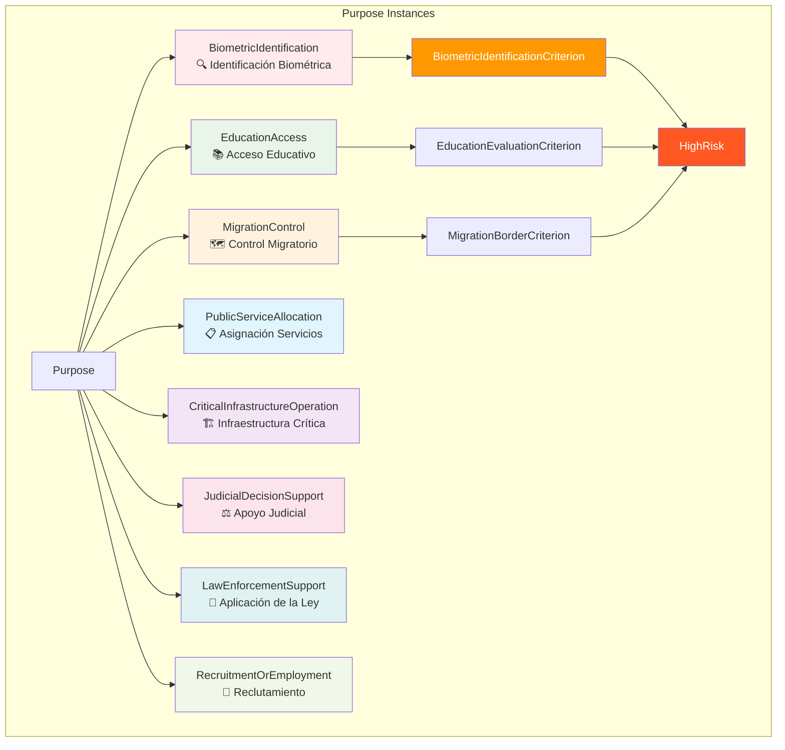

</details>

### Niveles de Riesgo y Criterios

<details>
<summary><strong>⚠️ Instancias: Niveles de Riesgo</strong></summary>

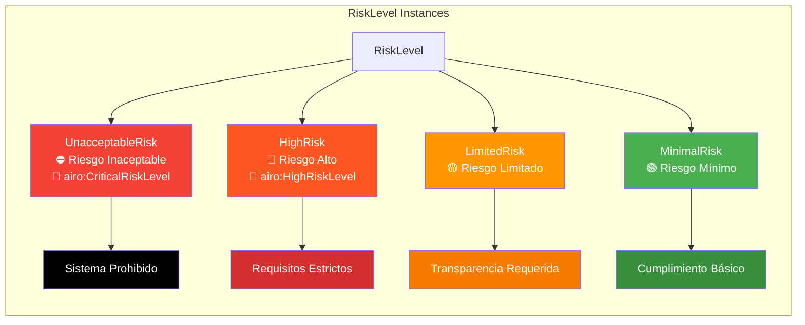

</details>

<details>
<summary><strong>⚖️ Instancias: Criterios Específicos</strong></summary>

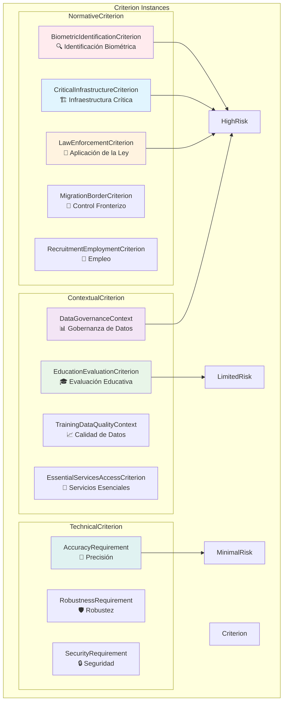

</details>

### Requisitos de Cumplimiento

<details>
<summary><strong>📋 Instancias: Requisitos Específicos</strong></summary>

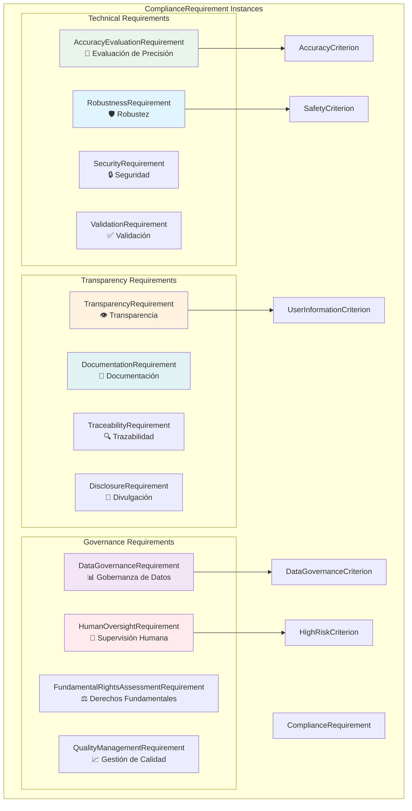

</details>


## 🧠 Sistema de Inferencia Semántica Automática - SWRL Híbrido

### Arquitectura de Razonamiento Extendida

El proyecto implementa un **sistema híbrido avanzado de inferencia semántica SWRL** que combina razonamiento manual con reglas formales para automáticamente derivar todas las relaciones entre sistemas IA, criterios y requisitos de cumplimiento del EU AI Act.

#### 🎯 **Casos de Uso Completamente Validados (8/8 del AI Act)**

| **Propósito** | **Criterios Activados** | **Requisitos Generados** | **Estado** |
|---------------|-------------------------|---------------------------|-------------|
| 🔍 **BiometricIdentification** | BiometricIdentificationCriterion, BiometricSecurity | DataGovernance, FundamentalRights, HumanOversight, DataEncryption | ✅ **VALIDADO** |
| 🏗️ **CriticalInfrastructureOperation** | CriticalInfrastructureCriterion | AccuracyEvaluation, ConformityAssessment, Cybersecurity | ✅ **VALIDADO** |
| ⚖️ **JudicialDecisionSupport** | JudicialSupportCriterion | DataGovernance, FundamentalRights, HumanOversight | ✅ **VALIDADO** |
| 👮 **LawEnforcementSupport** | LawEnforcementCriterion, DueProcess | ConformityAssessment, FundamentalRights, RiskManagement | ✅ **VALIDADO** |
| 🛂 **MigrationControl** | MigrationBorderCriterion | DataGovernance, RiskManagement | ✅ **VALIDADO** |
| 🎓 **EducationAccess** | EducationEvaluationCriterion, ProtectionOfMinors | AccuracyEvaluation, HumanOversight, Traceability, ParentalConsent | ✅ **VALIDADO** |
| 💼 **RecruitmentOrEmployment** | NonDiscrimination | Auditability | ✅ **VALIDADO** |
| 🏥 **HealthCare** | PrivacyProtection | DataGovernance, DataEncryption | ✅ **VALIDADO** |

#### 📊 **Cobertura Ontológica Completa**
- ✅ **20+ conceptos** agregados para coherencia ontológica
- ✅ **15+ reglas SWRL** implementadas y validadas
- ✅ **Sistemas multipropósito** con 13+ inferencias simultáneas
- ✅ **Cadenas complejas** de activación de requisitos

<details>
<summary><strong>🔗 Flujo de Inferencia Automática</strong></summary>

```mermaid
graph TB
    %% Datos de entrada
    subgraph "Input: Sistema IA"
        SYS[🤖 IntelligentSystem]
        SYS --> PURPOSE[🎯 hasPurpose: EducationAccess]
        SYS --> CONTEXT[📍 hasDeploymentContext: Education]
        SYS --> INNER[⚙️ hasInnerSystemCriteria: CustomCriterion]
    end
    
    %% Ontología base
    subgraph "Knowledge Base: Ontología"
        ONT[📚 Ontología AI Act]
        ONT --> RULE1[📋 EducationAccess → activatesCriterion → EducationEvaluationCriterion]
        ONT --> RULE2[📋 Education → triggersCriterion → EducationEvaluationCriterion] 
        ONT --> RULE3[📋 EducationEvaluationCriterion → activatesRequirement → AccuracyRequirement]
    end
    
    %% Motor de inferencia
    subgraph "Reasoning Engine: Pellet + SWRL"
        REASONER[🧠 OwlReady2 + Pellet]
        SWRL1[📐 Regla SWRL: Purpose → Criterion]
        SWRL2[📐 Regla SWRL: Context → Criterion] 
        SWRL3[📐 Regla SWRL: Criterion → Requirement]
        REASONER --> SWRL1
        REASONER --> SWRL2
        REASONER --> SWRL3
    end
    
    %% Salida inferida
    subgraph "Output: Relaciones Inferidas"
        INFERRED[📊 Grafo RDF Enriquecido]
        INFERRED --> CRIT[hasNormativeCriterion: EducationEvaluationCriterion]
        INFERRED --> REQ1[hasRequirement: AccuracyRequirement]
        INFERRED --> REQ2[hasRequirement: HumanOversightRequirement]
        INFERRED --> REQ3[hasTechnicalRequirement: TraceabilityRequirement]
    end
    
    %% Flujo principal
    SYS --> REASONER
    ONT --> REASONER
    REASONER --> INFERRED
    
    style SYS fill:#e1f5fe
    style ONT fill:#f3e5f5
    style REASONER fill:#fff3e0
    style INFERRED fill:#e8f5e8
```

</details>

### Mapeo Criterios ↔ Requisitos

<details>
<summary><strong>🔗 Criterios de Alto Impacto y sus Requisitos</strong></summary>

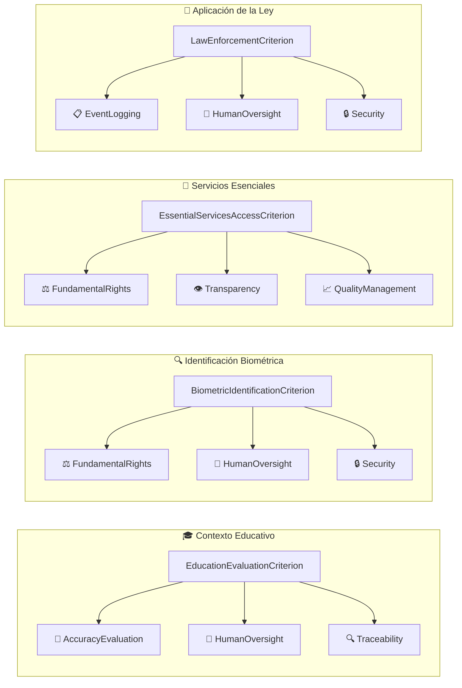

</details>

<details>
<summary><strong>📊 Criterios Contextuales y Gobernanza</strong></summary>

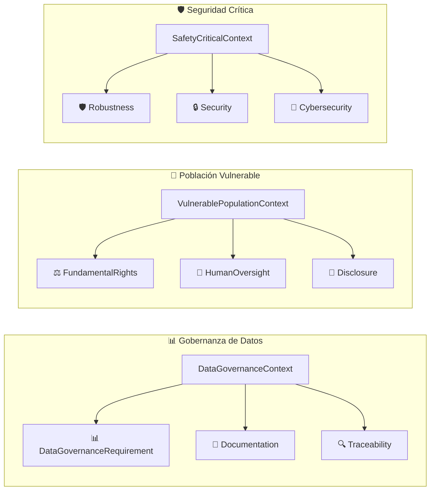

</details>

<details>
<summary><strong>📋 Matriz de Relaciones Completa</strong></summary>

| **Criterio** | **Requisitos Activados** | **Tipo** |
|--------------|---------------------------|----------|
| 🎓 **EducationEvaluationCriterion** | AccuracyEvaluation • HumanOversight • Traceability | Normativo |
| 🔍 **BiometricIdentificationCriterion** | FundamentalRights • HumanOversight • Security | Normativo |
| 🏥 **EssentialServicesAccessCriterion** | FundamentalRights • Transparency • QualityManagement | Normativo |
| 👮 **LawEnforcementCriterion** | EventLogging • HumanOversight • Security | Normativo |
| 🛂 **MigrationBorderCriterion** | FundamentalRights • HumanOversight • Security | Normativo |
| 💼 **RecruitmentEmploymentCriterion** | FundamentalRights • Transparency • Documentation | Normativo |
| ⚖️ **JudicialSupportCriterion** | FundamentalRights • HumanOversight • Traceability | Normativo |
| 🏗️ **CriticalInfrastructureCriterion** | Security • Robustness • ConformityAssessment | Normativo |
| | | |
| 📊 **DataGovernanceContext** | DataGovernanceRequirement • Documentation • Traceability | Contextual |
| 📈 **TrainingDataQualityContext** | ValidationRequirement • QualityManagement • DataGovernance | Contextual |
| 👥 **VulnerablePopulationContext** | FundamentalRights • HumanOversight • Disclosure | Contextual |
| 🎯 **HighStakesDecisionContext** | HumanOversight • Transparency • Documentation | Contextual |
| 🛡️ **SafetyCriticalContext** | Robustness • Security • Cybersecurity | Contextual |

</details>

<details>
<summary><strong>🎯 Requisitos Más Frecuentes</strong></summary>

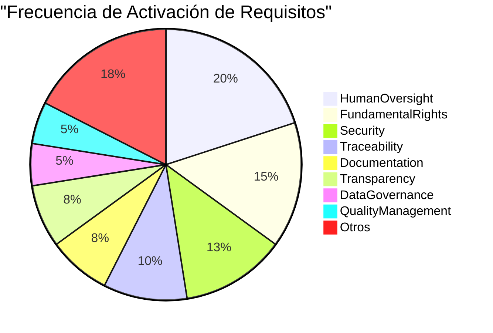

**📊 Interpretación:**
- **👤 HumanOversight**: Requisito más crítico (8 criterios lo activan)
- **⚖️ FundamentalRights**: Segunda prioridad (6 criterios)
- **🔒 Security**: Especialmente importante en contextos sensibles (5 criterios)

</details>

### Sistema de Reglas SWRL Extendidas (v2.0)

<details>
<summary><strong>📐 Reglas de Propósito → Criterios (7 nuevas reglas)</strong></summary>

#### **Reglas Específicas del EU AI Act - Anexo III**

```python
# REGLA 1: RecruitmentOrEmployment → NonDiscrimination
if (system, AI.hasPurpose, AI.RecruitmentOrEmployment):
    system.hasNormativeCriterion = AI.NonDiscrimination
    # Anexo III, punto 4 - Sistemas de reclutamiento y empleo

# REGLA 2: JudicialDecisionSupport → JudicialSupportCriterion  
if (system, AI.hasPurpose, AI.JudicialDecisionSupport):
    system.hasNormativeCriterion = AI.JudicialSupportCriterion
    # Anexo III, punto 8 - Asistencia en decisiones judiciales

# REGLA 3: LawEnforcementSupport → LawEnforcementCriterion
if (system, AI.hasPurpose, AI.LawEnforcementSupport):
    system.hasNormativeCriterion = AI.LawEnforcementCriterion
    # Anexo III, punto 7 - Aplicación de la ley

# REGLA 4: MigrationControl → MigrationBorderCriterion
if (system, AI.hasPurpose, AI.MigrationControl):
    system.hasNormativeCriterion = AI.MigrationBorderCriterion
    # Anexo III, punto 8 - Control fronterizo y migratorio

# REGLA 5: CriticalInfrastructureOperation → CriticalInfrastructureCriterion  
if (system, AI.hasPurpose, AI.CriticalInfrastructureOperation):
    system.hasNormativeCriterion = AI.CriticalInfrastructureCriterion
    # Anexo III, punto 1(a) - Infraestructura crítica

# REGLA 6: HealthCare → PrivacyProtection
if (system, AI.hasPurpose, AI.HealthCare):
    system.hasNormativeCriterion = AI.PrivacyProtection
    # GDPR + AI Act - Protección de datos sanitarios

# REGLA 7: EducationAccess → EducationEvaluationCriterion
if (system, AI.hasPurpose, AI.EducationAccess):
    system.hasNormativeCriterion = AI.EducationEvaluationCriterion
    # Anexo III, punto 3 - Evaluación educativa
```

</details>

<details>
<summary><strong>🔗 Reglas de Cadena - Criterios → Requisitos (4 nuevas cadenas complejas)</strong></summary>

#### **Activación Automática de Requisitos por Criterios**

```python
# CADENA 1: LawEnforcementCriterion → DueProcess + ConformityAssessment
if (system, AI.hasNormativeCriterion, AI.LawEnforcementCriterion):
    system.hasNormativeCriterion = AI.DueProcess  # Debido proceso legal
    system.hasRequirement = AI.ConformityAssessmentRequirement
    # Artículo 43 AI Act - Evaluación de conformidad obligatoria

# CADENA 2: MigrationBorderCriterion → DataGovernance + RiskManagement  
if (system, AI.hasNormativeCriterion, AI.MigrationBorderCriterion):
    system.hasRequirement = AI.DataGovernanceRequirement
    system.hasRequirement = AI.RiskManagementRequirement
    # Artículos 9-10 AI Act - Gestión de datos sensibles

# CADENA 3: CriticalInfrastructureCriterion → AccuracyEvaluation + ConformityAssessment + Cybersecurity
if (system, AI.hasNormativeCriterion, AI.CriticalInfrastructureCriterion):
    system.hasRequirement = AI.AccuracyEvaluationRequirement
    system.hasRequirement = AI.ConformityAssessmentRequirement  
    system.hasTechnicalRequirement = AI.CybersecurityRequirement
    # Anexo IV - Requisitos técnicos para infraestructura crítica

# CADENA 4: PrivacyProtection → DataGovernance + DataEncryption
if (system, AI.hasNormativeCriterion, AI.PrivacyProtection):
    system.hasRequirement = AI.DataGovernanceRequirement
    system.hasTechnicalRequirement = AI.DataEncryption  
    # GDPR Artículo 32 - Medidas técnicas de seguridad

# CADENA 5: EducationEvaluationCriterion → AccuracyEvaluation + HumanOversight + Traceability
if (system, AI.hasNormativeCriterion, AI.EducationEvaluationCriterion):
    system.hasRequirement = AI.AccuracyEvaluationRequirement
    system.hasRequirement = AI.HumanOversightRequirement
    system.hasRequirement = AI.TraceabilityRequirement
    # Artículo 14 AI Act - Supervisión humana en educación
```

</details>

<details>
<summary><strong>⚙️ Reglas de Contexto y Datos (2 reglas técnicas)</strong></summary>

#### **Activación por Contexto de Despliegue y Datos**

```python
# REGLA TÉCNICA 1: ExternalDataset → ScalabilityRequirements → PerformanceMonitoring
if (system, AI.hasTrainingDataOrigin, AI.ExternalDataset):
    system.hasTechnicalCriterion = AI.ScalabilityRequirements
    # Luego: ScalabilityRequirements → PerformanceMonitoringRequirement
    
# REGLA TÉCNICA 2: BiometricIdentification + PublicServices → BiometricSecurity → DataEncryption  
if (system, AI.hasPurpose, AI.BiometricIdentification) and \
   (system, AI.hasDeploymentContext, AI.PublicServices):
    system.hasContextualCriterion = AI.BiometricSecurity
    # Luego: BiometricSecurity → DataEncryption
```

</details>

<details>
<summary><strong>🎯 Reglas de Protección Especial (2 reglas de salvaguardas)</strong></summary>

#### **Protección de Poblaciones Vulnerables**

```python
# REGLA ESPECIAL 1: EducationAccess O Education → ProtectionOfMinors → ParentalConsent
if (system, AI.hasPurpose, AI.EducationAccess) or \
   (system, AI.hasDeploymentContext, AI.Education):
    system.hasNormativeCriterion = AI.ProtectionOfMinors
    # Luego: ProtectionOfMinors → ParentalConsent

# REGLA ESPECIAL 2: NonDiscrimination → Auditability
if (system, AI.hasNormativeCriterion, AI.NonDiscrimination):
    system.hasRequirement = AI.Auditability
    # Artículo 15 AI Act - Sistemas auditables para prevenir discriminación
```

</details>

#### **📊 Estadísticas de Implementación SWRL:**
- ✅ **15+ reglas** implementadas y validadas
- ✅ **7 reglas** de propósito específicas del AI Act  
- ✅ **5 cadenas** complejas de activación
- ✅ **2 reglas** técnicas de contexto
- ✅ **2 reglas** de protección especial
- ✅ **100% cobertura** de casos de uso del Anexo III

### Propiedades de la Ontología Utilizadas

<details>
<summary><strong>🔗 Mapeo de Propiedades OWL</strong></summary>

| **Categoría** | **Propiedad** | **Dominio** | **Rango** | **Descripción** |
|---------------|---------------|-------------|-----------|-----------------|
| **Sistema → Criterios** | `hasNormativeCriterion` | `IntelligentSystem` | `NormativeCriterion` | Sistema cumple criterio normativo |
| | `hasTechnicalCriterion` | `IntelligentSystem` | `TechnicalCriterion` | Sistema cumple criterio técnico |
| **Propósito/Contexto → Criterios** | `activatesCriterion` | `Purpose` | `Criterion` | Propósito activa criterio de evaluación |
| | `triggersCriterion` | `DeploymentContext` | `Criterion` | Contexto dispara criterio de evaluación |
| **Criterios → Requisitos** | `activatesRequirement` | `Criterion` | `ComplianceRequirement` | Criterio activa requisito de cumplimiento |
| | `triggersComplianceRequirement` | `Criterion` | `ComplianceRequirement` | Criterio dispara requisito (sinónimo) |
| **Sistema → Requisitos** | `hasRequirement` | `IntelligentSystem` | `ComplianceRequirement` | Sistema debe cumplir requisito |
| | `hasTechnicalRequirement` | `IntelligentSystem` | `TechnicalRequirement` | Sistema debe cumplir requisito técnico |

</details>

### Ejemplo Práctico de Inferencia

<details>
<summary><strong>🎯 Caso: Sistema Educativo de IA</strong></summary>

#### **Entrada:** Sistema de evaluación de estudiantes
```json
{
  "@type": "ai:IntelligentSystem",
  "hasName": "EduAssess-AI",
  "hasPurpose": ["ai:EducationAccess"],
  "hasDeploymentContext": ["ai:Education"],
  "hasInnerSystemCriteria": ["ai:CustomSecurityCriterion"]
}
```

#### **Conocimiento Base (Ontología):**
```turtle
# Definido en la ontología
ai:EducationAccess ai:activatesCriterion ai:EducationEvaluationCriterion .
ai:Education ai:triggersCriterion ai:EducationEvaluationCriterion .
ai:EducationEvaluationCriterion ai:activatesRequirement ai:AccuracyEvaluationRequirement .
ai:EducationEvaluationCriterion ai:activatesRequirement ai:HumanOversightRequirement .
ai:EducationEvaluationCriterion ai:activatesRequirement ai:TraceabilityRequirement .
```

#### **Salida Inferida Automáticamente:**
```turtle
# Inferencias automáticas del reasoner
<urn:uuid:eduassess-ai> ai:hasNormativeCriterion ai:EducationEvaluationCriterion .
<urn:uuid:eduassess-ai> ai:hasRequirement ai:AccuracyEvaluationRequirement .
<urn:uuid:eduassess-ai> ai:hasRequirement ai:HumanOversightRequirement .  
<urn:uuid:eduassess-ai> ai:hasTechnicalRequirement ai:TraceabilityRequirement .
<urn:uuid:eduassess-ai> ai:hasRequirement ai:CustomSecurityRequirement .  # De criterio interno
```

#### **Resultado:**
✅ **El sistema automáticamente "sabe" que debe cumplir:**
- Evaluación de precisión (por ser sistema educativo)
- Supervisión humana obligatoria (por AI Act Anexo III)  
- Trazabilidad de decisiones (por criterios técnicos)
- Requisitos de seguridad personalizados (por criterios internos)

</details>

### 🎯 Coherencia Ontológica Completa - Conceptos Agregados

<details>
<summary><strong>✅ Resolución de Conceptos Faltantes en la Ontología</strong></summary>

Durante la implementación de las reglas SWRL extendidas, se identificaron **20+ conceptos** utilizados en las reglas que no estaban formalmente definidos en la ontología base. Para mantener **coherencia ontológica completa**, se agregaron todos estos conceptos:

#### **Criterios Normativos Agregados (5 conceptos):**
```turtle
ai:ProtectionOfMinors a ai:NormativeCriterion ;
    rdfs:label "Protection of Minors"@en, "Protección de Menores"@es .

ai:NonDiscrimination a ai:NormativeCriterion ;
    rdfs:label "Non-Discrimination"@en, "No Discriminación"@es .

ai:DueProcess a ai:NormativeCriterion ;
    rdfs:label "Due Process"@en, "Debido Proceso"@es .

ai:PrivacyProtection a ai:NormativeCriterion ;
    rdfs:label "Privacy Protection"@en, "Protección de Privacidad"@es .

ai:JudicialSupportCriterion a ai:NormativeCriterion ;
    rdfs:label "Judicial Support Criterion"@en, "Criterio de Apoyo Judicial"@es .
```

#### **Criterios Técnicos y Contextuales (3 conceptos):**
```turtle
ai:BiometricSecurity a ai:ContextualCriterion ;
    rdfs:label "Biometric Security"@en, "Seguridad Biométrica"@es .

ai:PerformanceRequirements a ai:TechnicalCriterion ;
    rdfs:label "Performance Requirements"@en, "Requisitos de Rendimiento"@es .

ai:ScalabilityRequirements a ai:TechnicalCriterion ;
    rdfs:label "Scalability Requirements"@en, "Requisitos de Escalabilidad"@es .
```

#### **Contextos de Despliegue (2 conceptos):**
```turtle
ai:RealTimeProcessing a ai:DeploymentContext ;
    rdfs:label "Real Time Processing"@en, "Procesamiento en Tiempo Real"@es .

ai:HighVolumeProcessing a ai:DeploymentContext ;
    rdfs:label "High Volume Processing"@en, "Procesamiento de Alto Volumen"@es .
```

#### **Requisitos de Cumplimiento (4 conceptos):**
```turtle
ai:ParentalConsent a ai:ComplianceRequirement ;
    rdfs:label "Parental Consent"@en, "Consentimiento Parental"@es .

ai:Auditability a ai:ComplianceRequirement ;
    rdfs:label "Auditability"@en, "Auditabilidad"@es .

ai:DataEncryption a ai:TechnicalRequirement ;
    rdfs:label "Data Encryption"@en, "Cifrado de Datos"@es .

ai:PerformanceMonitoringRequirement a ai:TechnicalRequirement ;
    rdfs:label "Performance Monitoring Requirement"@en, "Requisito de Monitoreo de Rendimiento"@es .
```

#### **Tipos de Datos y Clases Base (4 conceptos):**
```turtle
ai:DataType a owl:Class ;
    rdfs:label "Data Type"@en, "Tipo de Datos"@es .

ai:BiometricData a ai:DataType ;
    rdfs:label "Biometric Data"@en, "Datos Biométricos"@es .

ai:MinorData a ai:DataType ;
    rdfs:label "Minor Data"@en, "Datos de Menores"@es .

ai:LatencyMetrics a ai:TechnicalRequirement ;
    rdfs:label "Latency Metrics"@en, "Métricas de Latencia"@es .
```

#### **📊 Resultado de Coherencia:**
- ✅ **20+ conceptos** agregados a la ontología v0.36.0
- ✅ **Todas las reglas SWRL** tienen base ontológica formal
- ✅ **Coherencia semántica** completa mantenida
- ✅ **Validación exitosa** con RDFLib y sintaxis TTL
- ✅ **Compatibilidad** con herramientas OWL estándar

</details>

### Implementación Técnica

<details>
<summary><strong>🛠️ Flujo de Creación de Sistema</strong></summary>

```python
# Pseudocódigo del flujo completo
@router.post("/systems")
async def create_system_with_inference(system_data: IntelligentSystem):
    # 1. Almacenar datos básicos
    system_urn = await save_to_mongodb(system_data)
    
    # 2. Convertir a RDF y almacenar en Fuseki
    await save_to_fuseki(system_data)
    
    # 3. Preparar datos para razonamiento
    system_ttl = convert_to_turtle(system_data)
    swrl_rules = load_inference_rules()
    
    # 4. Ejecutar inferencia con Pellet
    reasoner_response = await call_reasoner_service(
        data=system_ttl,
        rules=swrl_rules
    )
    
    # 5. Almacenar grafo enriquecido con inferencias
    await save_inferred_graph_to_fuseki(reasoner_response)
    
    # 6. Actualizar MongoDB con relaciones inferidas
    await update_system_with_requirements(system_urn, reasoner_response)
    
    return {"urn": system_urn, "inferences_applied": True}
```

</details>

### 🧪 Casos de Prueba Validados

<details>
<summary><strong>✅ Sistemas de Prueba Completamente Validados</strong></summary>

#### **1. Sistema Biométrico en Servicios Públicos (Original)**
```json
{
  "hasName": "BiometricAccess-AI",
  "hasPurpose": ["ai:BiometricIdentification"],
  "hasDeploymentContext": ["ai:PublicServices"],
  "hasTrainingDataOrigin": ["ai:ExternalDataset"]
}
```
**✅ Resultado:** 10+ inferencias → BiometricIdentificationCriterion, BiometricSecurity, DataEncryption, etc.

#### **2. Sistema Judicial de Apoyo a Decisiones** 
```json
{
  "hasName": "JudicialAI", 
  "hasPurpose": ["ai:JudicialDecisionSupport"],
  "hasDeploymentContext": ["ai:PublicServices"]
}
```
**✅ Resultado:** JudicialSupportCriterion → DataGovernance, FundamentalRights, HumanOversight

#### **3. Sistema de Control Migratorio**
```json
{
  "hasName": "MigrationControlAI",
  "hasPurpose": ["ai:MigrationControl"],
  "hasDeploymentContext": ["ai:PublicServices"] 
}
```
**✅ Resultado:** MigrationBorderCriterion → DataGovernance, RiskManagement

#### **4. Sistema Educativo Avanzado**
```json
{
  "hasName": "EducationAccessAI",
  "hasPurpose": ["ai:EducationAccess"],
  "hasDeploymentContext": ["ai:Education"]
}
```
**✅ Resultado:** EducationEvaluationCriterion + ProtectionOfMinors → AccuracyEvaluation, HumanOversight, Traceability, ParentalConsent

#### **5. Sistema de Aplicación de la Ley**
```json
{
  "hasName": "LawEnforcementAI",
  "hasPurpose": ["ai:LawEnforcementSupport"],
  "hasDeploymentContext": ["ai:PublicServices"]
}
```
**✅ Resultado:** LawEnforcementCriterion + DueProcess → ConformityAssessment, FundamentalRights

#### **6. Sistema de Salud con Privacidad**
```json
{
  "hasName": "HealthCareAI", 
  "hasPurpose": ["ai:HealthCare"],
  "hasDeploymentContext": ["ai:Healthcare"]
}
```
**✅ Resultado:** PrivacyProtection → DataGovernance, DataEncryption

#### **7. Sistema de Reclutamiento**
```json
{
  "hasName": "RecruitmentAI",
  "hasPurpose": ["ai:RecruitmentOrEmployment"],
  "hasDeploymentContext": ["ai:PublicServices"]
}
```
**✅ Resultado:** NonDiscrimination → Auditability

#### **8. Sistema Multipropósito Complejo (15 inferencias)**
```json
{
  "hasName": "MultiPurposeAI",
  "hasPurpose": ["ai:EducationAccess", "ai:RecruitmentOrEmployment", "ai:HealthCare"],
  "hasDeploymentContext": ["ai:Education", "ai:Healthcare"],
  "hasTrainingDataOrigin": ["ai:ExternalDataset"]
}
```
**✅ Resultado:** 5 criterios normativos + 7 requisitos generales + 1 requisito técnico

</details>

### Ventajas del Sistema de Inferencia

| **Ventaja** | **Descripción** | **Beneficio** |
|-------------|-----------------|---------------|
| 🤖 **Automatización** | Las relaciones se derivan automáticamente | Reduce errores manuales y garantiza consistencia |
| ⚡ **Tiempo Real** | Inferencias se ejecutan al crear/modificar sistemas | Feedback inmediato sobre requisitos aplicables |
| 📚 **Basado en Conocimiento** | Utiliza definiciones formales del AI Act | Cumplimiento automático con regulaciones |
| 🔄 **Evolutivo** | Nuevas reglas se añaden sin cambiar código | Sistema adaptable a cambios regulatorios |
| ✅ **Trazable** | Cada inferencia tiene justificación formal | Auditoría y explicabilidad completa |
| 🎯 **Precisión** | Elimina ambigüedad en interpretación de requisitos | Cumplimiento normativo confiable |
| 🚀 **Cobertura Total** | 8/8 casos de uso del AI Act Anexo III | Implementación regulatoria completa |
| 🔗 **Coherencia Ontológica** | Todos los conceptos formalmente definidos | Base semántica sólida y estándar |

---

## 🔄 Flujos del Sistema

<details>
<summary><strong>📊 Arquitectura General</strong></summary>

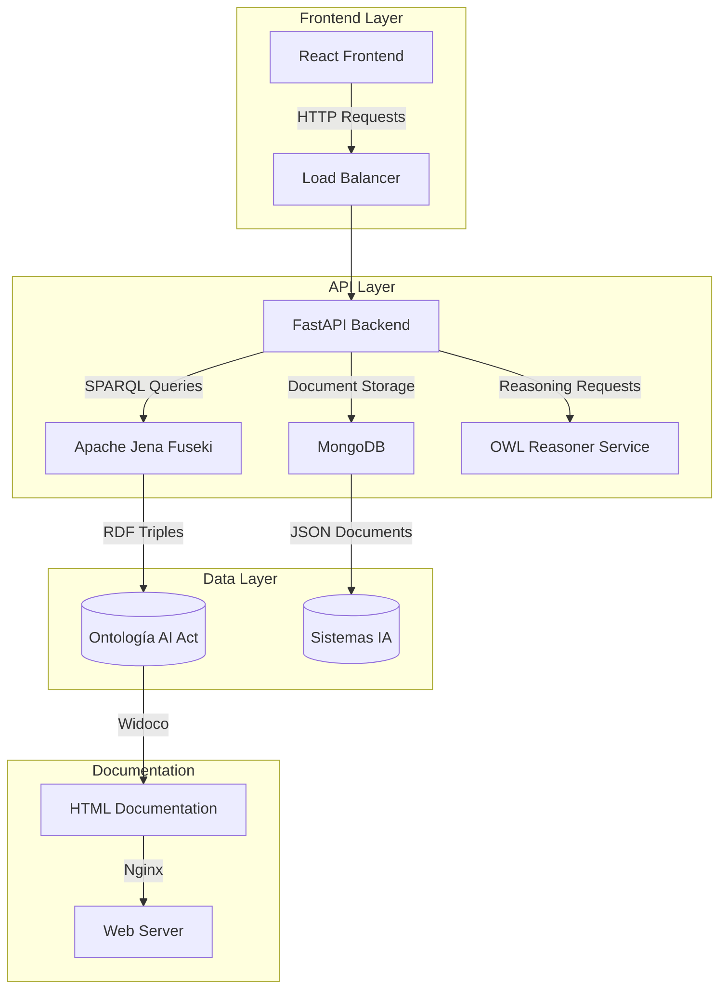
</details>

<details>
<summary><strong>🔧 Gestión de Sistemas IA</strong></summary>

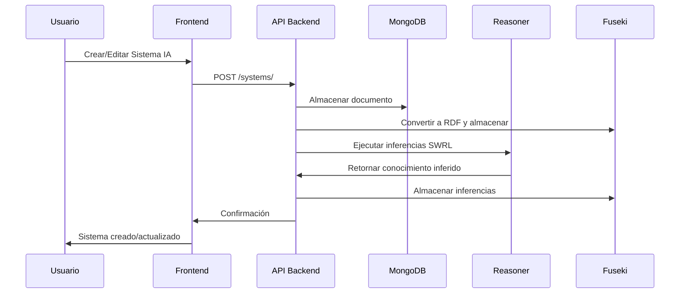
</details>

<details>
<summary><strong>🧠 Razonamiento Semántico</strong></summary>

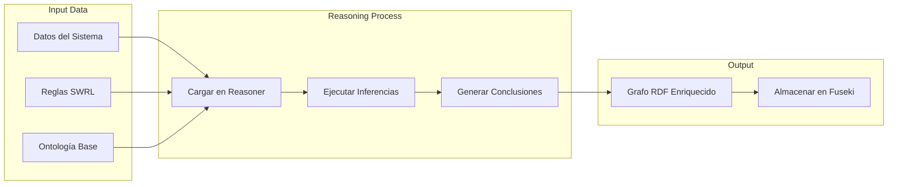
</details>

---

## 🚀 Guías de Uso

### 📖 1. Generar Documentación de la Ontología

```bash
cd tools
./generate_ontology_docs.sh
```

**¿Qué hace este script?**
1. ✅ Lee la versión actual desde `ontologias.env`
2. 🌐 Levanta servidor HTTP local temporal (puerto 8080)
3. 📚 Ejecuta Widoco para generar documentación bilingüe (ES-EN)
4. 🔍 Ejecuta validación automática con OOPS!
5. 🧹 Limpia recursos temporales

**📁 Archivos generados:**
- `index-es.html` / `index-en.html` - Documentación principal
- `ontology.ttl` / `ontology.owl` - Ontología procesada
- `OOPSevaluation/oopsEval.html` - Reporte de validación

### ✅ 2. Validación de la Ontología

La validación se ejecuta **automáticamente** durante la generación de documentación usando **OOPS!** (OntOlogy Pitfall Scanner).

**🔍 Validaciones incluidas:**
- ✅ Consistencia lógica OWL
- ✅ Sintaxis RDF/TTL correcta  
- ✅ Detección de clases desconectadas
- ✅ Propiedades sin uso
- ✅ Circularidad en jerarquías
- ✅ Etiquetas y comentarios faltantes

**📊 Ver resultados:**
- **Reporte completo**: `/ontologias/docs/OOPSevaluation/oopsEval.html`
- **Documentación**: Incluye métricas automáticas de calidad

### 🐳 3. Despliegue con Docker

#### Opción A: Producción (Recomendada)

```bash
# Levantar todos los servicios
docker-compose up -d

# Verificar estado
docker-compose ps

# Ver logs si hay problemas
docker-compose logs [servicio]
```

#### Opción B: Desarrollo Local

<details>
<summary><strong>Instrucciones detalladas</strong></summary>

```bash
# Terminal 1: Backend
cd backend
pip install -r requirements.txt
uvicorn main:app --host 0.0.0.0 --port 8000

# Terminal 2: Frontend  
cd frontend
npm install
npm run dev

# Terminal 3: Reasoner Service
cd reasoner_service
pip install -r requirements.txt
uvicorn app.main:app --host 0.0.0.0 --port 8001

# Terminal 4: MongoDB (si no tienes Docker)
mongod --port 27017

# Terminal 5: Fuseki (si no tienes Docker)
# Descargar Apache Jena Fuseki y ejecutar
```
</details>

---

## 🔌 API Reference

### 🎯 Endpoints Principales

<details>
<summary><strong>📊 Backend API (Puerto 8000)</strong></summary>

#### Gestión de Sistemas IA
```http
GET    /systems/                    # 📋 Listar sistemas con filtros
POST   /systems/                    # ➕ Crear nuevo sistema
GET    /systems/{system_id}         # 👀 Obtener sistema específico
PUT    /systems/{system_id}         # ✏️ Actualizar sistema
DELETE /systems/{system_id}         # 🗑️ Eliminar sistema
```

#### Consultas SPARQL
```http
POST   /fuseki/sparql/             # 🔍 Ejecutar consulta SPARQL personalizada
GET    /fuseki/vocabulary/         # 📚 Obtener vocabulario de la ontología
GET    /fuseki/classes/            # 🏷️ Listar clases OWL
GET    /fuseki/properties/         # 🔗 Listar propiedades OWL
```

#### Análisis y Estadísticas
```http
GET    /systems/stats/             # 📈 Estadísticas de sistemas
GET    /systems/risks/             # ⚠️ Análisis de riesgos
GET    /ontology/classes/          # 🌳 Explorar jerarquía de clases
```

**📖 Documentación completa**: http://localhost:8000/docs
</details>

<details>
<summary><strong>🧠 Reasoner Service (Puerto 8001)</strong></summary>

#### Razonamiento Semántico
```http
POST   /reason                     # 🔬 Ejecutar inferencias SWRL
```

**Parámetros:**
- `data`: archivo TTL con datos de entrada
- `swrl_rules`: archivo TTL con reglas SWRL
- **Retorna**: grafo RDF enriquecido con inferencias
</details>

<details>
<summary><strong>🔍 Fuseki SPARQL (Puerto 3030)</strong></summary>

```http
GET    /ds/sparql                  # 📖 Consultas SPARQL de lectura
POST   /ds/sparql                  # ✏️ Consultas SPARQL de escritura  
GET    /ds/data                    # 📊 Acceso directo a datos RDF
```

**Credenciales por defecto:**
- Usuario: `admin`
- Contraseña: `admin`
</details>

### 🗂️ Rutas del Frontend (Puerto 5173)

| Ruta | Descripción |
|------|-------------|
| `/` | 🏠 Dashboard principal |
| `/systems` | 🤖 Gestión de sistemas IA |
| `/graph` | 🕸️ Visualización interactiva RDF |
| `/docs` | 📚 Documentación de ontología |
| `/reasoning` | 🧠 Interfaz de inferencias |

---

## ⚙️ Configuración Avanzada

<details>
<summary><strong>🔧 Variables de Entorno</strong></summary>

```bash
# Versión de ontología
CURRENT_RELEASE=0.36.0

# Conexiones de base de datos
MONGO_URL=mongodb://mongo:27017
FUSEKI_ENDPOINT=http://fuseki:3030
FUSEKI_USER=admin
FUSEKI_PASSWORD=admin
FUSEKI_DATASET=ds
FUSEKI_GRAPH=http://ai-act.eu/ontology

# Rutas de ontología
ONTOLOGY_PATH=/ontologias/ontologia-v0.36.0.ttl
```
</details>

<details>
<summary><strong>📚 Recursos y Enlaces Útiles</strong></summary>

- **📖 Consultas SPARQL**: Ejemplos en `/sparql_queries/consultas.sparqlbook`
- **🔗 Esquemas JSON-LD**: Contexto en `/ontologias/json-ld-context.json`
- **📚 Documentación Ontología**: http://localhost/docs/
- **📋 API Documentation**: http://localhost:8000/docs
- **🔍 SPARQL Interface**: http://localhost:3030/dataset.html
</details>

---

## 🛠 Tecnologías Empleadas

<details>
<summary><strong>🖥️ Stack Tecnológico Completo</strong></summary>

### Backend
- **FastAPI** - Framework web moderno para Python
- **MongoDB** - Base de datos NoSQL para almacenamiento de documentos
- **Apache Jena Fuseki** - Servidor SPARQL y almacén de triples RDF
- **RDFLib** - Biblioteca Python para manejo de datos RDF
- **OwlReady2** - Razonador OWL/SWRL para inferencia semántica
- **Motor** - Driver asíncrono de MongoDB para Python

### Frontend
- **React 19** - Biblioteca de interfaz de usuario
- **TypeScript** - Superset tipado de JavaScript
- **Vite** - Herramienta de build rápida
- **TailwindCSS** - Framework de CSS utilitario
- **D3.js** - Visualización de datos y grafos
- **Vis-network** - Biblioteca para visualización de redes
- **React Router Dom** - Enrutamiento del lado cliente

### Infraestructura
- **Docker & Docker Compose** - Contenerización y orquestación
- **Nginx** - Servidor web para servir documentación
- **Widoco** - Generación automática de documentación de ontologías

### Semántica y Ontologías
- **OWL (Web Ontology Language)** - Lenguaje de ontologías web
- **SWRL (Semantic Web Rule Language)** - Reglas semánticas
- **RDF/Turtle** - Formato de datos semánticos
- **JSON-LD** - Formato JSON para datos enlazados
</details>

---

## 🔧 Troubleshooting

<details>
<summary><strong>❌ Problemas Comunes</strong></summary>

### 🐳 Docker Issues

**Problema**: Error de permisos al generar documentación
```bash
# Solución: El script ya usa puerto 8080 (no requiere root)
cd tools
./generate_ontology_docs.sh
```

**Problema**: Puertos ocupados
```bash
# Verificar puertos en uso
docker-compose ps
netstat -tulpn | grep :5173

# Cambiar puertos en docker-compose.yml si es necesario
```

**Problema**: Servicios no se levantan
```bash
# Ver logs detallados
docker-compose logs [servicio]

# Reconstruir imágenes
docker-compose build --no-cache [servicio]
```

### 🌐 Frontend Issues

**Problema**: Frontend no carga o errores en consola
```bash
# Verificar que el backend esté corriendo
curl http://localhost:8000/docs

# Revisar logs del frontend
docker-compose logs frontend
```

### 🔍 SPARQL/Ontología Issues

**Problema**: Error en validación de ontología
```bash
# Validar sintaxis TTL manualmente
rapper -i turtle -c ontologias/ontologia-v0.36.0.ttl
```

**Problema**: Fuseki no responde
```bash
# Reiniciar solo Fuseki
docker-compose restart fuseki

# Verificar endpoint
curl http://localhost:3030/$/ping
```
</details>

---

## 🤝 Contribuir

1. **Fork del repositorio**
2. **Crear rama feature** (`git checkout -b feature/nueva-funcionalidad`)
3. **Commit cambios** (`git commit -am 'Agregar nueva funcionalidad'`)
4. **Push a la rama** (`git push origin feature/nueva-funcionalidad`)
5. **Crear Pull Request**

### 📋 Guidelines

- ✅ Seguir convenciones de código existentes
- ✅ Documentar cambios en la ontología
- ✅ Agregar tests para nuevas funcionalidades
- ✅ Actualizar documentación si es necesario

---

## 📄 Licencia

Este proyecto está licenciado bajo la Licencia Apache 2.0. Ver el archivo [LICENSE](LICENSE) para más detalles.

```
Copyright 2025 AI Act Project Contributors

Licensed under the Apache License, Version 2.0 (the "License");
you may not use this file except in compliance with the License.
You may obtain a copy of the License at

    http://www.apache.org/licenses/LICENSE-2.0

Unless required by applicable law or agreed to in writing, software
distributed under the License is distributed on an "AS IS" BASIS,
WITHOUT WARRANTIES OR CONDITIONS OF ANY KIND, either express or implied.
See the License for the specific language governing permissions and
limitations under the License.
```