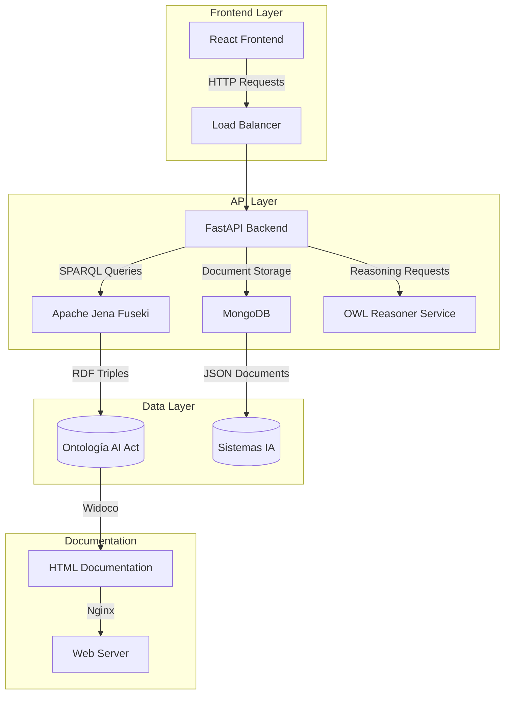
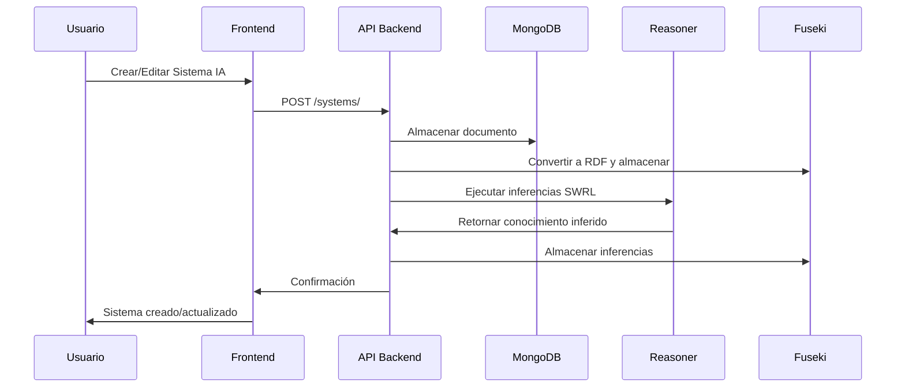
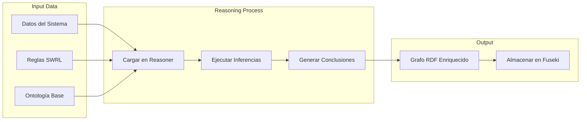
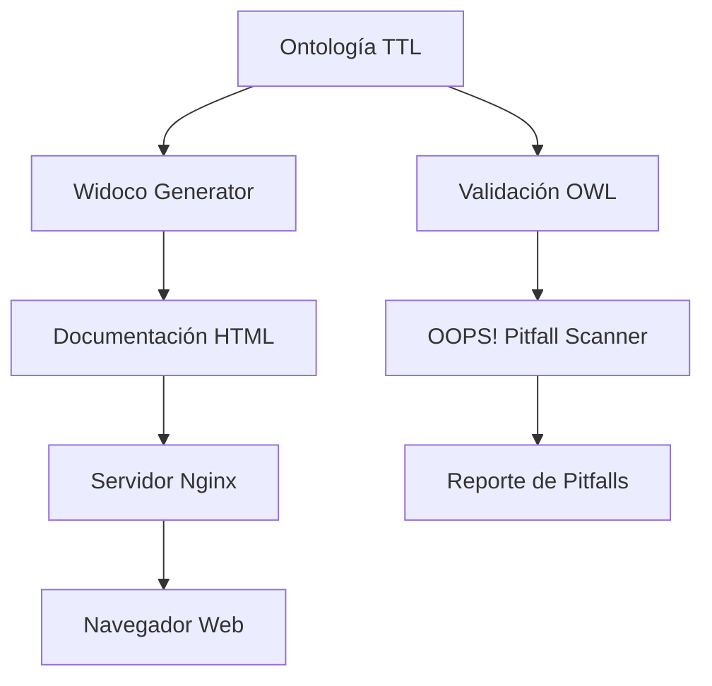

# AI Act Project

## Descripción General

Este proyecto implementa un sistema completo para la gestión y análisis de sistemas de inteligencia artificial bajo el marco del AI Act europeo. El sistema incluye una ontología formal, servicios de razonamiento semántico, APIs REST, y una interfaz web interactiva para la visualización y gestión de datos.

## 🛠 Tecnologías Empleadas

### Backend
- **FastAPI** - Framework web moderno para Python
- **MongoDB** - Base de datos NoSQL para almacenamiento de documentos
- **Apache Jena Fuseki** - Servidor SPARQL y almacén de triples RDF
- **RDFLib** - Biblioteca Python para manejo de datos RDF
- **OwlReady2** - Razonador OWL/SWRL para inferencia semántica
- **Motor** - Driver asíncrono de MongoDB para Python

### Frontend
- **React 19** - Biblioteca de interfaz de usuario
- **TypeScript** - Superset tipado de JavaScript
- **Vite** - Herramienta de build rápida
- **TailwindCSS** - Framework de CSS utilitario
- **D3.js** - Visualización de datos y grafos
- **Vis-network** - Biblioteca para visualización de redes
- **React Router Dom** - Enrutamiento del lado cliente

### Infraestructura
- **Docker & Docker Compose** - Contenerización y orquestación
- **Nginx** - Servidor web para servir documentación
- **Widoco** - Generación automática de documentación de ontologías

### Semántica y Ontologías
- **OWL (Web Ontology Language)** - Lenguaje de ontologías web
- **SWRL (Semantic Web Rule Language)** - Reglas semánticas
- **RDF/Turtle** - Formato de datos semánticos
- **JSON-LD** - Formato JSON para datos enlazados

## 📦 Módulos Integrados

### 1. Backend (`/backend`)
- **API Principal** (`main.py`) - Servidor FastAPI principal
- **Modelos de Datos** (`models/`) - Definiciones de sistemas inteligentes
- **Routers** (`routers/`) - Endpoints REST para sistemas y consultas SPARQL
- **Conexión a Bases de Datos** (`db.py`, `fuseki.py`) - Conectores MongoDB y Fuseki

### 2. Frontend (`/frontend`)
- **Interfaz de Usuario** - Aplicación React con múltiples vistas
- **Páginas** (`src/pages/`) - Gestión de sistemas, dashboard, documentación
- **Componentes** (`src/components/`) - Componentes reutilizables
- **Visualización** (`GraphView.tsx`) - Visualización interactiva de grafos RDF

### 3. Ontologías (`/ontologias`)
- **Ontología Principal** - Modelo formal del dominio AI Act
- **Documentación** (`docs/`) - Documentación HTML generada automáticamente
- **Contexto JSON-LD** - Mapeo de términos para datos enlazados
- **Versionado** (`versions/`) - Control de versiones de ontologías

### 4. Servicios de Razonamiento (`/reasoner_service`)
- **Motor de Inferencia** - Servicio de razonamiento OWL/SWRL
- **API de Razonamiento** - Endpoints para ejecutar inferencias

### 5. Inicialización de Datos (`/init_fuseki`, `/init_mongo`)
- **Cargadores de Datos** - Scripts para poblar las bases de datos
- **Migración de Datos** - Transferencia entre Fuseki y MongoDB

### 6. Herramientas (`/tools`)
- **Generación de Documentación** - Scripts para crear docs de ontologías
- **Validación** - Herramientas para validar ontologías
- **Gestión de Versiones** - Utilidades para releases

## 🔄 Flujos Principales

### Flujo de Arquitectura del Sistema


### Flujo de Gestión de Sistemas IA


### Flujo de Razonamiento Semántico


### Flujo de Documentación de Ontologías


## 🚀 Guía de Uso

### (i) Generar la Documentación de la Ontología

Para generar la documentación HTML de la ontología usando Widoco:

```bash
# Navegar al directorio de herramientas
cd tools

# Ejecutar el script de generación de documentación
./generate_ontology_docs.sh
```

Este script:
1. Lee la versión actual desde `ontologias.env`
2. Levanta un servidor HTTP local temporal
3. Ejecuta Widoco para generar documentación HTML bilingüe (ES-EN)
4. Genera la documentación en `/ontologias/docs/`
5. Limpia el servidor temporal

**Archivos generados:**
- `index-es.html` - Documentación en español
- `index-en.html` - Documentación en inglés
- `ontology.ttl` - Ontología procesada
- `ontology.owl` - Versión OWL de la ontología

### (ii) Validar la Ontología y Detectar Pitfalls

Para validar la ontología y detectar problemas comunes (pitfalls):

```bash
# Validar sintaxis de la ontología
rapper -c ontologias/ontologia-v0.36.0.ttl

# Ejecutar validación con Pellet (si está instalado)
pellet consistency ontologias/ontologia-v0.36.0.ttl

# Para detectar pitfalls, usar OOPS! online o generar reporte automático
cd tools
python3 validate_ontology.py
```

**Validaciones incluidas:**
- ✅ Consistencia lógica
- ✅ Sintaxis RDF/OWL correcta  
- ✅ Detección de clases órfanas
- ✅ Propiedades no utilizadas
- ✅ Circularidad en jerarquías
- ✅ Etiquetas y comentarios faltantes

### (iii) Arrancar la Aplicación

#### Opción 1: Docker Compose (Recomendado)

```bash
# Clonar el repositorio
git clone <repository-url>
cd ai_act_project

# Configurar variables de entorno
source tools/ontologias.env

# Levantar todos los servicios
docker-compose up -d

# Verificar que los servicios estén corriendo
docker-compose ps
```

#### Opción 2: Desarrollo Local

```bash
# Backend
cd backend
pip install -r requirements.txt
uvicorn main:app --host 0.0.0.0 --port 8000

# Frontend (en otra terminal)
cd frontend
npm install
npm run dev

# Reasoner Service (en otra terminal)
cd reasoner_service
pip install -r requirements.txt
uvicorn app.main:app --host 0.0.0.0 --port 8001
```

### 🔌 Endpoints Principales

#### API Backend (Puerto 8000)

##### Gestión de Sistemas IA
```http
GET    /systems/                    # Listar sistemas con filtros
POST   /systems/                    # Crear nuevo sistema
GET    /systems/{system_id}         # Obtener sistema específico
PUT    /systems/{system_id}         # Actualizar sistema
DELETE /systems/{system_id}         # Eliminar sistema
```

##### Consultas SPARQL
```http
POST   /fuseki/sparql/             # Ejecutar consulta SPARQL personalizada
GET    /fuseki/vocabulary/         # Obtener vocabulario de la ontología
GET    /fuseki/classes/            # Listar clases OWL
GET    /fuseki/properties/         # Listar propiedades OWL
```

##### Análisis y Estadísticas
```http
GET    /systems/stats/             # Estadísticas de sistemas
GET    /systems/risks/             # Análisis de riesgos
GET    /ontology/classes/          # Explorar jerarquía de clases
```

#### Reasoner Service (Puerto 8001)

##### Razonamiento Semántico
```http
POST   /reason                     # Ejecutar inferencias SWRL
# Parámetros:
# - data: archivo TTL con datos
# - swrl_rules: archivo TTL con reglas SWRL
# Retorna: grafo RDF enriquecido con inferencias
```

#### Fuseki SPARQL Endpoint (Puerto 3030)

```http
GET    /ds/sparql                  # Consultas SPARQL de lectura
POST   /ds/sparql                  # Consultas SPARQL de escritura
GET    /ds/data                    # Acceso directo a datos RDF
```

#### Frontend (Puerto 5173)

- **Dashboard** (`/`) - Vista general del sistema
- **Sistemas IA** (`/systems`) - Gestión de sistemas inteligentes
- **Vista de Grafo** (`/graph`) - Visualización interactiva RDF
- **Documentación** (`/docs`) - Documentación de ontología
- **Razonamiento** (`/reasoning`) - Interfaz de inferencias

### 📊 Servicios y Puertos

| Servicio | Puerto | Descripción |
|----------|--------|-------------|
| Frontend | 5173 | Interfaz web React |
| Backend API | 8000 | API REST principal |
| Reasoner | 8001 | Servicio de razonamiento |
| Fuseki | 3030 | Servidor SPARQL |
| MongoDB | 27017 | Base de datos documentos |
| Ontology Docs | 80 | Documentación HTML |

### 🔧 Configuración Avanzada

#### Variables de Entorno

```bash
# Versión de ontología
CURRENT_RELEASE=0.36.0

# Conexiones de base de datos
MONGO_URL=mongodb://mongo:27017
FUSEKI_ENDPOINT=http://fuseki:3030
FUSEKI_USER=admin
FUSEKI_PASSWORD=admin
FUSEKI_DATASET=ds
FUSEKI_GRAPH=http://ai-act.eu/ontology

# Rutas de ontología
ONTOLOGY_PATH=/ontologias/ontologia-v0.36.0.ttl
```

### 📚 Recursos Adicionales

- **Consultas SPARQL** - Ver ejemplos en `/sparql_queries/consultas.sparqlbook`
- **Esquemas JSON-LD** - Contexto semántico en `/ontologias/json-ld-context.json`
- **Documentación de Ontología** - Accesible en `http://localhost/docs/`
- **API Documentation** - Swagger UI en `http://localhost:8000/docs`

---

## 🤝 Contribuir

1. Fork del repositorio
2. Crear rama feature (`git checkout -b feature/nueva-funcionalidad`)
3. Commit cambios (`git commit -am 'Agregar nueva funcionalidad'`)
4. Push a la rama (`git push origin feature/nueva-funcionalidad`)
5. Crear Pull Request

## 📄 Licencia

Este proyecto está licenciado bajo la Licencia Apache 2.0. Ver el archivo [LICENSE](LICENSE) para más detalles.

```
Copyright 2025 AI Act Project Contributors

Licensed under the Apache License, Version 2.0 (the "License");
you may not use this file except in compliance with the License.
You may obtain a copy of the License at

    http://www.apache.org/licenses/LICENSE-2.0

Unless required by applicable law or agreed to in writing, software
distributed under the License is distributed on an "AS IS" BASIS,
WITHOUT WARRANTIES OR CONDITIONS OF ANY KIND, either express or implied.
See the License for the specific language governing permissions and
limitations under the License.
```