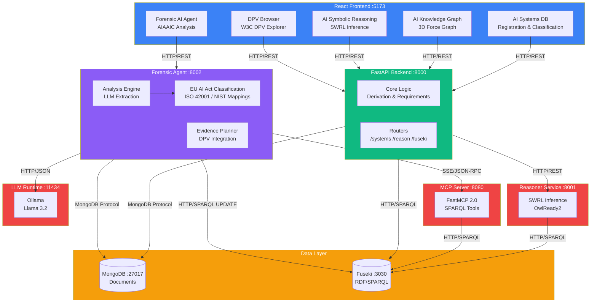
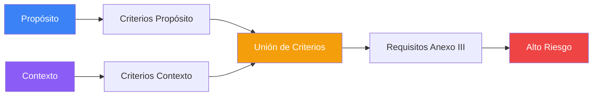

<p align="center">
  
</p>

<h1 align="center">SERAMIS v1.0</h1>

<h3 align="center">Semantic Reasoning and AI Management Intelligent System</h3>

<p align="center">
  <strong>Plataforma de evaluación semántica automatizada para el cumplimiento del Reglamento Europeo de Inteligencia Artificial (EU AI Act) </strong>
</p>

<p align="center">
  
  
  
  
  
  
</p>

---

## Trabajo Fin de Máster - UNIR

<p align="center">
  
</p>

Este proyecto ha sido desarrollado como **Trabajo Fin de Máster** del programa de **Máster en Inteligencia Artificial** de la **Universidad Internacional de La Rioja (UNIR)**.

### Equipo de Desarrollo

| Rol | Nombre |
|-----|--------|
| **Autores** | David Fernández González, Dr. Mariano Ortega de Mues |
| **Directora** | Dra. Xiomara Patricia Blanco Valencia |
| **Co-Director** | Dr. Sergio Castillo |

### Agradecimientos

Este proyecto utiliza datos del **[AIAAIC Repository](https://www.aiaaic.org/aiaaic-repository)** (AI, Algorithmic, and Automation Incidents and Controversies), una base de datos independiente que documenta incidentes de IA a nivel mundial. Agradecemos a **Charlie Pownall** y al equipo de AIAAIC por este recurso invaluable.

La ontología SERAMIS incorpora compatibilidad con **[AIRO (AI Risk Ontology)](https://w3id.org/airo)**, desarrollada por **Delaram Golpayegani** et al. en el ADAPT Centre, Dublin City University. Agradecemos al equipo de AIRO por su trabajo en la estandarización de conceptos de stakeholders para sistemas de IA.

La integración con **[W3C Data Privacy Vocabulary (DPV) 2.2](https://w3c.github.io/dpv/)** permite mapear requisitos del EU AI Act a medidas técnicas y organizativas estándar, facilitando la generación de planes de evidencia para cumplimiento normativo.

La integración con **[European Legislation Identifier (ELI)](https://eur-lex.europa.eu/eli-register/about.html)** proporciona URIs persistentes y desreferenciables para referenciar artículos específicos del AI Act en EUR-Lex, garantizando la interoperabilidad con el ecosistema legislativo europeo.

Este software fue parcialmente desarrollado empleando **Claude Sonnet** (Anthropic), asistente de IA utilizado para acelerar el desarrollo de código, documentación y diseño arquitectónico.

---

## Índice

- [Descripción](#descripción)
- [Arquitectura del Sistema](#arquitectura-del-sistema)
- [Instalación](#instalación)
- [Módulos del Frontend](#módulos-del-frontend)
- [Agente Forense](#agente-forense)
- [Ontología](#ontología)
  - [Integración AIRO](#integración-airo-ai-risk-ontology)
  - [Integración DPV](#integración-dpv-data-privacy-vocabulary)
  - [Razonamiento sobre Affected Persons](#razonamiento-sobre-affected-persons-art-86)
  - [Mappings Multi-Framework](#mappings-multi-framework)
- [Mecanismos de Inferencia](#mecanismos-de-inferencia)
- [Stack Tecnológico](#stack-tecnológico)
- [Estructura del Proyecto](#estructura-del-proyecto)
- [API Reference](#api-reference)
- [Referencias](#referencias)
- [Licencia](#licencia)

---

## Descripción

SERAMIS implementa un **sistema de evaluación semántica automatizada** para sistemas de IA regulados por el EU AI Act. Combina una ontología formal OWL (v0.37.5) con reglas de inferencia SWRL para derivar automáticamente requisitos de cumplimiento, evaluaciones de riesgo y obligaciones regulatorias.

### Características Principales

- **Razonamiento Semántico Híbrido** (SWRL + SHACL) para clasificación automática de riesgo
- **Análisis Forense Post-Incidente** con extracción LLM de narrativas de incidentes
- **Cumplimiento Multi-Framework**: EU AI Act + ISO 42001 + NIST AI RMF + DPV
- **Evidence Planner**: Generación automática de planes de evidencia basados en gaps de cumplimiento
- **DPV Browser**: Explorador interactivo del W3C Data Privacy Vocabulary con taxonomías de riesgos, medidas y conceptos del AI Act
- **Visualización 3D** interactiva del grafo de conocimiento
- **Persistencia Dual**: MongoDB para documentos + Apache Jena Fuseki para RDF/SPARQL
- **Servidor MCP** (Model Context Protocol) para integración con agentes de IA

---

## Arquitectura del Sistema



---

## Instalación

### Prerrequisitos

- **Docker** & **Docker Compose**
- **Git**
- **Ollama** (para el agente forense LLM - usa llama3.2:3b)

### Inicio Rápido

```bash
# 1. Clonar repositorio
git clone https://github.com/[usuario]/seramis.git
cd seramis

# 2. Iniciar todos los servicios
docker-compose up -d

# 3. Verificar despliegue
docker-compose ps
```

### Puntos de Acceso

| Servicio | URL | Descripción |
|----------|-----|-------------|
| **Frontend** | http://localhost:5173 | Interfaz web principal |
| **AI Systems DB** | http://localhost:5173/systems | Base de datos de sistemas de IA |
| **AI Knowledge Graph** | http://localhost:5173/graph | Visualización 3D de la ontología |
| **AI Symbolic Reasoning** | http://localhost:5173/reasoning | Razonamiento SWRL |
| **Forensic AI Agent** | http://localhost:5173/forensic | Análisis de incidentes AIAAIC |
| **DPV Browser** | http://localhost:5173/dpv | Explorador Data Privacy Vocabulary |
| **API Docs** | http://localhost:8000/docs | Documentación API (Swagger) |
| **API Forense** | http://localhost:8002/docs | Documentación API forense |
| **SPARQL Endpoint** | http://localhost:3030 | Consultas RDF/SPARQL |
| **MCP Server** | http://localhost:8080/mcp | Model Context Protocol |

---

## Módulos del Frontend

El frontend de SERAMIS proporciona una interfaz web completa para la gestión y análisis de sistemas de IA:

| Módulo | Ruta | Descripción |
|--------|------|-------------|
| **Dashboard** | `/` | Panel principal con métricas y resumen del sistema |
| **AI Systems DB** | `/systems` | Base de datos de sistemas de IA con formulario de registro, clasificación de riesgo EU AI Act y gestión de requisitos |
| **AI Knowledge Graph** | `/graph` | Visualización 3D interactiva del grafo de conocimiento usando Force Graph y Three.js |
| **AI Symbolic Reasoning** | `/reasoning` | Interfaz para ejecutar razonamiento SWRL sobre sistemas registrados |
| **Forensic AI Agent** | `/forensic` | Análisis forense post-incidente de sistemas de IA usando datos AIAAIC |
| **DPV Browser** | `/dpv` | Explorador interactivo del W3C Data Privacy Vocabulary 2.2 |
| **Ontology Docs** | `/ontology` | Documentación de la ontología SERAMIS |

### DPV Browser

El **DPV Browser** (`/dpv`) es un explorador interactivo del [W3C Data Privacy Vocabulary (DPV) 2.2](https://w3c.github.io/dpv/) que permite navegar las taxonomías de:

- **Riesgos de IA** (`dpv-ai:Risk`): Taxonomía de riesgos asociados a sistemas de IA
- **Medidas Técnicas y Organizativas** (`dpv:TechnicalMeasure`, `dpv:OrganisationalMeasure`): Catálogo de medidas de cumplimiento
- **Conceptos AI Act** (`dpv-legal-eu-aiact:`): Términos específicos del EU AI Act
- **Propósitos y Bases Legales**: Taxonomías de procesamiento de datos

Esta herramienta facilita la consulta y comprensión del vocabulario DPV para la generación de planes de evidencia y la evaluación de cumplimiento.

---

## Agente Forense

El **Agente Forense** es un microservicio potenciado por LLM para análisis de cumplimiento post-incidente. Extrae información estructurada de narrativas de incidentes y evalúa el cumplimiento contra múltiples frameworks.

📖 **Documentación completa:** [`forensic_agent/README.md`](forensic_agent/README.md)

### Fuente de Datos: AIAAIC Repository

El agente utiliza datos del **AI, Algorithmic, and Automation Incidents and Controversies (AIAAIC) Repository**, una base de datos independiente que documenta incidentes relacionados con sistemas de IA a nivel mundial.

🔗 **AIAAIC Repository:** https://www.aiaaic.org/aiaaic-repository

### Características

| Característica | Descripción |
|----------------|-------------|
| **Extracción LLM** | Usa Ollama (llama3.2:3b) o Anthropic para extraer datos estructurados |
| **Análisis Multi-Framework** | EU AI Act + ISO 42001 (15 mappings) + NIST AI RMF (18 mappings) + DPV 2.2 |
| **Clasificación de Riesgo** | Categorización automática según 8 categorías del Anexo III + GPAI |
| **Detección de Brechas** | Identifica requisitos faltantes y calcula ratio de cumplimiento |
| **Evidence Planner** | Genera planes de evidencia con 14 requisitos y ~40 items de evidencia |
| **Persistencia Dual** | Guarda en MongoDB + Fuseki RDF para consultas semánticas |

### Ejemplo de Análisis

```bash
curl -X POST http://localhost:8002/forensic/analyze \
  -H "Content-Type: application/json" \
  -d '{
    "narrative": "Sistema de reconocimiento facial utilizado por fuerzas policiales para identificar manifestantes. El sistema mostró sesgo significativo contra minorías.",
    "source": "AIAAIC Repository",
    "metadata": {
      "aiaaic_id": "AIAAIC0042",
      "headline": "Sesgo en reconocimiento facial policial"
    }
  }'
```

---

## Ontología

### Versión: 0.37.4

| Propiedad | Valor |
|-----------|-------|
| **Namespace** | `http://ai-act.eu/ai#` |
| **Formato** | Turtle (.ttl) |
| **Clases** | 60+ |
| **Propiedades** | 50+ |
| **Individuos** | 120+ |
| **Tripletas** | ~2,000 |

### Cobertura Regulatoria

- EU AI Act Anexo III (8/8 categorías de alto riesgo)
- **Artículo 5** (Prácticas Prohibidas - Riesgo Inaceptable)
- Artículos 51-55 (requisitos GPAI)
- Taxonomía de algoritmos (Anexo I)
- Framework de gobernanza de datos
- Shapes SHACL de validación
- Reglas de inferencia SWRL

### Integración AIRO (AI Risk Ontology)

La ontología SERAMIS v0.37.2 incorpora compatibilidad con **AIRO** para la gestión de stakeholders según el EU AI Act:

| Propiedad SERAMIS | Clase AIRO | Artículo EU AI Act |
|-------------------|------------|-------------------|
| `ai:hasProvider` | `airo:AIProvider` | Art. 3.3 |
| `ai:hasDeployer` | `airo:AIDeployer` | Art. 3.4 |
| `ai:hasDeveloper` | `airo:AIDeveloper` | - |
| `ai:hasUser` | `airo:AIUser` | - |
| `ai:hasSubject` | `airo:AISubject` | Art. 86 (Affected Person) |
| `ai:hasOversightBody` | `airo:Regulator` | Art. 70 |

Esta integración permite:
- **Trazabilidad de responsabilidad**: Identificar claramente quién desarrolla, despliega y opera cada sistema
- **Análisis forense mejorado**: El Agente Forense extrae deployer/developer de incidentes AIAAIC
- **Interoperabilidad**: Compatible con otras ontologías que usen AIRO
- **Razonamiento sobre Affected Persons**: Inferencia automática de requisitos basados en personas afectadas

### Integración DPV (Data Privacy Vocabulary)

SERAMIS v1.1.0 integra el **[W3C Data Privacy Vocabulary (DPV) 2.2](https://w3c.github.io/dpv/)** para la generación de planes de evidencia de cumplimiento.

| Extensión DPV | Propósito | Uso en SERAMIS |
|---------------|-----------|----------------|
| **dpv:core** | Medidas técnicas y organizativas | Mapeo de requisitos a medidas |
| **dpv:ai** | Sistemas de IA, capacidades, riesgos | Clasificación de sistemas |
| **dpv:risk** | Gestión de riesgos | Evaluación de gaps |
| **dpv:legal/eu/aiact** | Conceptos específicos AI Act | Equivalencias semánticas |

#### Tipos de Evidencia Definidos

El módulo `dpv-integration.ttl` define 6 tipos de evidencia:

| Tipo | Descripción | Ejemplo |
|------|-------------|---------|
| `PolicyEvidence` | Políticas y procedimientos | Human Oversight Policy |
| `TechnicalEvidence` | Documentación técnica | Model Card, System Architecture |
| `AuditEvidence` | Logs, tests, auditorías | Bias Audit Report |
| `TrainingEvidence` | Registros de formación | Operator Training Records |
| `AssessmentEvidence` | Evaluaciones de impacto | FRIA Report, DPIA |
| `ContractualEvidence` | Contratos y acuerdos | Data Processing Agreement |

#### Mappings Requisito → Medida DPV

```turtle
ai:HumanOversightRequirement
    ai:mapsToDPVMeasure dpv:HumanInvolvement ;
    ai:requiresEvidence ai:HumanOversightPolicyEvidence,
                        ai:OverrideDecisionLogEvidence .

ai:FundamentalRightsAssessmentRequirement
    ai:mapsToDPVMeasure dpv:ImpactAssessment ;
    ai:requiresEvidence ai:FRIAReportEvidence .
```

### Razonamiento sobre Affected Persons (Art. 86)

El reasoner implementa **4 reglas de inferencia** basadas en la identificación de "Affected Persons" (personas afectadas por decisiones del sistema de IA):

| Regla | Artículo | Condición | Inferencia |
|-------|----------|-----------|------------|
| **7** | Art. 86 | `hasSubject` + `HighRisk` | `requiresExplainability = true` |
| **8** | Art. 27 | Affected person en grupo vulnerable | `requiresFundamentalRightsAssessment = true` |
| **9** | Art. 26 | Propósito de empleo + affected persons | `requiresAffectedPersonNotification = true` |
| **10** | Art. 5 | Biométrico + espacio público + affected persons | `requiresProhibitionReview = true` |

**Grupos vulnerables detectados automáticamente:**
- Menores (Minor/Child)
- Personas mayores (Elderly)
- Personas con discapacidad (Disabled)
- Migrantes y solicitantes de asilo (Migrant/Asylum)

**Propiedades de inferencia añadidas:**
- `ai:requiresExplainability` - Requiere explicabilidad Art. 86
- `ai:requiresFundamentalRightsAssessment` - Requiere FRIA Art. 27
- `ai:requiresAffectedPersonNotification` - Requiere notificación Art. 26
- `ai:requiresProhibitionReview` - Requiere revisión prohibiciones Art. 5

**Requisitos de cumplimiento inferidos:**
- `ai:ExplainabilityRequirement`
- `ai:FundamentalRightsImpactAssessment`
- `ai:WorkerNotificationRequirement`
- `ai:Article5ProhibitionReview`

### Mappings Multi-Framework

| Framework | Tipo | Mappings | Confianza |
|-----------|------|----------|-----------|
| **EU AI Act** | Regulación obligatoria | Base | - |
| **ISO 42001** | Estándar de certificación | 15 | 87% HIGH |
| **NIST AI RMF** | Guía voluntaria | 18 | 100% HIGH |
| **DPV 2.2** | Vocabulario W3C | 14 | - |
| **Total** | Multi-framework | **47+** | **94% HIGH** |

---

## Mecanismos de Inferencia

SERAMIS implementa **tres mecanismos de inferencia** basados en diferentes secciones del EU AI Act para la clasificación automática de sistemas de IA:

### 1. Inferencia por Propósito + Contexto (Anexo III)

Clasifica sistemas de IA como **Alto Riesgo** basándose en la combinación del propósito del sistema y su contexto de despliegue, según las 8 categorías del Anexo III del EU AI Act.



**Categorías cubiertas:**
- Biometría e identificación de personas
- Gestión de infraestructuras críticas
- Educación y formación profesional
- Empleo y gestión de trabajadores
- Acceso a servicios esenciales (crédito, seguros)
- Aplicación de la ley
- Migración, asilo y control fronterizo
- Administración de justicia y procesos democráticos

### 2. Inferencia por Experto Humano (Artículo 6.3)

Permite que un **experto humano** identifique manualmente **criterios de riesgo adicionales** para sistemas que no son capturados por las reglas automáticas de Propósito + Contexto. Esta evaluación experta complementa la inferencia automática.

En el interfaz **AI Systems DB**, la Sección 6 "Expert Evaluation" permite al evaluador:

```
Si experto identifica riesgos no detectados automáticamente
   → Añade criterios manualmente (hasManuallyIdentifiedCriterion)
   → Sistema reclasificado a HighRisk con criterios adicionales
```

**Campos disponibles en el formulario:**
- `hasManuallyIdentifiedCriterion`: Criterios de alto riesgo identificados por el experto
- Selección múltiple de criterios del catálogo del Anexo III
- Los criterios manuales se combinan con los criterios derivados automáticamente

**Aplicación del Art. 6.3:**
- Casos residuales no cubiertos por reglas automáticas
- Sistemas con riesgo contextual específico
- Evaluación caso por caso por experto cualificado

### 3. Inferencia para Modelos GPAI (Artículos 51-55)

Clasifica **Modelos de Propósito General** (GPAI) y detecta aquellos con **Riesgo Sistémico** basándose en capacidad computacional y otros indicadores.

```
Si modelo GPAI tiene FLOPS ≥ 10^25
   → Riesgo Sistémico (Art. 51)
   → Requisitos adicionales Arts. 52-55
```

**Criterios de Riesgo Sistémico:**
- Capacidad computacional ≥ 10²⁵ FLOPS de entrenamiento
- Capacidades de alto impacto determinadas por la Comisión
- Número significativo de usuarios registrados

### Resumen de Mecanismos

| Mecanismo | Base Legal | Entrada | Salida |
|-----------|------------|---------|--------|
| **Propósito + Contexto** | Anexo III | Propósito, Contexto de despliegue | HighRisk / NotHighRisk + Criterios automáticos |
| **Experto Humano** | Art. 6.3 | `hasManuallyIdentifiedCriterion` | Criterios adicionales → HighRisk |
| **GPAI** | Arts. 51-55 | FLOPS, capacidades | SystemicRisk / GPAI estándar |

---

## Stack Tecnológico

### Backend
- Python 3.11
- FastAPI
- RDFLib (procesamiento RDF/OWL)
- OwlReady2 (razonamiento OWL)
- Motor (MongoDB async)
- FastMCP 2.0 (Model Context Protocol)

### Frontend
- React 19
- TypeScript
- Vite
- TailwindCSS
- react-force-graph-3d (visualización 3D)
- Three.js (rendering WebGL)

### AI/LLM
- Ollama (runtime LLM local)
- llama3.2:3b (modelo por defecto)

### Infraestructura
- Docker & Docker Compose
- Apache Jena Fuseki
- MongoDB 6
- NGINX

---

## Estructura del Proyecto

```
seramis/
├── backend/                    # FastAPI backend (8000)
│   ├── main.py
│   ├── derivation.py
│   ├── routers/
│   └── models/
├── frontend/                   # React + TypeScript UI (5173)
│   ├── src/
│   │   ├── pages/
│   │   │   ├── DashboardPage.tsx        # Panel principal
│   │   │   ├── SystemsPage.tsx          # AI Systems DB
│   │   │   ├── GraphView.tsx            # AI Knowledge Graph 3D
│   │   │   ├── ReasoningPage.tsx        # AI Symbolic Reasoning
│   │   │   ├── ForensicAgentPage.tsx    # Forensic AI Agent
│   │   │   ├── DPVPage.tsx              # DPV Browser
│   │   │   └── OntologyDocs.tsx         # Documentación ontología
│   │   ├── components/
│   │   │   └── Navbar.tsx
│   │   └── lib/
├── forensic_agent/            # Agente de Análisis Forense (8002)
│   ├── app/
│   │   ├── main.py
│   │   └── services/
│   │       ├── incident_extractor.py
│   │       ├── analysis_engine.py
│   │       ├── evidence_planner.py   # Evidence Planner (DPV)
│   │       ├── persistence.py
│   │       └── mcp_client.py
├── mcp-servers/               # Servidores MCP
│   └── forensic-sparql/
│       └── server.py
├── reasoner_service/          # Microservicio de razonamiento SWRL (8001)
├── ontologias/                # Archivos de ontología
│   ├── versions/0.37.4/
│   ├── rules/
│   ├── shacl/
│   └── mappings/
│       ├── iso-42001-mappings.ttl
│       ├── nist-ai-rmf-mappings.ttl
│       └── dpv-integration.ttl      # DPV 2.2 integration
├── docker-compose.yml
└── README.md
```

---

## API Reference

### Sistemas

```http
GET    /systems              # Listar sistemas
POST   /systems              # Registrar sistema
GET    /systems/{urn}        # Obtener sistema
PUT    /systems/{urn}        # Actualizar sistema
DELETE /systems/{urn}        # Eliminar sistema
```

### Razonamiento

```http
POST   /reasoning/system/{id}  # Ejecutar razonamiento SWRL
GET    /reasoning/rules        # Obtener reglas SWRL
GET    /reasoning/status       # Estado del servicio
```

### Análisis Forense

```http
POST   /forensic/analyze                    # Analizar narrativa de incidente
POST   /forensic/analyze-with-evidence-plan # Analizar + generar plan de evidencias
POST   /forensic/evidence-plan              # Generar plan de evidencias desde gaps
GET    /forensic/systems                    # Listar sistemas analizados
GET    /forensic/systems/{urn}              # Obtener análisis específico
DELETE /forensic/systems/{urn}              # Eliminar análisis
```

### MCP Tools

```python
query_ontology(query)           # Ejecutar consultas SPARQL
get_requirements_for_system()   # Obtener requisitos EU AI Act
determine_risk_level()          # Determinar nivel de riesgo
query_iso_mappings()            # Consultar mappings ISO 42001
query_nist_mappings()           # Consultar mappings NIST AI RMF
get_inference_rules()           # Obtener reglas de inferencia
get_ontology_stats()            # Estadísticas de la ontología
```

---

## Referencias

- **EU AI Act:** https://eur-lex.europa.eu/legal-content/EN/TXT/?uri=CELEX:32024R1689
- **W3C Data Privacy Vocabulary (DPV) 2.2:** https://w3c.github.io/dpv/
- **AIAAIC Repository:** https://www.aiaaic.org/aiaaic-repository
- **AIRO (AI Risk Ontology):** https://w3id.org/airo
- **ISO/IEC 42001:2023:** https://www.iso.org/standard/81230.html
- **NIST AI RMF 1.0:** https://www.nist.gov/itl/ai-risk-management-framework
- **Apache Jena Fuseki:** https://jena.apache.org/documentation/fuseki2/
- **OWL 2 Web Ontology Language:** https://www.w3.org/TR/owl2-overview/
- **SHACL:** https://www.w3.org/TR/shacl/

---

## Licencia

Este proyecto utiliza la ontología EU AI Act licenciada bajo **Creative Commons Attribution 4.0 International (CC BY 4.0)**.

El código fuente está disponible bajo los términos definidos por UNIR para Trabajos Fin de Máster.

---

<p align="center">
  
</p>

<p align="center">
  <strong>Universidad Internacional de La Rioja</strong><br/>
  Máster en Inteligencia Artificial<br/>
  Curso 2024-2025
</p>

<p align="center">
  <sub>Versión 1.1.0 | Diciembre 2025</sub>
</p>
