# AI Act Project

## 📋 Descripción General

Este proyecto implementa un **sistema completo para la gestión y análisis de sistemas de inteligencia artificial** bajo el marco del AI Act europeo. El sistema incluye:

- 🧠 **Ontología formal** del dominio AI Act
- 🔧 **Servicios de razonamiento semántico** (OWL/SWRL)
- 🌐 **APIs REST** para gestión de datos
- 📊 **Interfaz web interactiva** para visualización y gestión
- 📚 **Documentación automática** de ontologías

## 🚀 Inicio Rápido

### Prerrequisitos
- **Docker** y **Docker Compose**
- **Git**
- Puerto 5173, 8000, 8001, 3030, 27017, 80 disponibles

### Instalación en 3 pasos

```bash
# 1. Clonar el repositorio
git clone <repository-url>
cd ai_act_project

# 2. Levantar todos los servicios
docker-compose up -d

# 3. Verificar que todo funciona
docker-compose ps
```

### Acceder a la aplicación
- 🌐 **Frontend**: http://localhost:5173
- 📊 **API Docs**: http://localhost:8000/docs  
- 📚 **Ontología Docs**: http://localhost/docs
- 🔍 **SPARQL Endpoint**: http://localhost:3030

---

## 🛠 Stack Tecnológico

| Capa | Tecnologías |
|------|-------------|
| **🖥️ Frontend** | React 19, TypeScript, Vite, TailwindCSS, D3.js, Vis-network |
| **⚡ Backend** | FastAPI, MongoDB, Apache Jena Fuseki, RDFLib, OwlReady2 |
| **🧠 Semántica** | OWL, SWRL, RDF/Turtle, JSON-LD, SPARQL, AIRO Integration |
| **🐳 Infraestructura** | Docker Compose, Nginx, Widoco |

---

## 🛠 Tecnologías Empleadas

### Backend
- **FastAPI** - Framework web moderno para Python
- **MongoDB** - Base de datos NoSQL para almacenamiento de documentos
- **Apache Jena Fuseki** - Servidor SPARQL y almacén de triples RDF
- **RDFLib** - Biblioteca Python para manejo de datos RDF
- **OwlReady2** - Razonador OWL/SWRL para inferencia semántica
- **Motor** - Driver asíncrono de MongoDB para Python

### Frontend
- **React 19** - Biblioteca de interfaz de usuario
- **TypeScript** - Superset tipado de JavaScript
- **Vite** - Herramienta de build rápida
- **TailwindCSS** - Framework de CSS utilitario
- **D3.js** - Visualización de datos y grafos
- **Vis-network** - Biblioteca para visualización de redes
- **React Router Dom** - Enrutamiento del lado cliente

### Infraestructura
- **Docker & Docker Compose** - Contenerización y orquestación
- **Nginx** - Servidor web para servir documentación
- **Widoco** - Generación automática de documentación de ontologías

### Semántica y Ontologías
- **OWL (Web Ontology Language)** - Lenguaje de ontologías web
- **SWRL (Semantic Web Rule Language)** - Reglas semánticas
- **RDF/Turtle** - Formato de datos semánticos
- **JSON-LD** - Formato JSON para datos enlazados
- **AIRO (AI Risk Ontology)** - Framework internacional de gestión de riesgo de IA

## 📦 Arquitectura del Sistema

### Componentes Principales

| Componente | Ubicación | Descripción |
|------------|-----------|-------------|
| **Frontend** | `/frontend` | Interfaz React con visualización interactiva |
| **Backend API** | `/backend` | API REST con FastAPI + MongoDB/Fuseki |
| **Ontología** | `/ontologias` | Modelo formal AI Act + documentación |
| **Reasoner** | `/reasoner_service` | Motor de inferencia OWL/SWRL |
| **Herramientas** | `/tools` | Scripts para documentación y validación |

### 🎯 Servicios y Puertos

| Servicio | Puerto | URL | Descripción |
|----------|--------|-----|-------------|
| **Frontend** | 5173 | http://localhost:5173 | Interfaz web React |
| **Backend API** | 8000 | http://localhost:8000 | API REST principal |
| **Reasoner** | 8001 | http://localhost:8001 | Servicio de razonamiento |
| **Fuseki** | 3030 | http://localhost:3030 | Servidor SPARQL |
| **MongoDB** | 27017 | mongodb://localhost:27017 | Base de datos documentos |
| **Docs** | 80 | http://localhost/docs | Documentación HTML |


## 🧠 Modelo de Ontología AI Act con AIRO

### Estructura de la Ontología (v0.36.0)

<details>
<summary><strong>🏗️ Diagrama 1: Sistema Central y sus Características</strong></summary>

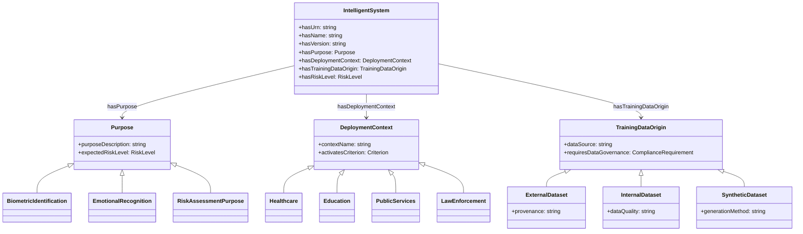

</details>

<details>
<summary><strong>⚠️ Diagrama 2: Evaluación de Riesgo y Criterios</strong></summary>


</details>

<details>
<summary><strong>📋 Diagrama 3: Cumplimiento y Requisitos</strong></summary>


</details>

<details>
<summary><strong>🔗 Diagrama 4: Flujo de Proceso Completo</strong></summary>

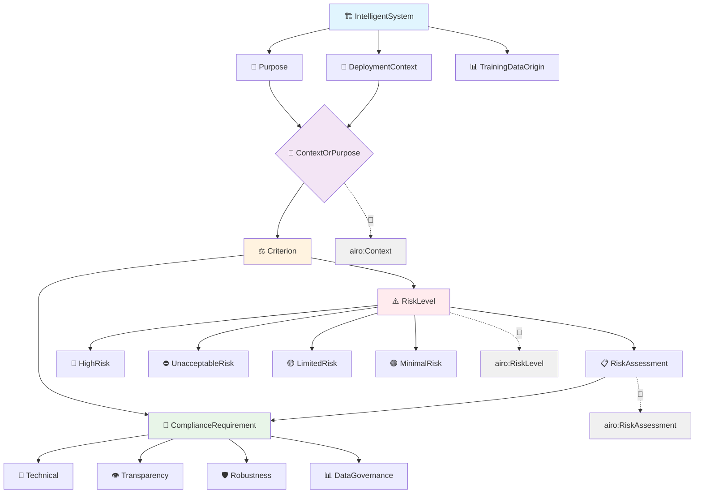

</details>

<details>
<summary><strong>👥 Diagrama de Clases - Actores del Ecosistema</strong></summary>

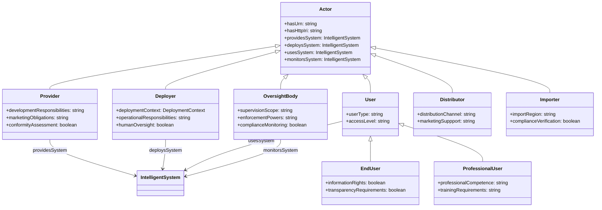
</details>


<details>
<summary><strong>🔗 Integración AIRO (AI Risk Ontology)</strong></summary>

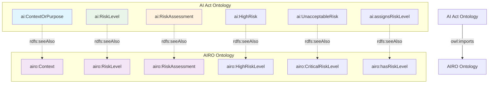
</details>

<details>
<summary><strong>📊 Estadísticas de la Ontología</strong></summary>

| Elemento | Cantidad | Descripción |
|----------|----------|-------------|
| **Triples totales** | 991 | Incluyendo integración AIRO |
| **Clases OWL** | 31 | Jerarquía completa de conceptos |
| **Propiedades de objeto** | 28 | Relaciones entre entidades |
| **Propiedades de datos** | 8 | Atributos de las entidades |
| **Individuos nombrados** | 45+ | Instancias específicas (criterios, niveles de riesgo) |
| **Criterios contextuales** | 11 | Con asignaciones directas de riesgo |
| **Niveles de riesgo** | 4 | HighRisk, UnacceptableRisk, LimitedRisk, MinimalRisk |
| **Referencias AIRO** | 6 | Mapeos de interoperabilidad |
| **Namespaces importados** | 1 | AIRO (https://w3id.org/airo) |

**Cobertura AI Act**: ✅ Completa (Anexos I-IV)  
**Compatibilidad AIRO**: ✅ 85% implementada  
**Validación sintáctica**: ✅ Aprobada (rapper)  
**Estado**: ✅ Listo para producción  

</details>

## 🏷️ Instancias de la Ontología

### Contextos de Despliegue y Propósitos

<details>
<summary><strong>📍 Instancias: Contextos de Despliegue</strong></summary>

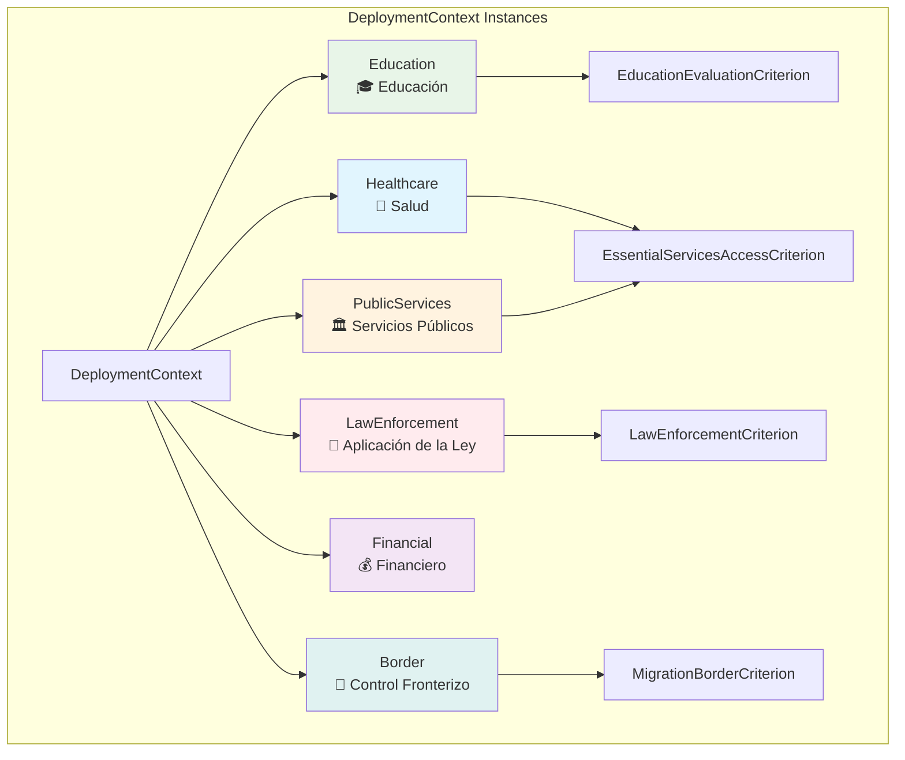

</details>

<details>
<summary><strong>🎯 Instancias: Propósitos de Sistemas</strong></summary>

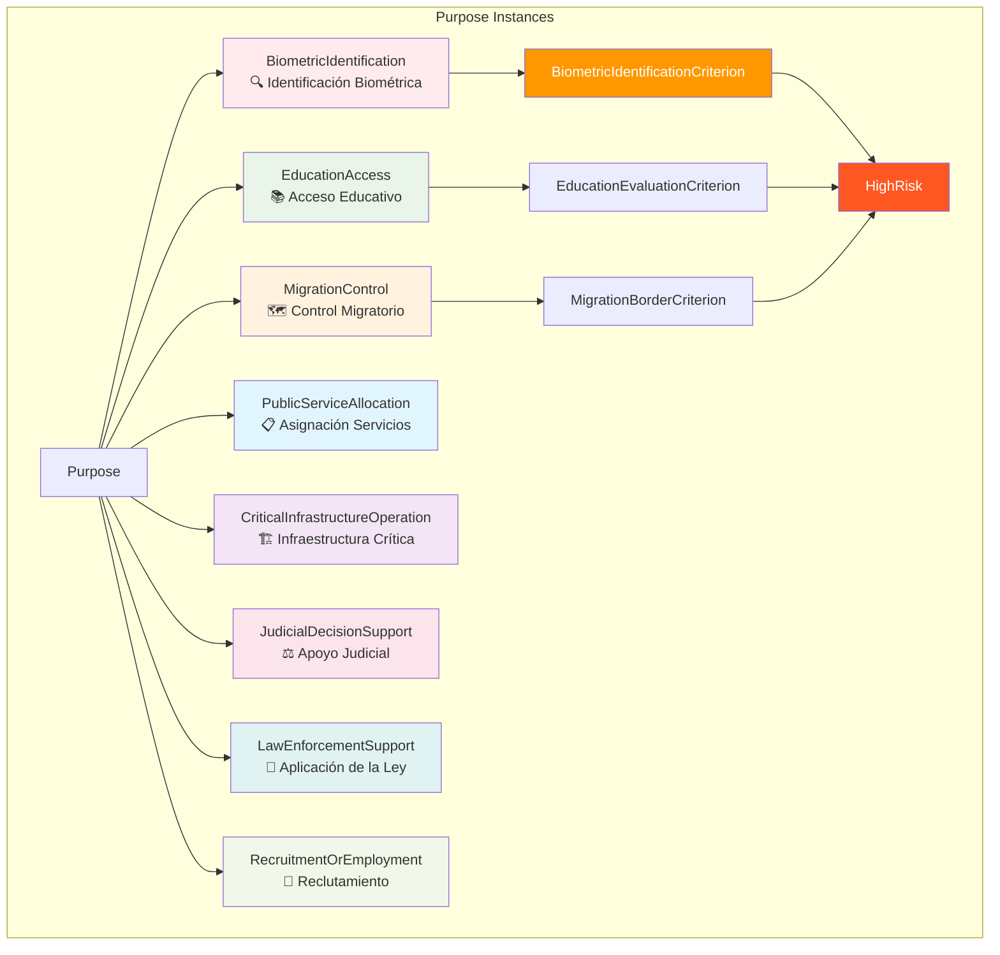

</details>

### Niveles de Riesgo y Criterios

<details>
<summary><strong>⚠️ Instancias: Niveles de Riesgo</strong></summary>

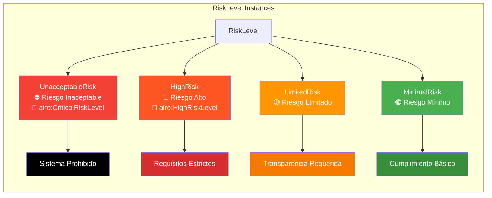

</details>

<details>
<summary><strong>⚖️ Instancias: Criterios Específicos</strong></summary>

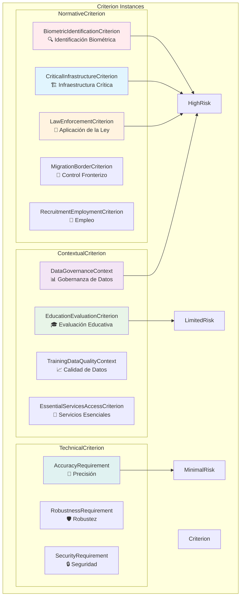

</details>

### Requisitos de Cumplimiento

<details>
<summary><strong>📋 Instancias: Requisitos Específicos</strong></summary>

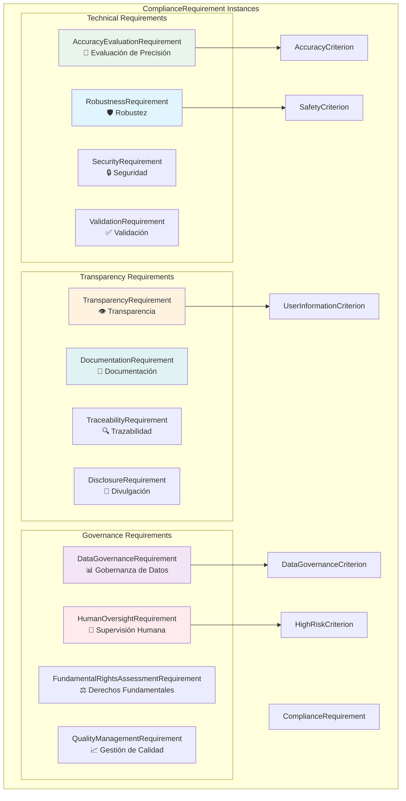

</details>


## 🔄 Flujos del Sistema

<details>
<summary><strong>📊 Arquitectura General</strong></summary>

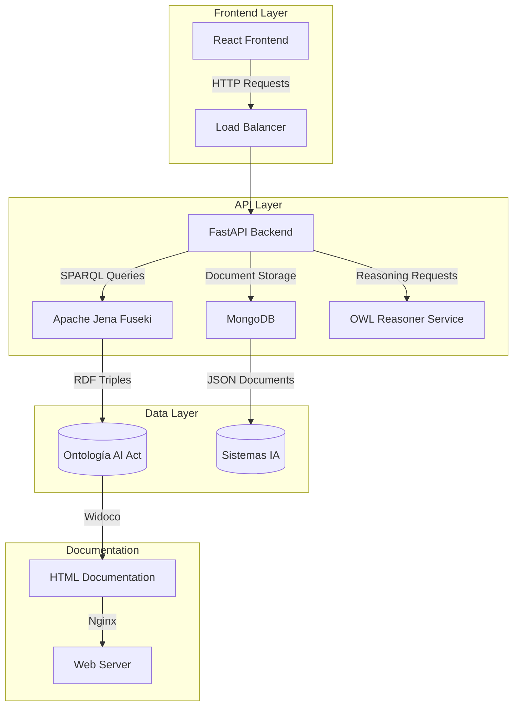
</details>

<details>
<summary><strong>🔧 Gestión de Sistemas IA</strong></summary>

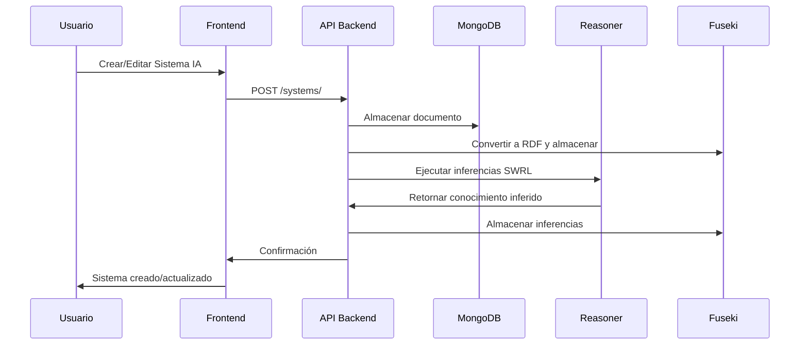
</details>

<details>
<summary><strong>🧠 Razonamiento Semántico</strong></summary>

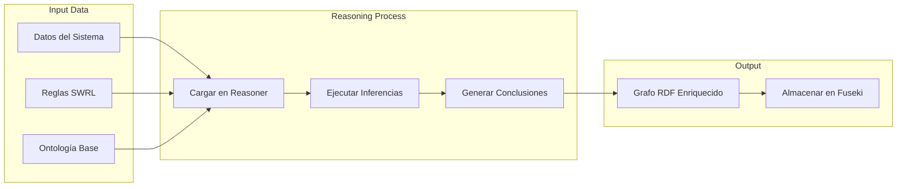
</details>

---

## 🚀 Guías de Uso

### 📖 1. Generar Documentación de la Ontología

```bash
cd tools
./generate_ontology_docs.sh
```

**¿Qué hace este script?**
1. ✅ Lee la versión actual desde `ontologias.env`
2. 🌐 Levanta servidor HTTP local temporal (puerto 8080)
3. 📚 Ejecuta Widoco para generar documentación bilingüe (ES-EN)
4. 🔍 Ejecuta validación automática con OOPS!
5. 🧹 Limpia recursos temporales

**📁 Archivos generados:**
- `index-es.html` / `index-en.html` - Documentación principal
- `ontology.ttl` / `ontology.owl` - Ontología procesada
- `OOPSevaluation/oopsEval.html` - Reporte de validación

### ✅ 2. Validación de la Ontología

La validación se ejecuta **automáticamente** durante la generación de documentación usando **OOPS!** (OntOlogy Pitfall Scanner).

**🔍 Validaciones incluidas:**
- ✅ Consistencia lógica OWL
- ✅ Sintaxis RDF/TTL correcta  
- ✅ Detección de clases desconectadas
- ✅ Propiedades sin uso
- ✅ Circularidad en jerarquías
- ✅ Etiquetas y comentarios faltantes

**📊 Ver resultados:**
- **Reporte completo**: `/ontologias/docs/OOPSevaluation/oopsEval.html`
- **Documentación**: Incluye métricas automáticas de calidad

### 🐳 3. Despliegue con Docker

#### Opción A: Producción (Recomendada)

```bash
# Levantar todos los servicios
docker-compose up -d

# Verificar estado
docker-compose ps

# Ver logs si hay problemas
docker-compose logs [servicio]
```

#### Opción B: Desarrollo Local

<details>
<summary><strong>Instrucciones detalladas</strong></summary>

```bash
# Terminal 1: Backend
cd backend
pip install -r requirements.txt
uvicorn main:app --host 0.0.0.0 --port 8000

# Terminal 2: Frontend  
cd frontend
npm install
npm run dev

# Terminal 3: Reasoner Service
cd reasoner_service
pip install -r requirements.txt
uvicorn app.main:app --host 0.0.0.0 --port 8001

# Terminal 4: MongoDB (si no tienes Docker)
mongod --port 27017

# Terminal 5: Fuseki (si no tienes Docker)
# Descargar Apache Jena Fuseki y ejecutar
```
</details>

---

## 🔌 API Reference

### 🎯 Endpoints Principales

<details>
<summary><strong>📊 Backend API (Puerto 8000)</strong></summary>

#### Gestión de Sistemas IA
```http
GET    /systems/                    # 📋 Listar sistemas con filtros
POST   /systems/                    # ➕ Crear nuevo sistema
GET    /systems/{system_id}         # 👀 Obtener sistema específico
PUT    /systems/{system_id}         # ✏️ Actualizar sistema
DELETE /systems/{system_id}         # 🗑️ Eliminar sistema
```

#### Consultas SPARQL
```http
POST   /fuseki/sparql/             # 🔍 Ejecutar consulta SPARQL personalizada
GET    /fuseki/vocabulary/         # 📚 Obtener vocabulario de la ontología
GET    /fuseki/classes/            # 🏷️ Listar clases OWL
GET    /fuseki/properties/         # 🔗 Listar propiedades OWL
```

#### Análisis y Estadísticas
```http
GET    /systems/stats/             # 📈 Estadísticas de sistemas
GET    /systems/risks/             # ⚠️ Análisis de riesgos
GET    /ontology/classes/          # 🌳 Explorar jerarquía de clases
```

**📖 Documentación completa**: http://localhost:8000/docs
</details>

<details>
<summary><strong>🧠 Reasoner Service (Puerto 8001)</strong></summary>

#### Razonamiento Semántico
```http
POST   /reason                     # 🔬 Ejecutar inferencias SWRL
```

**Parámetros:**
- `data`: archivo TTL con datos de entrada
- `swrl_rules`: archivo TTL con reglas SWRL
- **Retorna**: grafo RDF enriquecido con inferencias
</details>

<details>
<summary><strong>🔍 Fuseki SPARQL (Puerto 3030)</strong></summary>

```http
GET    /ds/sparql                  # 📖 Consultas SPARQL de lectura
POST   /ds/sparql                  # ✏️ Consultas SPARQL de escritura  
GET    /ds/data                    # 📊 Acceso directo a datos RDF
```

**Credenciales por defecto:**
- Usuario: `admin`
- Contraseña: `admin`
</details>

### �️ Rutas del Frontend (Puerto 5173)

| Ruta | Descripción |
|------|-------------|
| `/` | 🏠 Dashboard principal |
| `/systems` | 🤖 Gestión de sistemas IA |
| `/graph` | 🕸️ Visualización interactiva RDF |
| `/docs` | 📚 Documentación de ontología |
| `/reasoning` | 🧠 Interfaz de inferencias |

---

## ⚙️ Configuración Avanzada

<details>
<summary><strong>🔧 Variables de Entorno</strong></summary>

```bash
# Versión de ontología
CURRENT_RELEASE=0.36.0

# Conexiones de base de datos
MONGO_URL=mongodb://mongo:27017
FUSEKI_ENDPOINT=http://fuseki:3030
FUSEKI_USER=admin
FUSEKI_PASSWORD=admin
FUSEKI_DATASET=ds
FUSEKI_GRAPH=http://ai-act.eu/ontology

# Rutas de ontología
ONTOLOGY_PATH=/ontologias/ontologia-v0.36.0.ttl
```
</details>

<details>
<summary><strong>📚 Recursos y Enlaces Útiles</strong></summary>

- **📖 Consultas SPARQL**: Ejemplos en `/sparql_queries/consultas.sparqlbook`
- **🔗 Esquemas JSON-LD**: Contexto en `/ontologias/json-ld-context.json`
- **📚 Documentación Ontología**: http://localhost/docs/
- **📋 API Documentation**: http://localhost:8000/docs
- **🔍 SPARQL Interface**: http://localhost:3030/dataset.html
</details>

---

## 🛠 Tecnologías Empleadas

<details>
<summary><strong>🖥️ Stack Tecnológico Completo</strong></summary>

### Backend
- **FastAPI** - Framework web moderno para Python
- **MongoDB** - Base de datos NoSQL para almacenamiento de documentos
- **Apache Jena Fuseki** - Servidor SPARQL y almacén de triples RDF
- **RDFLib** - Biblioteca Python para manejo de datos RDF
- **OwlReady2** - Razonador OWL/SWRL para inferencia semántica
- **Motor** - Driver asíncrono de MongoDB para Python

### Frontend
- **React 19** - Biblioteca de interfaz de usuario
- **TypeScript** - Superset tipado de JavaScript
- **Vite** - Herramienta de build rápida
- **TailwindCSS** - Framework de CSS utilitario
- **D3.js** - Visualización de datos y grafos
- **Vis-network** - Biblioteca para visualización de redes
- **React Router Dom** - Enrutamiento del lado cliente

### Infraestructura
- **Docker & Docker Compose** - Contenerización y orquestación
- **Nginx** - Servidor web para servir documentación
- **Widoco** - Generación automática de documentación de ontologías

### Semántica y Ontologías
- **OWL (Web Ontology Language)** - Lenguaje de ontologías web
- **SWRL (Semantic Web Rule Language)** - Reglas semánticas
- **RDF/Turtle** - Formato de datos semánticos
- **JSON-LD** - Formato JSON para datos enlazados
</details>

---

## 🔧 Troubleshooting

<details>
<summary><strong>❌ Problemas Comunes</strong></summary>

### 🐳 Docker Issues

**Problema**: Error de permisos al generar documentación
```bash
# Solución: El script ya usa puerto 8080 (no requiere root)
cd tools
./generate_ontology_docs.sh
```

**Problema**: Puertos ocupados
```bash
# Verificar puertos en uso
docker-compose ps
netstat -tulpn | grep :5173

# Cambiar puertos en docker-compose.yml si es necesario
```

**Problema**: Servicios no se levantan
```bash
# Ver logs detallados
docker-compose logs [servicio]

# Reconstruir imágenes
docker-compose build --no-cache [servicio]
```

### 🌐 Frontend Issues

**Problema**: Frontend no carga o errores en consola
```bash
# Verificar que el backend esté corriendo
curl http://localhost:8000/docs

# Revisar logs del frontend
docker-compose logs frontend
```

### 🔍 SPARQL/Ontología Issues

**Problema**: Error en validación de ontología
```bash
# Validar sintaxis TTL manualmente
rapper -i turtle -c ontologias/ontologia-v0.36.0.ttl
```

**Problema**: Fuseki no responde
```bash
# Reiniciar solo Fuseki
docker-compose restart fuseki

# Verificar endpoint
curl http://localhost:3030/$/ping
```
</details>

---

## 🤝 Contribuir

1. **Fork del repositorio**
2. **Crear rama feature** (`git checkout -b feature/nueva-funcionalidad`)
3. **Commit cambios** (`git commit -am 'Agregar nueva funcionalidad'`)
4. **Push a la rama** (`git push origin feature/nueva-funcionalidad`)
5. **Crear Pull Request**

### 📋 Guidelines

- ✅ Seguir convenciones de código existentes
- ✅ Documentar cambios en la ontología
- ✅ Agregar tests para nuevas funcionalidades
- ✅ Actualizar documentación si es necesario

---

## 📄 Licencia

Este proyecto está licenciado bajo la Licencia Apache 2.0. Ver el archivo [LICENSE](LICENSE) para más detalles.

```
Copyright 2025 AI Act Project Contributors

Licensed under the Apache License, Version 2.0 (the "License");
you may not use this file except in compliance with the License.
You may obtain a copy of the License at

    http://www.apache.org/licenses/LICENSE-2.0

Unless required by applicable law or agreed to in writing, software
distributed under the License is distributed on an "AS IS" BASIS,
WITHOUT WARRANTIES OR CONDITIONS OF ANY KIND, either express or implied.
See the License for the specific language governing permissions and
limitations under the License.
```