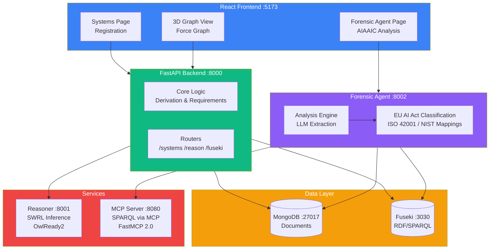

<p align="center">
  
</p>

<h1 align="center">SERAMIS v1.0</h1>

<h3 align="center">Semantic Reasoning and AI Management Intelligent System</h3>

<p align="center">
  <strong>Plataforma de evaluación semántica automatizada para el cumplimiento del Reglamento Europeo de Inteligencia Artificial (EU AI Act)</strong>
</p>

<p align="center">
  
  
  
  
</p>

---

## Trabajo Fin de Máster - UNIR

<p align="center">
  
</p>

Este proyecto ha sido desarrollado como **Trabajo Fin de Máster** del programa de **Máster en Inteligencia Artificial** de la **Universidad Internacional de La Rioja (UNIR)**.

### Equipo de Desarrollo

| Rol | Nombre |
|-----|--------|
| **Autores** | David Fernández González, Mariano Ortega de Mues |
| **Directora** | Dra. Xiomara Patricia Blanco Valencia |
| **Co-Director** | Dr. Sergio Castillo |

### Agradecimientos

Este software fue parcialmente desarrollado empleando **Claude Sonnet 4.5** (Anthropic), asistente de IA utilizado para acelerar el desarrollo de código, documentación y diseño arquitectónico.

---

## Descripción

SERAMIS implementa un **sistema de evaluación semántica automatizada** para sistemas de IA regulados por el EU AI Act. Combina una ontología formal OWL (v0.37.2) con reglas de inferencia SWRL para derivar automáticamente requisitos de cumplimiento, evaluaciones de riesgo y obligaciones regulatorias.

### Características Principales

- **Razonamiento Semántico Híbrido** (SWRL + SHACL) para clasificación automática de riesgo
- **Análisis Forense Post-Incidente** con extracción LLM de narrativas de incidentes
- **Cumplimiento Multi-Framework**: EU AI Act + ISO 42001 + NIST AI RMF
- **Visualización 3D** interactiva del grafo de conocimiento
- **Persistencia Dual**: MongoDB para documentos + Apache Jena Fuseki para RDF/SPARQL
- **Servidor MCP** (Model Context Protocol) para integración con agentes de IA

---

## Arquitectura del Sistema



---

## Instalación

### Prerrequisitos

- **Docker** & **Docker Compose**
- **Git**
- **Ollama** (para el agente forense LLM - usa llama3.2:3b)

### Inicio Rápido

```bash
# 1. Clonar repositorio
git clone https://github.com/[usuario]/seramis.git
cd seramis

# 2. Iniciar todos los servicios
docker-compose up -d

# 3. Verificar despliegue
docker-compose ps
```

### Puntos de Acceso

| Servicio | URL | Descripción |
|----------|-----|-------------|
| **Frontend** | http://localhost:5173 | Interfaz web principal |
| **Visor 3D de Grafo** | http://localhost:5173/graph | Visualización 3D de la ontología |
| **Agente Forense UI** | http://localhost:5173/forensic | Análisis de incidentes AIAAIC |
| **API Docs** | http://localhost:8000/docs | Documentación API (Swagger) |
| **API Forense** | http://localhost:8002/docs | Documentación API forense |
| **SPARQL Endpoint** | http://localhost:3030 | Consultas RDF/SPARQL |
| **MCP Server** | http://localhost:8080/mcp | Model Context Protocol |

---

## Agente Forense

El **Agente Forense** es un microservicio potenciado por LLM para análisis de cumplimiento post-incidente. Extrae información estructurada de narrativas de incidentes y evalúa el cumplimiento contra múltiples frameworks.

📖 **Documentación completa:** [`forensic_agent/README.md`](forensic_agent/README.md)

### Fuente de Datos: AIAAIC Repository

El agente utiliza datos del **AI, Algorithmic, and Automation Incidents and Controversies (AIAAIC) Repository**, una base de datos independiente que documenta incidentes relacionados con sistemas de IA a nivel mundial.

🔗 **AIAAIC Repository:** https://www.aiaaic.org/aiaaic-repository

### Características

| Característica | Descripción |
|----------------|-------------|
| **Extracción LLM** | Usa Ollama (llama3.2:3b) para extraer datos estructurados |
| **Análisis Multi-Framework** | EU AI Act + ISO 42001 (15 mappings) + NIST AI RMF (18 mappings) |
| **Clasificación de Riesgo** | Categorización automática según 6 categorías del Anexo III |
| **Detección de Brechas** | Identifica requisitos faltantes y calcula ratio de cumplimiento |
| **Persistencia Dual** | Guarda en MongoDB + Fuseki RDF para consultas semánticas |

### Ejemplo de Análisis

```bash
curl -X POST http://localhost:8002/forensic/analyze \
  -H "Content-Type: application/json" \
  -d '{
    "narrative": "Sistema de reconocimiento facial utilizado por fuerzas policiales para identificar manifestantes. El sistema mostró sesgo significativo contra minorías.",
    "source": "AIAAIC Repository",
    "metadata": {
      "aiaaic_id": "AIAAIC0042",
      "headline": "Sesgo en reconocimiento facial policial"
    }
  }'
```

---

## Ontología

### Versión: 0.37.2

| Propiedad | Valor |
|-----------|-------|
| **Namespace** | `http://ai-act.eu/ai#` |
| **Formato** | Turtle (.ttl) |
| **Clases** | 50+ |
| **Propiedades** | 45+ |
| **Individuos** | 100+ |
| **Tripletas** | ~1,800 |

### Cobertura Regulatoria

- EU AI Act Anexo III (8/8 categorías de alto riesgo)
- Artículos 51-55 (requisitos GPAI)
- Taxonomía de algoritmos (Anexo I)
- Framework de gobernanza de datos
- Shapes SHACL de validación
- Reglas de inferencia SWRL

### Mappings Multi-Framework

| Framework | Tipo | Mappings | Confianza |
|-----------|------|----------|-----------|
| **EU AI Act** | Regulación obligatoria | Base | - |
| **ISO 42001** | Estándar de certificación | 15 | 87% HIGH |
| **NIST AI RMF** | Guía voluntaria | 18 | 100% HIGH |
| **Total** | Multi-framework | **33** | **94% HIGH** |

---

## Mecanismos de Inferencia

SERAMIS implementa **tres mecanismos de inferencia** basados en diferentes secciones del EU AI Act para la clasificación automática de sistemas de IA:

### 1. Inferencia por Propósito + Contexto (Anexo III)

Clasifica sistemas de IA como **Alto Riesgo** basándose en la combinación del propósito del sistema y su contexto de despliegue, según las 8 categorías del Anexo III del EU AI Act.

```mermaid
flowchart LR
    P[Propósito] --> C1[Criterios Propósito]
    X[Contexto] --> C2[Criterios Contexto]
    C1 --> U[Unión de Criterios]
    C2 --> U
    U --> R[Requisitos Anexo III]
    R --> RL[Alto Riesgo]

    style P fill:#3b82f6,color:#fff
    style X fill:#8b5cf6,color:#fff
    style U fill:#f59e0b,color:#fff
    style RL fill:#ef4444,color:#fff
```



**Categorías cubiertas:**
- Biometría e identificación de personas
- Gestión de infraestructuras críticas
- Educación y formación profesional
- Empleo y gestión de trabajadores
- Acceso a servicios esenciales (crédito, seguros)
- Aplicación de la ley
- Migración, asilo y control fronterizo
- Administración de justicia y procesos democráticos

### 2. Inferencia por Experto Humano (Artículo 6.3)

Permite que un **experto humano** identifique manualmente **criterios de riesgo adicionales** para sistemas que no son capturados por las reglas automáticas de Propósito + Contexto. Esta evaluación experta complementa la inferencia automática.

En el interfaz **AI Systems DB**, la Sección 6 "Expert Evaluation" permite al evaluador:

```
Si experto identifica riesgos no detectados automáticamente
   → Añade criterios manualmente (hasManuallyIdentifiedCriterion)
   → Sistema reclasificado a HighRisk con criterios adicionales
```

**Campos disponibles en el formulario:**
- `hasManuallyIdentifiedCriterion`: Criterios de alto riesgo identificados por el experto
- Selección múltiple de criterios del catálogo del Anexo III
- Los criterios manuales se combinan con los criterios derivados automáticamente

**Aplicación del Art. 6.3:**
- Casos residuales no cubiertos por reglas automáticas
- Sistemas con riesgo contextual específico
- Evaluación caso por caso por experto cualificado

### 3. Inferencia para Modelos GPAI (Artículos 51-55)

Clasifica **Modelos de Propósito General** (GPAI) y detecta aquellos con **Riesgo Sistémico** basándose en capacidad computacional y otros indicadores.

```
Si modelo GPAI tiene FLOPS ≥ 10^25
   → Riesgo Sistémico (Art. 51)
   → Requisitos adicionales Arts. 52-55
```

**Criterios de Riesgo Sistémico:**
- Capacidad computacional ≥ 10²⁵ FLOPS de entrenamiento
- Capacidades de alto impacto determinadas por la Comisión
- Número significativo de usuarios registrados

### Resumen de Mecanismos

| Mecanismo | Base Legal | Entrada | Salida |
|-----------|------------|---------|--------|
| **Propósito + Contexto** | Anexo III | Propósito, Contexto de despliegue | HighRisk / NotHighRisk + Criterios automáticos |
| **Experto Humano** | Art. 6.3 | `hasManuallyIdentifiedCriterion` | Criterios adicionales → HighRisk |
| **GPAI** | Arts. 51-55 | FLOPS, capacidades | SystemicRisk / GPAI estándar |

---

## Stack Tecnológico

### Backend
- Python 3.11
- FastAPI
- RDFLib (procesamiento RDF/OWL)
- OwlReady2 (razonamiento OWL)
- Motor (MongoDB async)
- FastMCP 2.0 (Model Context Protocol)

### Frontend
- React 19
- TypeScript
- Vite
- TailwindCSS
- react-force-graph-3d (visualización 3D)
- Three.js (rendering WebGL)

### AI/LLM
- Ollama (runtime LLM local)
- llama3.2:3b (modelo por defecto)

### Infraestructura
- Docker & Docker Compose
- Apache Jena Fuseki
- MongoDB 6
- NGINX

---

## Estructura del Proyecto

```
seramis/
├── backend/                    # FastAPI backend (8000)
│   ├── main.py
│   ├── derivation.py
│   ├── routers/
│   └── models/
├── frontend/                   # React + TypeScript UI (5173)
│   ├── src/
│   │   ├── pages/
│   │   │   ├── SystemsPage.tsx
│   │   │   ├── GraphView.tsx
│   │   │   └── ForensicAgentPage.tsx
│   │   └── lib/
├── forensic_agent/            # Agente de Análisis Forense (8002)
│   ├── app/
│   │   ├── main.py
│   │   └── services/
│   │       ├── incident_extractor.py
│   │       ├── analysis_engine.py
│   │       ├── persistence.py
│   │       └── mcp_client.py
├── mcp-servers/               # Servidores MCP
│   └── forensic-sparql/
│       └── server.py
├── reasoner_service/          # Microservicio de razonamiento SWRL (8001)
├── ontologias/                # Archivos de ontología
│   ├── versions/0.37.2/
│   ├── rules/
│   ├── shacl/
│   └── mappings/
├── docker-compose.yml
└── README.md
```

---

## API Reference

### Sistemas

```http
GET    /systems              # Listar sistemas
POST   /systems              # Registrar sistema
GET    /systems/{urn}        # Obtener sistema
PUT    /systems/{urn}        # Actualizar sistema
DELETE /systems/{urn}        # Eliminar sistema
```

### Razonamiento

```http
POST   /reasoning/system/{id}  # Ejecutar razonamiento SWRL
GET    /reasoning/rules        # Obtener reglas SWRL
GET    /reasoning/status       # Estado del servicio
```

### Análisis Forense

```http
POST   /forensic/analyze       # Analizar narrativa de incidente
GET    /forensic/systems       # Listar sistemas analizados
GET    /forensic/systems/{urn} # Obtener análisis específico
DELETE /forensic/systems/{urn} # Eliminar análisis
```

### MCP Tools

```python
query_ontology(query)           # Ejecutar consultas SPARQL
get_requirements_for_system()   # Obtener requisitos EU AI Act
determine_risk_level()          # Determinar nivel de riesgo
query_iso_mappings()            # Consultar mappings ISO 42001
query_nist_mappings()           # Consultar mappings NIST AI RMF
get_inference_rules()           # Obtener reglas de inferencia
get_ontology_stats()            # Estadísticas de la ontología
```

---

## Referencias

- **EU AI Act:** https://eur-lex.europa.eu/legal-content/EN/TXT/?uri=CELEX:32024R1689
- **AIAAIC Repository:** https://www.aiaaic.org/aiaaic-repository
- **ISO/IEC 42001:2023:** https://www.iso.org/standard/81230.html
- **NIST AI RMF 1.0:** https://www.nist.gov/itl/ai-risk-management-framework
- **Apache Jena Fuseki:** https://jena.apache.org/documentation/fuseki2/
- **OWL 2 Web Ontology Language:** https://www.w3.org/TR/owl2-overview/
- **SHACL:** https://www.w3.org/TR/shacl/

---

## Agradecimientos

Este proyecto utiliza datos del **AI, Algorithmic, and Automation Incidents and Controversies (AIAAIC) Repository**, una base de datos independiente y de acceso abierto que documenta incidentes relacionados con sistemas de IA a nivel mundial. Agradecemos a **Charlie Pownall** y al equipo de AIAAIC por su trabajo en la recopilación y mantenimiento de este recurso invaluable.

Este proyecto ha sido desarrollado con la asistencia de **Claude Sonnet** (Anthropic), utilizado como herramienta de desarrollo para la generación de código, documentación y diseño de arquitectura.

---

## Licencia

Este proyecto utiliza la ontología EU AI Act licenciada bajo **Creative Commons Attribution 4.0 International (CC BY 4.0)**.

El código fuente está disponible bajo los términos definidos por UNIR para Trabajos Fin de Máster.

---

<p align="center">
  
</p>

<p align="center">
  <strong>Universidad Internacional de La Rioja</strong><br/>
  Máster en Inteligencia Artificial<br/>
  Curso 2024-2025
</p>

<p align="center">
  <sub>Versión 1.0.0 | Diciembre 2025</sub>
</p>
