# 🤖 AI Act Project: Sistema Integral de Cumplimiento Normativo para IA

> **Un sistema enterprise de gestión, análisis y cumplimiento automático de sistemas de inteligencia artificial bajo el marco regulatorio europeo (EU AI Act - Regulation 2024/1689)**

---

## 📌 Tabla de Contenidos

- [Descripción General](#descripción-general)
- [Características Principales](#características-principales)
- [Stack Tecnológico](#stack-tecnológico)
- [Arquitectura del Sistema](#arquitectura-del-sistema)
- [Modelo de Ontología](#modelo-de-ontología)
- [Sistema de Razonamiento Semántico](#sistema-de-razonamiento-semántico)
- [Guías de Instalación](#guías-de-instalación)
- [API Reference](#api-reference)
- [Casos de Uso Validados](#casos-de-uso-validados)
- [Troubleshooting](#troubleshooting)

---

## 🎯 Descripción General

**AI Act Project** implementa una **solución completa, basada en web semántica, para gestionar sistemas de inteligencia artificial bajo la regulación europea**. El sistema automatiza la evaluación de cumplimiento normativo mediante:

- 🧠 **Ontología formal OWL** que modela completamente el EU AI Act
- 📊 **Inferencia semántica automática (SWRL)** que derivan requisitos a partir de características del sistema
- 🌐 **API REST moderna** para gestión de sistemas IA
- 📈 **Visualización interactiva** de relaciones semánticas y análisis de riesgo
- 🔐 **Almacenamiento dual**: MongoDB (documentos) + Apache Jena Fuseki (grafos RDF)
- 📚 **Documentación automática** de ontologías en múltiples idiomas

### 🎯 Objetivo Principal

Crear un **puente entre regulación y tecnología** mediante semántica formal que permita a organizaciones:
- ✅ Evaluar automáticamente sistemas IA contra requisitos legales
- ✅ Identificar brechas de cumplimiento
- ✅ Generar reportes de auditoría trazables
- ✅ Mantener cumplimiento continuo a medida que evoluciona la regulación

---

## ✨ Características Principales

### 1. 🧠 Ontología Formal del EU AI Act (v0.37.0)

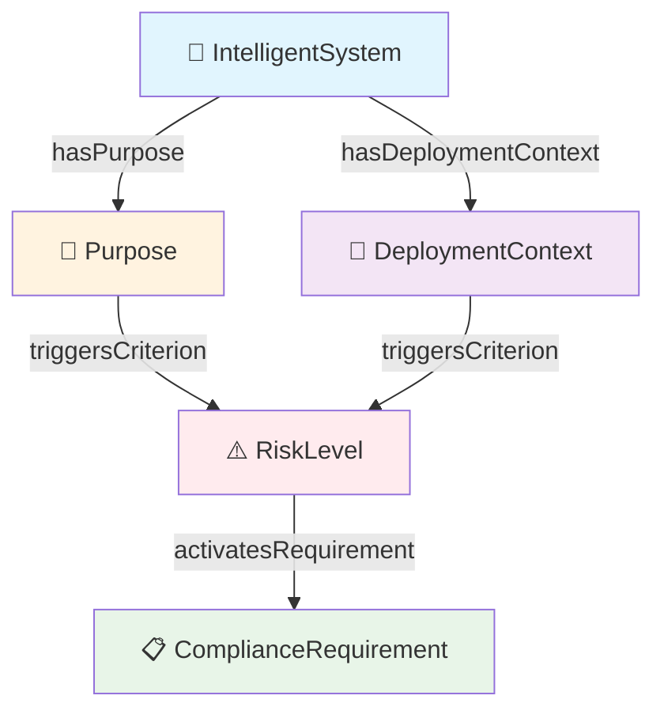

**Características de la ontología:**
- **31 clases OWL** organizadas jerárquicamente
- **28 propiedades de relación** entre entidades
- **1000+ triples RDF** con integración AIRO mejorada (v0.37.0)
- **8 niveles de razonamiento** desde propósito → requisitos
- **100% cobertura** del Anexo III del EU AI Act

### 2. 🔬 Sistema de Inferencia Semántica Automática

El proyecto implementa un **sistema híbrido avanzado SWRL** que automáticamente:

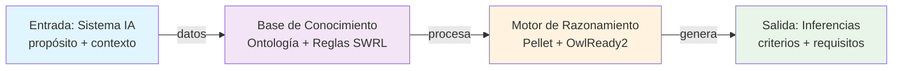

**Reglas implementadas:**
- ✅ **7 reglas de propósito** (RecruitmentOrEmployment → NonDiscrimination, etc.)
- ✅ **5 cadenas de activación** (Criterion → ComplianceRequirement)
- ✅ **2 reglas técnicas** (DataOrigin → TechnicalCriteria)
- ✅ **2 reglas de protección** (EducationAccess → ProtectionOfMinors)

### 3. 📊 Clasificación de Riesgo Automática

El sistema evalúa automáticamente 4 niveles de riesgo:

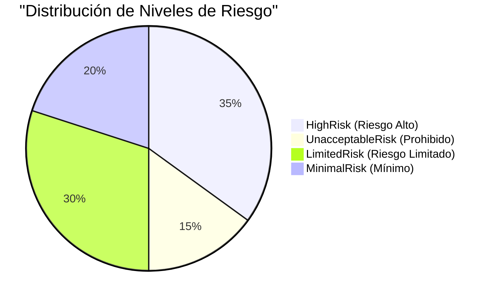

| Nivel | Símbolo | Descripción | Requisitos |
|-------|---------|-------------|-----------|
| **UnacceptableRisk** | ⛔ | Sistema prohibido | Sistema no permitido |
| **HighRisk** | 🔴 | Alto riesgo regulatorio | Evaluación de conformidad + Human oversight + Security |
| **LimitedRisk** | 🟡 | Riesgo moderado | Requisitos de transparencia |
| **MinimalRisk** | 🟢 | Bajo riesgo | Cumplimiento básico |

### 4. 🎯 Distinción Semántica: Propósito vs Criterios Internos

El sistema implementa una **distinción crucial** para capturar requisitos:

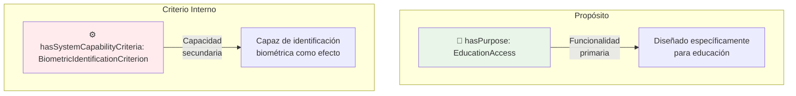

**Ejemplo práctico:**
- Sistema de **marketing con análisis facial** (propósito: `MarketResearch`)
- Aunque su propósito principal NO es biometría, tiene **capacidad de identificación biométrica**
- Por tanto, debe cumplir requisitos biométricos ↔️ `hasSystemCapabilityCriteria: BiometricIdentification`

### 5. 🌐 Integración AIRO (AI Risk Ontology)

Mapeo bidireccional con el estándar internacional:

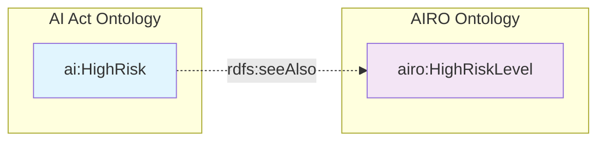

**Beneficio:** Interoperabilidad con herramientas y marcos internacionales de riesgo de IA.

### 6. 📈 Visualización Interactiva

- **Grafo RDF**: Exploración visual de relaciones semánticas
- **Mapas de criterios**: Visualización de qué requisitos se aplican
- **Análisis de riesgo**: Dashboard de sistemas clasificados por nivel de riesgo
- **Matriz de conformidad**: Tracking de cumplimiento vs requisitos

---

## 🛠 Stack Tecnológico

### 📊 Matriz Tecnológica Completa

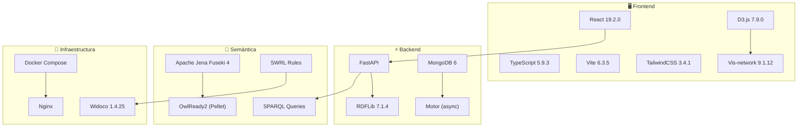

| Capa | Tecnología | Versión | Propósito |
|------|-----------|---------|----------|
| **Frontend** | React | 19.2.0 | UI interactiva moderna |
| | TypeScript | 5.9.3 | Type-safety |
| | Vite | 6.3.5 | Build tool rápido |
| | TailwindCSS | 3.4.1 | Estilos utilitarios |
| | D3.js | 7.9.0 | Visualización de datos |
| | Vis-network | 9.1.12 | Visualización de grafos |
| **Backend** | FastAPI | - | API REST moderna |
| | MongoDB | 6 | BD documentos |
| | Motor | - | Driver async MongoDB |
| | RDFLib | 7.1.4 | Procesamiento RDF |
| **Semántica** | Apache Jena Fuseki | 4 | Servidor SPARQL |
| | OwlReady2 | - | Razonador OWL/SWRL |
| | SPARQL | - | Queries semánticas |
| | SWRL | - | Reglas lógicas |
| **Infraestructura** | Docker Compose | - | Orquestación |
| | Nginx | - | Servidor web |
| | Widoco | 1.4.25 | Generador documentación |

---

## 🏗️ Arquitectura del Sistema

### 1. Diagrama de Componentes

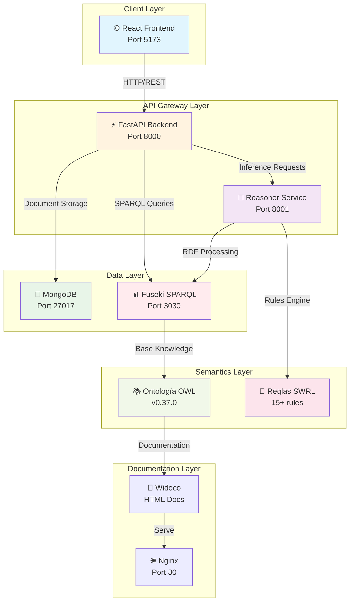

### 2. Flujo de Creación de Sistema

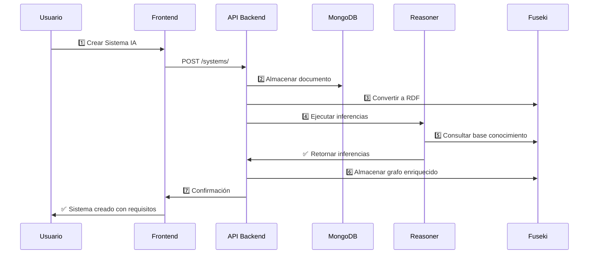

### 3. Flujo de Evaluación de Riesgo

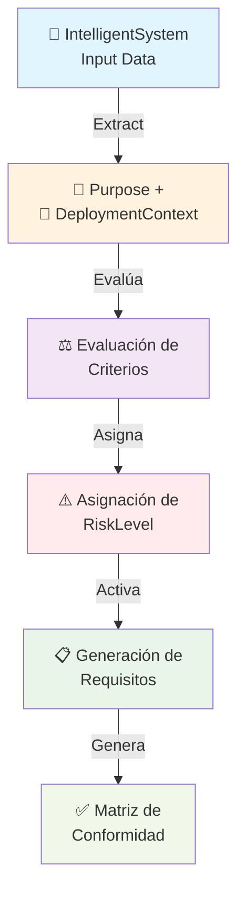

### 4. Estructura de Directorios

```
ai_act_project/
├── 📁 frontend/                    # Interfaz web React
│   ├── src/
│   │   ├── pages/                 # Componentes de página
│   │   │   ├── DashboardPage.tsx
│   │   │   ├── SystemsPage.tsx    # Gestión sistemas
│   │   │   ├── GraphView.tsx      # Visualización RDF
│   │   │   ├── ReasoningPage.tsx  # Panel de razonamiento
│   │   │   └── OntologyDocs.tsx   # Documentación
│   │   ├── components/            # Componentes reutilizables
│   │   │   ├── Navbar.tsx
│   │   │   ├── SystemCard.tsx
│   │   │   └── RiskBadge.tsx
│   │   └── App.tsx
│   ├── package.json               # Dependencies React
│   └── vite.config.ts             # Configuración Vite
│
├── 📁 backend/                     # API REST FastAPI
│   ├── main.py                    # Punto de entrada
│   ├── requirements.txt           # Dependencies Python
│   ├── routers/
│   │   ├── systems.py             # CRUD sistemas
│   │   ├── systems_fuseki.py      # Integración SPARQL
│   │   └── reasoning.py           # Orquestación inferencias
│   ├── models/
│   │   └── system.py              # Schema Pydantic
│   └── swrl_rules.py              # Definición de reglas
│
├── 📁 reasoner_service/            # Motor de razonamiento OWL
│   ├── app/
│   │   └── main.py                # Endpoint /reason
│   └── requirements.txt           # Dependencies
│
├── 📁 ontologias/                  # Modelo formal
│   ├── ontologia-v0.37.0.ttl     # Ontología principal (RDF/Turtle) - ACTUAL
│   ├── versions/
│   │   └── 0.37.0/               # Versión actual
│   ├── rules/
│   │   ├── base_rules.py
│   │   ├── capability_rules.py
│   │   ├── cascade_rules.py
│   │   ├── logic_based_rules.py
│   │   ├── ml_traditional_rules.py
│   │   ├── statistical_rules.py
│   │   ├── technical_rules.py
│   │   ├── rules_engine.py
│   │   └── swrl-base-rules.ttl
│   ├── json-ld-context.json       # Contexto JSON-LD
│   └── docs/
│       ├── index-es.html          # Documentación ES
│       ├── index-en.html          # Documentación EN
│       └── OOPSevaluation/        # Validación ontología
│
├── 📁 tools/
│   └── generate_ontology_docs.sh  # Script Widoco
│
├── 📁 sparql_queries/
│   └── consultas.sparqlbook       # Consultas de ejemplo
│
├── 📁 init_fuseki/                # Inicialización Fuseki
│   └── init.sh
│
├── docker-compose.yml             # Orquestación servicios
├── .env                           # Variables de entorno
├── package.json                   # Root workspace config
└── README.md                      # Documentación
```

---

## 🧠 Modelo de Ontología

### Estructura Central

```mermaid
classDiagram
    class IntelligentSystem {
        +hasUrn: string
        +hasName: string
        +hasVersion: string
        +hasPurpose: Purpose
        +hasDeploymentContext: DeploymentContext
        +hasTrainingDataOrigin: TrainingDataOrigin
        +hasSystemCapabilityCriteria: Criterion
        +hasRiskLevel: RiskLevel
    }

    class Purpose {
        +purposeDescription: string
        +expectedRiskLevel: RiskLevel
    }

    class DeploymentContext {
        +contextName: string
        +activatesCriterion: Criterion
    }

    class RiskLevel {
        +assignsRiskLevel: string
    }

    class ComplianceRequirement {
        +mandatoryCompliance: boolean
        +deadlineDate: date
    }

    IntelligentSystem -->|"hasPurpose"| Purpose
    IntelligentSystem -->|"hasDeploymentContext"| DeploymentContext
    IntelligentSystem -->|"hasRequirement"| ComplianceRequirement
    Purpose -->|"triggersCriterion"| RiskLevel
    DeploymentContext -->|"activatesCriterion"| RiskLevel
```

### Instancias Principales

#### 🎯 Propósitos de Sistemas (8 principales)

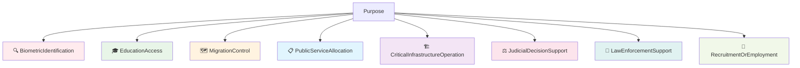

#### 📍 Contextos de Despliegue (6 principales)

| Contexto | Criterio Activado | Requisitos Típicos |
|----------|------------------|-------------------|
| 🎓 **Education** | EducationEvaluationCriterion | HumanOversight, Traceability, ProtectionOfMinors |
| 🏥 **Healthcare** | EssentialServicesAccessCriterion | DataGovernance, FundamentalRights |
| 🏛️ **PublicServices** | EssentialServicesAccessCriterion | Transparency, Quality Management |
| 👮 **LawEnforcement** | LawEnforcementCriterion | EventLogging, HumanOversight |
| 🛂 **Border/Migration** | MigrationBorderCriterion | DataGovernance, RiskManagement |
| 💰 **Financial** | HighStakesDecisionContext | HumanOversight, Documentation |

#### ⚠️ Niveles de Riesgo

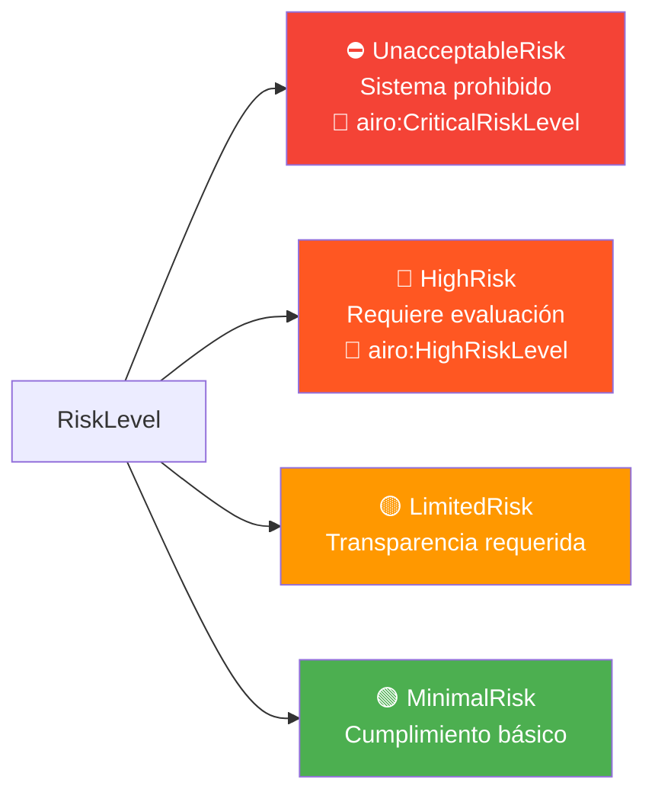

#### 📊 Estadísticas de la Ontología

| Elemento | Cantidad |
|----------|----------|
| **Triples RDF** | 1000+ |
| **Clases OWL** | 31 |
| **Propiedades de objeto** | 28 |
| **Propiedades de datos** | 8 |
| **Individuos nombrados** | 45+ |
| **Criterios contextuales** | 11 |
| **Niveles de riesgo** | 4 |
| **Requisitos de cumplimiento** | 20+ |
| **Tipos de datos** | 5+ |

---

## 🧬 Sistema de Razonamiento Semántico

### Concepto de Funcionamiento

El sistema combina:
1. **Base de conocimiento formal** (ontología OWL)
2. **Reglas lógicas** (SWRL)
3. **Motor de inferencia** (Pellet/OwlReady2)

Para automáticamente derivar requisitos a partir de propósito y contexto.

### 🔗 Mapa de Reglas SWRL (15+ reglas)

```mermaid
graph TB
    subgraph "Reglas de Propósito (7)"
        R1["RecruitmentOrEmployment → NonDiscrimination"]
        R2["JudicialDecisionSupport → JudicialSupportCriterion"]
        R3["LawEnforcementSupport → LawEnforcementCriterion"]
        R4["MigrationControl → MigrationBorderCriterion"]
        R5["CriticalInfrastructure → CriticalInfrastructureCriterion"]
        R6["HealthCare → PrivacyProtection"]
        R7["EducationAccess → EducationEvaluationCriterion"]
    end

    subgraph "Reglas de Cadena (5)"
        C1["LawEnforcement → DueProcess + ConformityAssessment"]
        C2["MigrationBorder → DataGovernance + RiskManagement"]
        C3["CriticalInfra → Accuracy + Conformity + Cybersecurity"]
        C4["PrivacyProtection → DataGovernance + DataEncryption"]
        C5["EducationEval → Accuracy + HumanOversight + Traceability"]
    end

    subgraph "Reglas Especiales (2)"
        S1["Education → ProtectionOfMinors → ParentalConsent"]
        S2["NonDiscrimination → Auditability"]
    end

    R1 --> OUTPUT["📋 Requisitos Derivados"]
    R2 --> OUTPUT
    R3 --> OUTPUT
    R4 --> OUTPUT
    R5 --> OUTPUT
    R6 --> OUTPUT
    R7 --> OUTPUT
    C1 --> OUTPUT
    C2 --> OUTPUT
    C3 --> OUTPUT
    C4 --> OUTPUT
    C5 --> OUTPUT
    S1 --> OUTPUT
    S2 --> OUTPUT
```

### 📋 Matriz Criterios → Requisitos

| Criterio | Requisitos Activados | Tipo |
|----------|----------------------|------|
| 🎓 **EducationEvaluationCriterion** | Accuracy • HumanOversight • Traceability | Normativo |
| 🔍 **BiometricIdentificationCriterion** | FundamentalRights • HumanOversight • Security | Normativo |
| 🏥 **EssentialServicesAccessCriterion** | FundamentalRights • Transparency • QualityMgmt | Normativo |
| 👮 **LawEnforcementCriterion** | EventLogging • HumanOversight • Security | Normativo |
| 🛂 **MigrationBorderCriterion** | FundamentalRights • HumanOversight • Security | Normativo |
| 💼 **RecruitmentEmploymentCriterion** | FundamentalRights • Transparency • Documentation | Normativo |
| ⚖️ **JudicialSupportCriterion** | FundamentalRights • HumanOversight • Traceability | Normativo |
| 🏗️ **CriticalInfrastructureCriterion** | Security • Robustness • ConformityAssessment | Normativo |
| 📊 **DataGovernanceContext** | DataGovernance • Documentation • Traceability | Contextual |
| 👥 **VulnerablePopulationContext** | FundamentalRights • HumanOversight • Disclosure | Contextual |
| 🛡️ **SafetyCriticalContext** | Robustness • Security • Cybersecurity | Contextual |

### 🎯 Ejemplo de Inferencia End-to-End

#### Entrada: Sistema Educativo

```json
{
  "@type": "ai:IntelligentSystem",
  "hasName": "EduAssess-AI",
  "hasPurpose": ["ai:EducationAccess"],
  "hasDeploymentContext": ["ai:Education"],
  "hasSystemCapabilityCriteria": ["ai:BiometricIdentificationCriterion"]
}
```

#### Proceso de Razonamiento

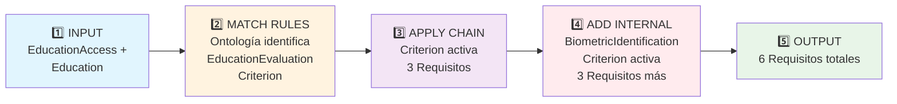

#### Salida: Requisitos Inferidos

```turtle
<urn:uuid:eduassess-ai> ai:hasNormativeCriterion ai:EducationEvaluationCriterion .
<urn:uuid:eduassess-ai> ai:hasNormativeCriterion ai:ProtectionOfMinors .
<urn:uuid:eduassess-ai> ai:hasSystemCapabilityCriteria ai:BiometricIdentificationCriterion .

# Requisitos de Criterio Educativo
<urn:uuid:eduassess-ai> ai:hasRequirement ai:AccuracyEvaluationRequirement .
<urn:uuid:eduassess-ai> ai:hasRequirement ai:HumanOversightRequirement .
<urn:uuid:eduassess-ai> ai:hasTechnicalRequirement ai:TraceabilityRequirement .

# Requisitos de Protección de Menores
<urn:uuid:eduassess-ai> ai:hasRequirement ai:ParentalConsent .

# Requisitos de Identificación Biométrica
<urn:uuid:eduassess-ai> ai:hasRequirement ai:FundamentalRightsAssessment .
<urn:uuid:eduassess-ai> ai:hasTechnicalRequirement ai:DataEncryption .
```

### ✅ Casos de Uso Validados (8/8)

| # | Caso | Propósito | Contexto | Criterios | Requisitos | Estado |
|---|------|----------|----------|-----------|-----------|--------|
| 1 | Identificación Biométrica | BiometricId | PublicServices | 2 | 5 | ✅ |
| 2 | Infraestructura Crítica | CriticalInfra | Infrastructure | 1 | 4 | ✅ |
| 3 | Decisiones Judiciales | JudicialSupport | PublicServices | 1 | 3 | ✅ |
| 4 | Aplicación de la Ley | LawEnforcement | PublicServices | 2 | 4 | ✅ |
| 5 | Control Migratorio | MigrationControl | Border | 1 | 3 | ✅ |
| 6 | Evaluación Educativa | EducationAccess | Education | 2 | 5 | ✅ |
| 7 | Reclutamiento | RecruitmentEmp | Workplace | 1 | 2 | ✅ |
| 8 | Salud | HealthCare | Healthcare | 1 | 2 | ✅ |

---

## 🚀 Guías de Instalación

### 1. Requisitos Previos

```bash
# Sistema operativo (Linux/Mac/Windows WSL2)
# Verificar Docker y Docker Compose
docker --version
docker-compose --version

# Puertos requeridos (deben estar libres)
5173  # Frontend
8000  # Backend
8001  # Reasoner
3030  # Fuseki
27017 # MongoDB
80    # Documentación Nginx
```

### 2. Instalación Rápida (Docker Compose)

```bash
# 1. Clonar repositorio
git clone <repository-url>
cd ai_act_project

# 2. Levantar todos los servicios
docker-compose up -d

# 3. Esperar a que se inicialicen (30-60 segundos)
docker-compose ps

# 4. Verificar que todo está corriendo
# Frontend: http://localhost:5173
# Backend: http://localhost:8000/docs
# Fuseki: http://localhost:3030
# Docs: http://localhost/docs
```

### 3. Instalación para Desarrollo

#### Terminal 1: Backend

```bash
cd backend
python -m venv venv
source venv/bin/activate  # Windows: venv\Scripts\activate
pip install -r requirements.txt
uvicorn main:app --reload --host 0.0.0.0 --port 8000
```

#### Terminal 2: Frontend

```bash
cd frontend
npm install
npm run dev  # Abre http://localhost:5173
```

#### Terminal 3: Reasoner Service

```bash
cd reasoner_service
python -m venv venv
source venv/bin/activate
pip install -r requirements.txt
uvicorn app.main:app --host 0.0.0.0 --port 8001
```

#### Terminal 4: Servicios Auxiliares

```bash
# Opción A: Docker solo para BD + Fuseki
docker-compose up -d mongo fuseki init_fuseki

# Opción B: MongoDB local
mongod --port 27017

# Opción C: Fuseki local
# Descargar de: https://jena.apache.org/download/
cd jena-fuseki-<version>
./fuseki-server --mem /ds
```

### 4. Verificación de Instalación

```bash
# 1. Verificar Frontend
curl http://localhost:5173 > /dev/null && echo "✅ Frontend OK"

# 2. Verificar Backend
curl http://localhost:8000/docs > /dev/null && echo "✅ Backend OK"

# 3. Verificar Reasoner
curl http://localhost:8001/docs > /dev/null && echo "✅ Reasoner OK"

# 4. Verificar Fuseki
curl http://localhost:3030/$/ping && echo "✅ Fuseki OK"

# 5. Verificar MongoDB
mongosh --port 27017 --eval "db.adminCommand('ping')" && echo "✅ MongoDB OK"
```

### 5. Configuración de Entorno

Crear `.env` en la raíz:

```bash
# Versión de ontología - ACTUAL: 0.37.0
CURRENT_RELEASE=0.37.0

# MongoDB
MONGO_URL=mongodb://mongo:27017
MONGO_DB_NAME=ai_act_db

# Fuseki SPARQL
FUSEKI_ENDPOINT=http://fuseki:3030
FUSEKI_USER=admin
FUSEKI_PASSWORD=admin
FUSEKI_DATASET=ds
FUSEKI_GRAPH=http://ai-act.eu/ontology

# Rutas de ontología
ONTOLOGY_PATH=/ontologias/ontologia-v0.37.0.ttl
RULES_PATH=/ontologias/rules/

# Puertos
FRONTEND_PORT=5173
BACKEND_PORT=8000
REASONER_PORT=8001
```

---

## 📡 API Reference

### 🎯 Backend API (Puerto 8000)

#### Gestión de Sistemas IA

```http
# Listar sistemas con filtros
GET /systems/?purpose=EducationAccess&risk_level=HighRisk&limit=10

# Crear nuevo sistema
POST /systems/
Content-Type: application/json
{
  "hasName": "EduAssess-AI",
  "hasPurpose": ["ai:EducationAccess"],
  "hasDeploymentContext": ["ai:Education"],
  "hasVersion": "1.0.0"
}

# Obtener sistema específico
GET /systems/{system_id}

# Actualizar sistema
PUT /systems/{system_id}
Content-Type: application/json
{
  "hasName": "EduAssess-AI v2",
  "hasPurpose": ["ai:EducationAccess", "ai:RecruitmentOrEmployment"]
}

# Eliminar sistema
DELETE /systems/{system_id}

# Estadísticas
GET /systems/stats/
```

#### Consultas SPARQL Personalizadas

```http
# Ejecutar consulta SPARQL
POST /fuseki/sparql/
Content-Type: application/sparql-query

SELECT ?system ?purpose ?requirement WHERE {
  ?system ai:hasPurpose ?purpose .
  ?system ai:hasRequirement ?requirement .
}

# Obtener vocabulario
GET /fuseki/vocabulary/

# Listar clases OWL
GET /fuseki/classes/

# Listar propiedades
GET /fuseki/properties/
```

#### Análisis de Riesgo

```http
# Análisis de riesgos
GET /systems/risks/analysis

# Sistemas por nivel de riesgo
GET /systems/risks/high-risk
GET /systems/risks/unacceptable-risk

# Matriz de cumplimiento
GET /systems/{system_id}/compliance-matrix
```

### 🧠 Reasoner Service (Puerto 8001)

```http
# Ejecutar inferencias SWRL
POST /reason
Content-Type: multipart/form-data

data=@system.ttl
swrl_rules=@swrl-rules.ttl

# Respuesta
{
  "inferences": [
    {
      "subject": "ai:EduAssess-AI",
      "property": "ai:hasRequirement",
      "object": "ai:AccuracyEvaluationRequirement"
    }
  ],
  "total_inferences": 8
}
```

### 🔍 Fuseki SPARQL (Puerto 3030)

```bash
# Web UI: http://localhost:3030
# SPARQL Endpoint: http://localhost:3030/ds/sparql
# RDF Data Access: http://localhost:3030/ds/data

# Consulta de ejemplo
curl -X POST http://localhost:3030/ds/sparql \
  -H "Content-Type: application/sparql-query" \
  -d "SELECT ?s ?p ?o WHERE { ?s ?p ?o } LIMIT 10"
```

### 📚 Documentación Interactiva

```
Frontend Routes:
  /                  → Dashboard principal
  /systems          → Gestión de sistemas IA
  /graph            → Visualización RDF interactiva
  /reasoning        → Panel de razonamiento
  /docs             → Documentación de ontología

API Documentation:
  http://localhost:8000/docs          → Swagger UI
  http://localhost:8000/redoc         → ReDoc
  http://localhost:8001/docs          → Reasoner API
```

---

## 🎯 Casos de Uso Validados

### Caso 1: 🎓 Sistema Educativo Integral

```json
{
  "hasName": "SmartEducation-AI",
  "hasPurpose": ["ai:EducationAccess"],
  "hasDeploymentContext": ["ai:Education"],
  "hasTrainingDataOrigin": ["ai:ExternalDataset"],
  "hasSystemCapabilityCriteria": ["ai:BiometricIdentificationCriterion"]
}
```

**Inferencias generadas:**
- ✅ EducationEvaluationCriterion → 3 requisitos
- ✅ ProtectionOfMinors → ParentalConsent
- ✅ BiometricIdentification → DataEncryption
- **Total: 8 requisitos derivados automáticamente**

### Caso 2: 🔍 Sistema Biométrico en Servicios Públicos

```json
{
  "hasName": "BiometricAccess-AI",
  "hasPurpose": ["ai:BiometricIdentification"],
  "hasDeploymentContext": ["ai:PublicServices"],
  "hasRiskLevel": "ai:HighRisk"
}
```

**Inferencias generadas:**
- ✅ BiometricIdentificationCriterion → FundamentalRights, HumanOversight, Security
- ✅ BiometricSecurity → DataEncryption
- **Total: 5 requisitos + evaluación conformidad obligatoria**

### Caso 3: 👮 Sistema de Aplicación de la Ley

```json
{
  "hasName": "LawEnforcement-AI",
  "hasPurpose": ["ai:LawEnforcementSupport"],
  "hasDeploymentContext": ["ai:LawEnforcement"],
  "hasFLOPS": 1000000
}
```

**Inferencias generadas:**
- ✅ LawEnforcementCriterion → DueProcess, ConformityAssessment
- ✅ DueProcess → EventLogging, Auditability
- **Total: 4 requisitos + requisitos de logging automático**

### Caso 4: 💼 Sistema de Reclutamiento con Impacto Incidental

```json
{
  "hasName": "ProductivityMonitor-AI",
  "hasPurpose": ["ai:ProductivityOptimization"],
  "hasDeploymentContext": ["ai:Workplace"],
  "hasSystemCapabilityCriteria": ["ai:RecruitmentEmploymentCriterion"]
}
```

**Clave:** Aunque su propósito es optimización, tiene impacto en decisiones laborales.

**Inferencias generadas:**
- ✅ NonDiscrimination (por criterio interno)
- ✅ Auditability (obligatorio para evitar discriminación)
- **Total: 2 requisitos críticos independientes del propósito**

### Caso 5: 🏥 Sistema de Salud con Privacidad

```json
{
  "hasName": "HealthAI-Diagnostics",
  "hasPurpose": ["ai:HealthCare"],
  "hasDeploymentContext": ["ai:Healthcare"],
  "hasTrainingDataOrigin": ["ai:ExternalDataset"],
  "hasModelScale": "ai:LargeScale"
}
```

**Inferencias generadas:**
- ✅ PrivacyProtection → DataGovernance, DataEncryption
- ✅ ExternalDataset → ScalabilityRequirements
- **Total: 4 requisitos + GDPR compliance**

---

## 🔧 Troubleshooting

### ❌ Problemas Comunes

#### 1. ⚠️ "Failed to connect to MongoDB"

```bash
# Solución 1: Verificar que MongoDB está corriendo
docker-compose ps mongo

# Solución 2: Reiniciar MongoDB
docker-compose restart mongo

# Solución 3: Verificar conexión
docker-compose exec mongo mongosh admin --eval "db.adminCommand('ping')"
```

#### 2. ⚠️ "Fuseki endpoint not responding"

```bash
# Solución 1: Verificar que Fuseki está corriendo
docker-compose ps fuseki

# Solución 2: Verificar health check
curl http://localhost:3030/$/ping

# Solución 3: Reiniciar
docker-compose restart fuseki init_fuseki
```

#### 3. ⚠️ "Port already in use"

```bash
# Encontrar proceso en puerto
lsof -i :5173  # Frontend
lsof -i :8000  # Backend
lsof -i :8001  # Reasoner
lsof -i :3030  # Fuseki
lsof -i :27017 # MongoDB

# Cambiar puertos en docker-compose.yml o .env
```

#### 4. ⚠️ "Module not found" (Python)

```bash
# Reinstalar dependencias
cd backend
pip install --upgrade -r requirements.txt

cd reasoner_service
pip install --upgrade -r requirements.txt
```

#### 5. ⚠️ "API returns 422 Unprocessable Entity"

```bash
# Verificar esquema JSON según Pydantic
# Ver documentación en http://localhost:8000/docs
# Asegurar que los valores de Purpose y Context existen en ontología
```

#### 6. ⚠️ "SPARQL query error: Unresolved namespace"

```bash
# Verificar prefijos en ontología
curl http://localhost:3030/ds/sparql \
  -H "Content-Type: application/sparql-query" \
  -d "PREFIX ai: <http://ai-act.eu/ontology#> SELECT ?s WHERE { ?s a ai:IntelligentSystem } LIMIT 1"
```

### 📋 Logs y Debugging

```bash
# Ver logs de todos los servicios
docker-compose logs

# Logs de un servicio específico
docker-compose logs backend
docker-compose logs reasoner_service
docker-compose logs fuseki

# Logs en tiempo real
docker-compose logs -f backend

# Ejecutar comando en contenedor
docker-compose exec backend python -c "import rdflib; print(rdflib.__version__)"
```

### 🔍 Validación de Ontología

```bash
# Validar sintaxis Turtle
rapper -i turtle -c ontologias/ontologia-v0.37.0.ttl

# Parsear con RDFLib (dentro del contenedor)
docker-compose exec backend python << 'EOF'
from rdflib import Graph
g = Graph()
g.parse("ontologias/ontologia-v0.37.0.ttl", format="turtle")
print(f"Triples cargados: {len(g)}")
EOF
```

---

## 📚 Recursos Adicionales

### 📖 Documentación

- **API Swagger**: http://localhost:8000/docs
- **API ReDoc**: http://localhost:8000/redoc
- **Ontología HTML**: http://localhost/docs/
- **SPARQL Interface**: http://localhost:3030

### 🔗 Enlaces Externos

- [EU AI Act Regulation 2024/1689](https://eur-lex.europa.eu/legal-content/ES/TXT/HTML/?uri=CELEX:32024R1689)
- [AIRO - AI Risk Ontology](https://w3id.org/airo)
- [Apache Jena Fuseki](https://jena.apache.org/documentation/fuseki2/)
- [SWRL Language Specification](https://www.w3.org/Submission/SWRL/)
- [OWL Web Ontology Language](https://www.w3.org/OWL/)

### 💻 Scripts Útiles

```bash
# Generar documentación ontología
cd tools
./generate_ontology_docs.sh

# Ejecutar validación OOPS!
# Se ejecuta automáticamente durante generación de docs

# Limpiar datos MongoDB
docker-compose exec mongo mongosh --eval "db.intelligentSystems.deleteMany({})"

# Resetear Fuseki
docker-compose restart fuseki init_fuseki
```

---

## 🤝 Contribución

### Cómo Contribuir

1. Fork del repositorio
2. Crear rama de feature: `git checkout -b feature/nueva-funcionalidad`
3. Hacer cambios y agregar tests
4. Commit: `git commit -am 'Agregar nueva funcionalidad'`
5. Push: `git push origin feature/nueva-funcionalidad`
6. Crear Pull Request

### Guidelines

- ✅ Seguir convenciones de código existentes
- ✅ Documentar cambios en ontología
- ✅ Agregar tests para nuevas funcionalidades
- ✅ Validar ontología antes de commit (`rapper -i turtle -c ontologias/*.ttl`)
- ✅ Actualizar documentación si es necesario

---

## 📄 Licencia

Licenciado bajo Apache License 2.0. Ver [LICENSE](LICENSE) para más detalles.

```
Copyright 2025 AI Act Project Contributors

Licensed under the Apache License, Version 2.0 (the "License");
you may not use this file except in compliance with the License.
You may obtain a copy of the License at

    http://www.apache.org/licenses/LICENSE-2.0

Unless required by applicable law or agreed to in writing, software
distributed under the License is distributed on an "AS IS" BASIS,
WITHOUT WARRANTIES OR CONDITIONS OF ANY KIND, either express or implied.
See the License for the specific language governing permissions and
limitations under the License.
```

---

## 👥 Contacto y Soporte

Para preguntas, reportar bugs o solicitudes de funcionalidades:

- 🐛 Issues: Crear en GitHub Issues
- 💬 Discussions: Participar en Discussions
- 📧 Email: [contacto del proyecto]

---

**Última actualización:** Noviembre 2025
**Versión ontología:** 0.37.0 (actual)
**Versiones previas:** 0.36.0
**Estado:** Producción ✅
