# EU AI Act Ontology - Comprehensive Guide

> Complete technical documentation of the EU AI Act ontology (v0.37.2) including architecture, class hierarchies, properties, and reasoning mechanisms.

## Table of Contents

1. [Overview](#overview)
2. [Core Architecture](#core-architecture)
3. [Class Hierarchy](#class-hierarchy)
4. [Properties](#properties)
5. [Three Compliance Mechanisms](#three-compliance-mechanisms)
6. [Reasoning Chains](#reasoning-chains)
7. [Data Flow](#data-flow)
8. [Examples](#examples)
9. [Query Patterns](#query-patterns)

---

## Overview

The EU AI Act Ontology models the complete regulatory framework of the EU Artificial Intelligence Act in formal semantic web standards (OWL 2.0).

### Key Statistics

```
Version:          0.37.2
Namespace:        http://ai-act.eu/ai#
Language:         OWL 2.0 DL + SWRL
Classes:          50+
Object Properties: 30+
Data Properties:  15+
Named Individuals: 100+
Total Triples:    1,800+
Coverage:         EU AI Act Annex I-IV + Articles 51-55
Standards:        ISO 42001, NIST AI RMF, AIRO
```

### Unified Namespace

All concepts consolidated under single namespace `http://ai-act.eu/ai#` for:
- **Simplicity**: Reduces namespace proliferation
- **Discoverability**: All AI Act concepts in one place
- **Interoperability**: Single context for JSON-LD and RDF

---

## Core Architecture

### Top-Level Concept: IntelligentSystem

The ontology models AI systems as instances of `ai:IntelligentSystem`, which is the central entity that holds all compliance information.

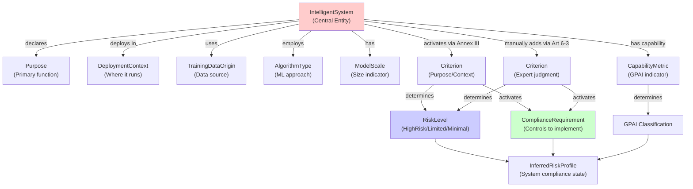

### Conceptual Layers

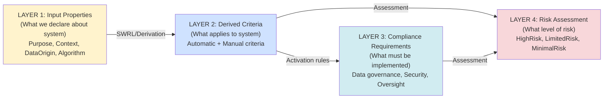

---

## Class Hierarchy

### Complete Class Taxonomy

```mermaid
graph TD
    OWL["owl:Thing"]

    OWL --> IS["IntelligentSystem<br/>(Central entity for AI systems)"]
    OWL --> C["Criterion<br/>(Classification unit)"]
    OWL --> Purpose["Purpose<br/>(Declared function)"]
    OWL --> Context["DeploymentContext<br/>(Operational scenario)"]
    OWL --> Req["ComplianceRequirement<br/>(Regulatory control)"]
    OWL --> Risk["RiskLevel<br/>(Classification level)"]
    OWL --> Data["TrainingDataOrigin<br/>(Data source)"]
    OWL --> Algo["AlgorithmType<br/>(ML approach)"]
    OWL --> Scale["ModelScale<br/>(Size category)"]

    C --> NC["NormativeCriterion<br/>(Based on EU AI Act articles)"]
    C --> CC["ContextualCriterion<br/>(Context-specific risks)"]
    C --> TC["TechnicalCriterion<br/>(Technical standards)"]
    C --> SCC["SystemCapabilityCriterion<br/>(Capability-based)"]

    NC --> BIC["BiometricIdentificationCriterion"]
    NC --> JC["JudicialSupportCriterion"]
    NC --> LEC["LawEnforcementCriterion"]
    NC --> MBC["MigrationBorderCriterion"]
    NC --> CIC["CriticalInfrastructureCriterion"]
    NC --> EEC["EducationEvaluationCriterion"]
    NC --> REC["RecruitmentEmploymentCriterion"]
    NC --> WEC["WorkforceEvaluationCriterion"]
    NC --> EAC["EssentialServicesAccessCriterion"]

    CC --> CMR["ChildrenAndMinorsRiskCriterion"]
    CC --> EDR["ElderlyAndDisabledRiskCriterion"]
    CC --> SVR["SocioeconomicVulnerabilityRiskCriterion"]
    CC --> ADR["AutonomousDecisionmakingRiskCriterion"]
    CC --> RTA["RealTimeAutonomousRiskCriterion"]
    CC --> WSI["WidespreadSystemicImpactRiskCriterion"]
    CC --> CII["CriticalInfrastructureInterdependencyRiskCriterion"]
    CC --> BDR["BlackBoxDecisionRiskCriterion"]
    CC --> HSD["HighStakesDecisionWithoutAppealRiskCriterion"]
    CC --> HBR["HistoricalBiasReplicationRiskCriterion"]
    CC --> PCI["ProtectedCharacteristicInferenceRiskCriterion"]
    CC --> BDS["BiometricDataSensitivityRiskCriterion"]
    CC --> PDR["PersonalDataRetentionRiskCriterion"]
    CC --> LEI["LargeScaleEnvironmentalImpactRiskCriterion"]
    CC --> MAR["MisinformationAmplificationRiskCriterion"]

    SCC --> SRA["SystemicRiskAssessmentCriterion"]
    SCC --> DUR["DualUseRiskCriterion"]

    Req --> DR["DataGovernanceRequirement"]
    Req --> TR["TransparencyRequirement"]
    Req --> TecR["TechnicalRequirement"]
    Req --> RobR["RobustnessRequirement"]
    Req --> SecR["SecurityRequirement"]
    Req --> LogR["LoggingRequirement"]
    Req --> DocR["DocumentationRequirement"]
    Req --> HOR["HumanOversightRequirement"]
    Req --> FRA["FundamentalRightsAssessmentRequirement"]
    Req --> NDR["NonDiscriminationRequirement"]
    Req --> BDtR["BiasDetectionRequirement"]
    Req --> BDSSecR["BiometricSecurityRequirement"]
    Req --> ENC["EncryptionRequirement"]
    Req --> ACR["AccessControlRequirement"]

    Risk --> UR["UnacceptableRisk"]
    Risk --> HR["HighRisk"]
    Risk --> LR["LimitedRisk"]
    Risk --> MR["MinimalRisk"]

    style IS fill:#ff6b6b
    style C fill:#4ecdc4
    style NC fill:#45b7d1
    style CC fill:#96ceb4
    style SCC fill:#ffeaa7
    style Req fill:#dfe6e9
    style Risk fill:#fab1a0
    style Purpose fill:#74b9ff
    style Context fill:#a29bfe
```

### Criterion Classification

```mermaid
graph TD
    Crit["Criterion<br/>(Abstract)"]

    subgraph "Purpose-Based<br/>(Automatic via SWRL)"
        NC["NormativeCriterion<br/>(Annex III)"]
        NC1["BiometricIdentificationCriterion"]
        NC2["JudicialSupportCriterion"]
        NC3["LawEnforcementCriterion"]
        NC4["MigrationBorderCriterion"]
        NC5["CriticalInfrastructureCriterion"]
        NC6["EducationEvaluationCriterion"]
        NC7["RecruitmentEmploymentCriterion"]
        NC8["WorkforceEvaluationCriterion"]
        NC9["EssentialServicesAccessCriterion"]

        NC --> NC1
        NC --> NC2
        NC --> NC3
        NC --> NC4
        NC --> NC5
        NC --> NC6
        NC --> NC7
        NC --> NC8
        NC --> NC9
    end

    subgraph "Expert-Identified<br/>(Manual via Article 6-3)"
        CC["ContextualCriterion<br/>(15 vulnerability factors)"]
        CC1["ChildrenAndMinorsRiskCriterion"]
        CC2["ElderlyAndDisabledRiskCriterion"]
        CC3["SocioeconomicVulnerabilityRiskCriterion"]
        CC4["AutonomousDecisionmakingRiskCriterion"]
        CC5["RealTimeAutonomousRiskCriterion"]
        CC6["WidespreadSystemicImpactRiskCriterion"]

        CC --> CC1
        CC --> CC2
        CC --> CC3
        CC --> CC4
        CC --> CC5
        CC --> CC6
    end

    subgraph "Capability-Based<br/>(Technical indicators)"
        SCC["SystemCapabilityCriterion<br/>(Articles 51-55)"]
        SCC1["SystemicRiskAssessmentCriterion"]
        SCC2["DualUseRiskCriterion"]

        SCC --> SCC1
        SCC --> SCC2
    end

    Crit --> NC
    Crit --> CC
    Crit --> SCC

    style Crit fill:#ffcccc
    style NC fill:#cfe2ff
    style CC fill:#d1ecf1
    style SCC fill:#fff3cd
```

### Compliance Requirements Hierarchy

```mermaid
graph TD
    CR["ComplianceRequirement<br/>(What must be implemented)"]

    CR --> DG["DataGovernanceRequirement<br/>(Data quality, lineage, minimization)"]
    CR --> TR["TransparencyRequirement<br/>(User disclosure, explainability)"]
    CR --> TecR["TechnicalRequirement<br/>(Performance, robustness, accuracy)"]
    CR --> RobR["RobustnessRequirement<br/>(Reliability, error handling)"]
    CR --> SecR["SecurityRequirement<br/>(Encryption, access control, audit trails)"]
    CR --> LogR["LoggingRequirement<br/>(Event tracking, audit logs)"]
    CR --> DocR["DocumentationRequirement<br/>(Technical docs, risk assessments)"]
    CR --> HOR["HumanOversightRequirement<br/>(Manual review, intervention)"]
    CR --> FRA["FundamentalRightsAssessmentRequirement<br/>(FRIA - human dignity protection)"]
    CR --> NDR["NonDiscriminationRequirement<br/>(Fairness, bias detection)"]
    CR --> BDR["BiasDetectionRequirement<br/>(Monitoring for discrimination)"]
    CR --> BDSR["BiometricSecurityRequirement<br/>(Biometric-specific security)"]
    CR --> ENC["EncryptionRequirement<br/>(Data encryption in transit/at rest)"]
    CR --> ACR["AccessControlRequirement<br/>(Who can access what)"]

    style CR fill:#d1ecf1
    style DG fill:#e2f0ff
    style TR fill:#e2f0ff
    style TecR fill:#e2f0ff
    style SecR fill:#ffe2e2
    style HOR fill:#ffe2f0
    style FRA fill:#fff0e2
```

---

## Properties

### Object Properties (IRI → IRI References)

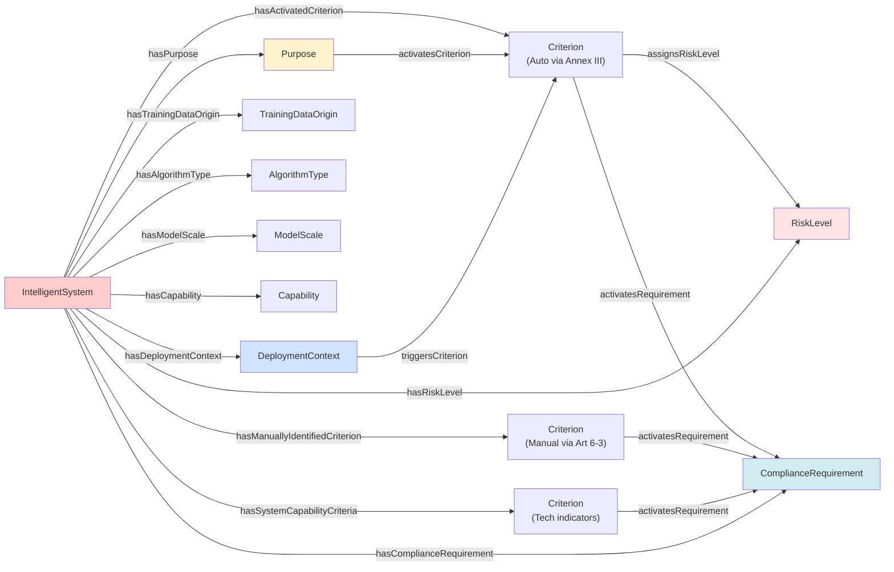

### Data Properties (IRI → Literal Values)

| Property | Type | Description | Example |
|----------|------|-------------|---------|
| `hasName` | `xsd:string` | System identifier | "EduEval-AI" |
| `hasUrn` | `xsd:anyURI` | Unique resource identifier | "urn:uuid:abc-123" |
| `hasVersion` | `xsd:string` | System version | "1.0.0" |
| `hasDescription` | `xsd:string` | System description | "Student evaluation system" |
| `hasFLOPS` | `xsd:double` | Computational capacity | 1e13 |

### Property Relationships

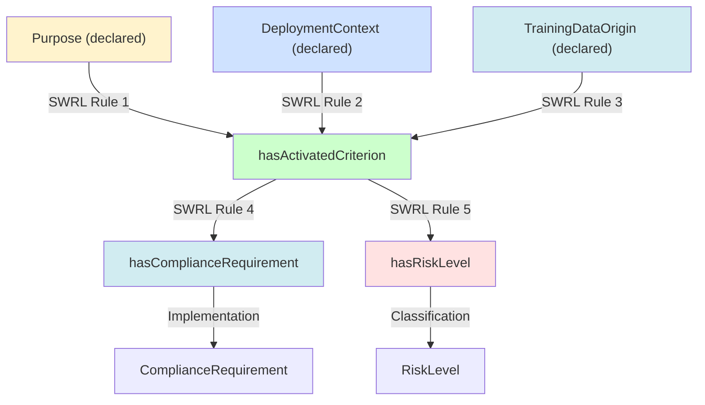

---

## Three Compliance Mechanisms

### Mechanism 1: Annex III (Purpose/Context → Automatic Criteria)

**Regulatory Basis**: EU AI Act Annex III defines 8 high-risk AI system categories

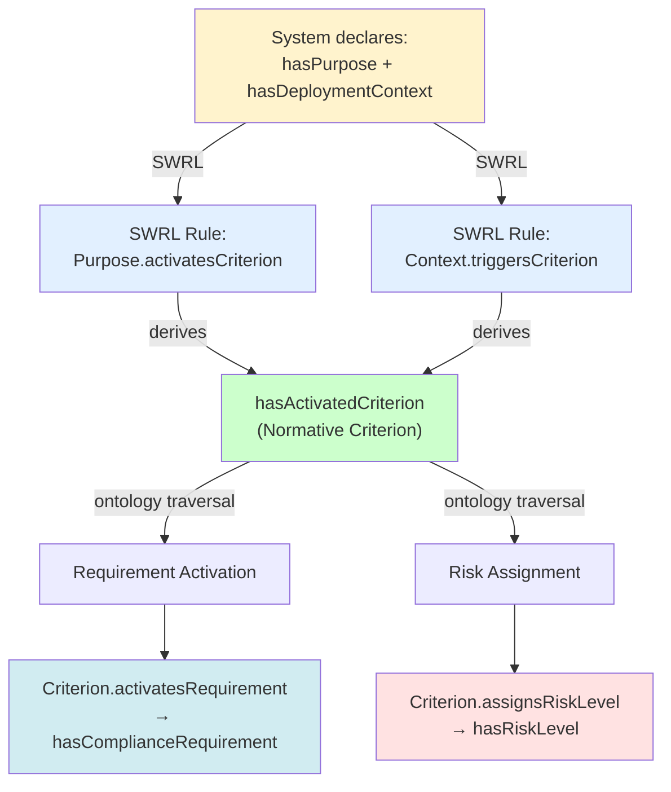

**10 Annex III Purposes:**
1. BiometricIdentification
2. EducationAccess
3. HealthCare
4. JudicialDecisionSupport
5. LawEnforcementSupport
6. MigrationControl
7. PublicServiceAllocation
8. RecruitmentOrEmployment
9. WorkforceEvaluationPurpose
10. CriticalInfrastructureOperation

### Mechanism 2: Article 6(3) (Expert Judgment → Manual Criteria)

**Regulatory Basis**: EU AI Act Article 6(3) for residual/unforeseen risks

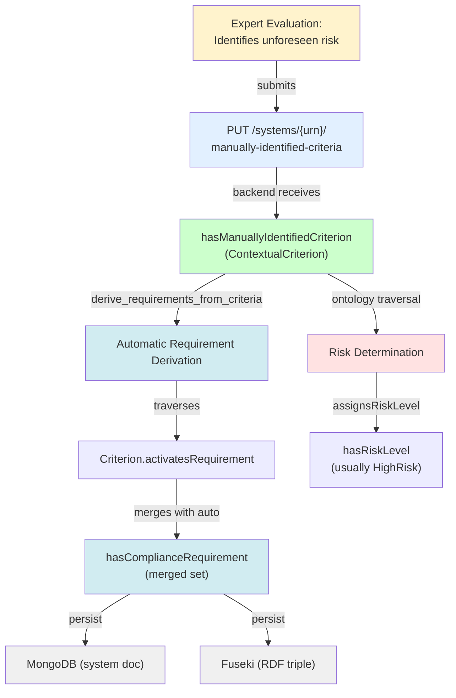

**15 Article 6(3) Contextual Criteria:**
1. ChildrenAndMinorsRiskCriterion
2. ElderlyAndDisabledRiskCriterion
3. SocioeconomicVulnerabilityRiskCriterion
4. AutonomousDecisionmakingRiskCriterion
5. RealTimeAutonomousRiskCriterion
6. WidespreadSystemicImpactRiskCriterion
7. CriticalInfrastructureInterdependencyRiskCriterion
8. BlackBoxDecisionRiskCriterion
9. HighStakesDecisionWithoutAppealRiskCriterion
10. HistoricalBiasReplicationRiskCriterion
11. ProtectedCharacteristicInferenceRiskCriterion
12. BiometricDataSensitivityRiskCriterion
13. PersonalDataRetentionRiskCriterion
14. LargeScaleEnvironmentalImpactRiskCriterion
15. MisinformationAmplificationRiskCriterion

### Mechanism 3: Articles 51-55 (Capability-Based → GPAI Classification)

**Regulatory Basis**: EU AI Act Articles 51-55 for General Purpose AI systemic risk

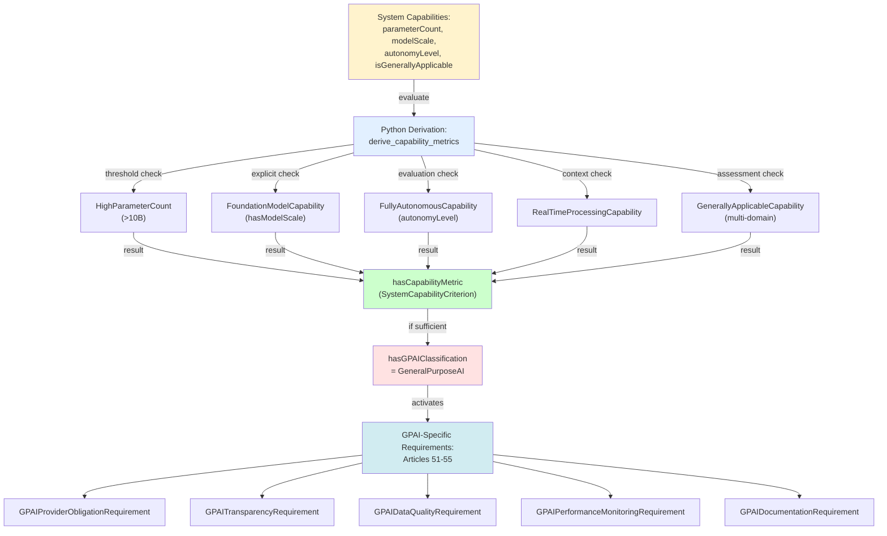

**5 Capability Metrics:**
1. HighParameterCount (>10 billion parameters)
2. FoundationModelCapability (explicitly foundation model)
3. FullyAutonomousCapability (no human-in-loop)
4. RealTimeProcessingCapability (real-time inference)
5. GenerallyApplicableCapability (adaptable to any domain)

---

## Reasoning Chains

### Example 1: Education System Reasoning

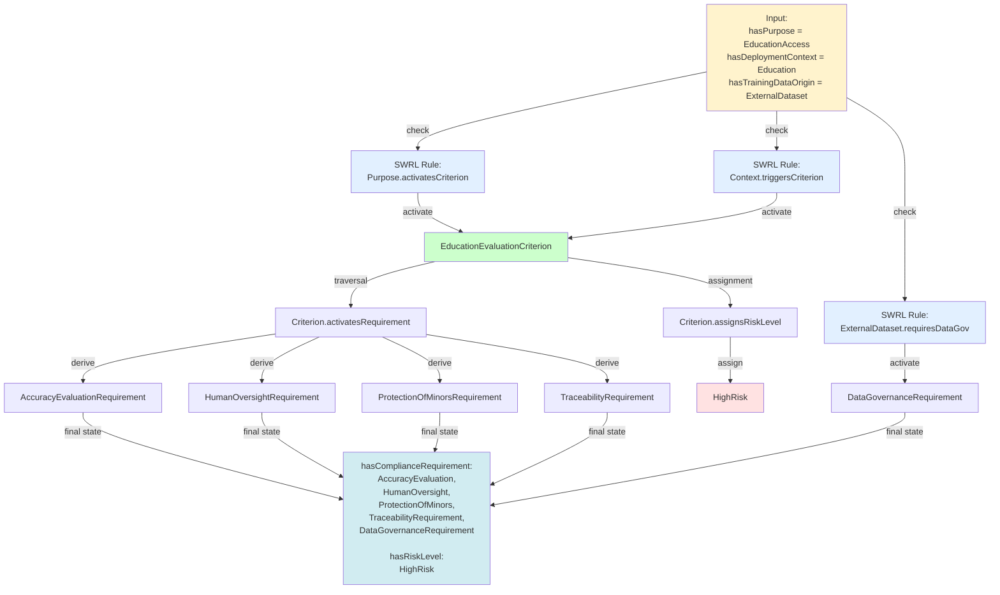

### Example 2: Biometric + Article 6(3) Reasoning

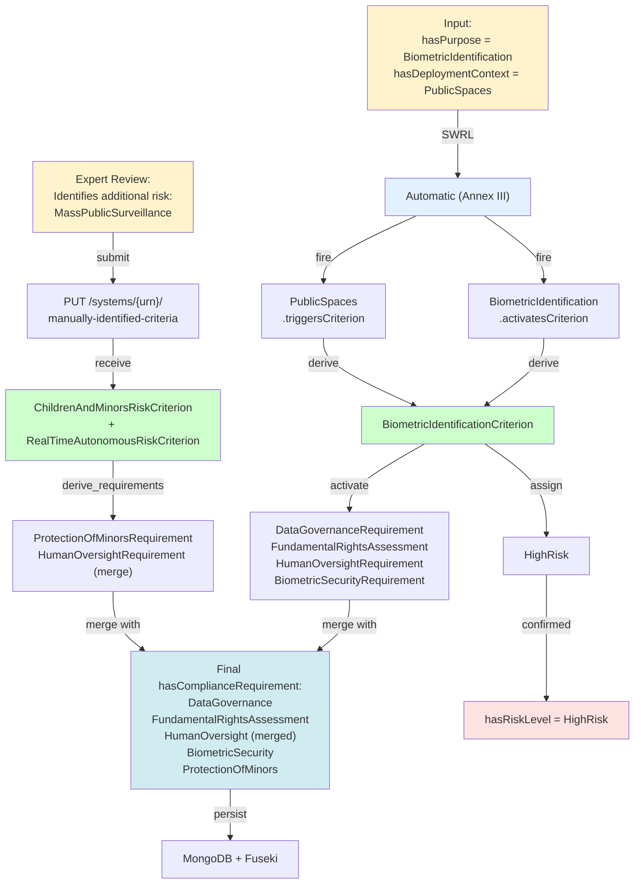

### Example 3: Foundation Model (GPAI) Reasoning

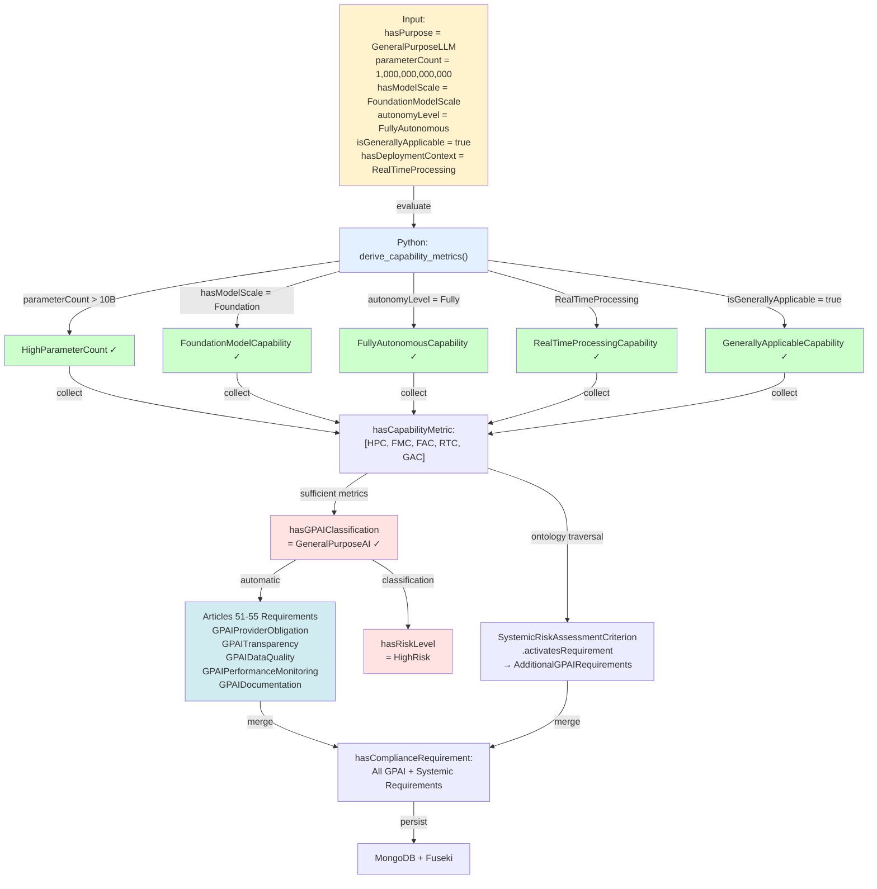

---

## Data Flow

### Complete System Data Flow

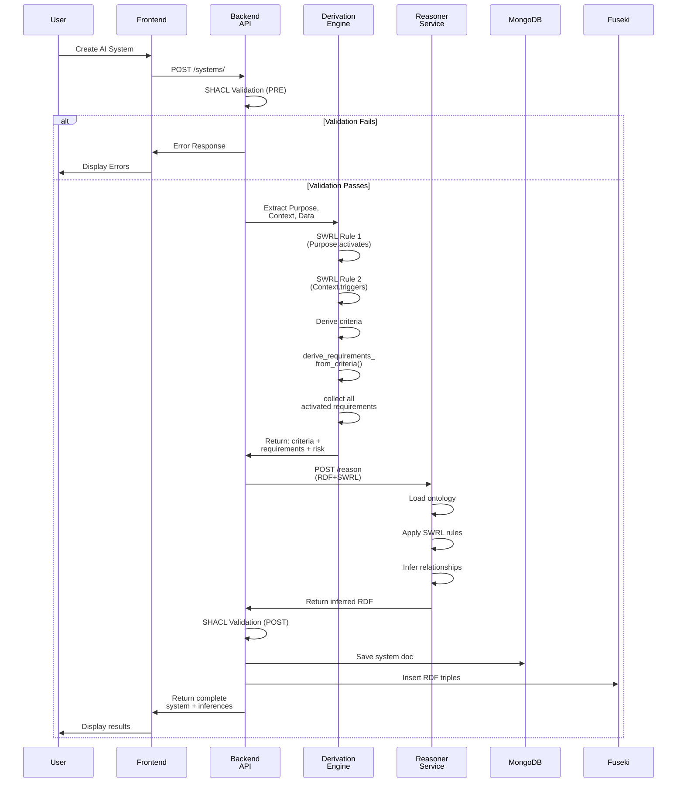

### Requirements Derivation Flow

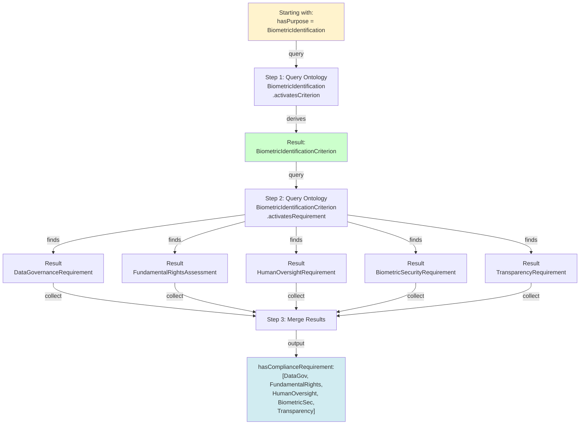

---

## Examples

### Example 1: Simple Education System

**Input:**
```json
{
  "hasName": "StudentGradeAnalyzer",
  "hasPurpose": ["ai:EducationAccess"],
  "hasDeploymentContext": ["ai:Education"],
  "hasTrainingDataOrigin": ["ai:InternalDataset"],
  "hasAlgorithmType": ["ai:NeuralNetwork"],
  "hasVersion": "1.0"
}
```

**Reasoning Process:**

1. **Purpose Rule Fires**
   - `ai:EducationAccess` activates `ai:EducationEvaluationCriterion`

2. **Context Rule Fires**
   - `ai:Education` triggers `ai:EducationEvaluationCriterion`

3. **Additional Rule Fires** (Protection of Minors)
   - Education + minor risk → `ai:ProtectionOfMinorsRiskCriterion`

4. **Requirement Derivation**
   - `ai:EducationEvaluationCriterion` activates:
     - `ai:AccuracyEvaluationRequirement`
     - `ai:HumanOversightRequirement`
     - `ai:TraceabilityRequirement`
     - `ai:DataGovernanceRequirement`
   - `ai:ProtectionOfMinorsRiskCriterion` activates:
     - `ai:ProtectionOfMinorsRequirement`
     - `ai:ParentalConsentRequirement`

5. **Risk Assignment**
   - Both criteria assign `ai:HighRisk`

**Output:**
```json
{
  "urn": "urn:uuid:student-grade-analyzer-12345",
  "hasActivatedCriterion": [
    "ai:EducationEvaluationCriterion",
    "ai:ProtectionOfMinorsRiskCriterion"
  ],
  "hasComplianceRequirement": [
    "ai:AccuracyEvaluationRequirement",
    "ai:HumanOversightRequirement",
    "ai:TraceabilityRequirement",
    "ai:DataGovernanceRequirement",
    "ai:ProtectionOfMinorsRequirement",
    "ai:ParentalConsentRequirement"
  ],
  "hasRiskLevel": "ai:HighRisk",
  "totalInferences": 6
}
```

### Example 2: Biometric System with Expert Override

**Input (Automatic):**
```json
{
  "hasName": "AirportBiometricSystem",
  "hasPurpose": ["ai:BiometricIdentification"],
  "hasDeploymentContext": ["ai:Migration", "ai:PublicSpaces"],
  "hasTrainingDataOrigin": ["ai:ExternalDataset"],
  "hasVersion": "2.1"
}
```

**Automatic Requirements:**
- DataGovernance, FundamentalRights, HumanOversight, BiometricSecurity, Transparency
- **Risk:** HighRisk

**Expert Adds (Article 6(3)):**
```json
{
  "hasManuallyIdentifiedCriterion": [
    "ai:ChildrenAndMinorsRiskCriterion",
    "ai:RealTimeAutonomousRiskCriterion"
  ]
}
```

**Additional Requirements from Manual Criteria:**
- ProtectionOfMinors (merges HumanOversight)
- RealTimeProcessingCapabilityRequirement

**Final Output:**
```json
{
  "hasActivatedCriterion": [
    "ai:BiometricIdentificationCriterion",
    "ai:MigrationBorderCriterion"
  ],
  "hasManuallyIdentifiedCriterion": [
    "ai:ChildrenAndMinorsRiskCriterion",
    "ai:RealTimeAutonomousRiskCriterion"
  ],
  "hasComplianceRequirement": [
    "ai:DataGovernanceRequirement",
    "ai:FundamentalRightsAssessmentRequirement",
    "ai:HumanOversightRequirement",
    "ai:BiometricSecurityRequirement",
    "ai:TransparencyRequirement",
    "ai:ProtectionOfMinorsRequirement",
    "ai:RealTimeProcessingCapabilityRequirement"
  ],
  "hasRiskLevel": "ai:HighRisk"
}
```

### Example 3: Foundation Model (GPAI)

**Input:**
```json
{
  "hasName": "LargeLanguageModel-XL",
  "hasPurpose": ["ai:GeneralPurposeLLM"],
  "parameterCount": 1000000000000,
  "hasModelScale": "ai:FoundationModelScale",
  "autonomyLevel": "FullyAutonomous",
  "isGenerallyApplicable": true,
  "hasDeploymentContext": ["ai:RealTimeProcessing"]
}
```

**Capability Analysis:**
- HighParameterCount: 1T > 10B ✓
- FoundationModelCapability: Explicit ✓
- FullyAutonomousCapability: No human oversight ✓
- RealTimeProcessingCapability: Real-time inference ✓
- GenerallyApplicableCapability: Adaptable to all domains ✓

**Output:**
```json
{
  "hasCapabilityMetric": [
    "ai:HighParameterCount",
    "ai:FoundationModelCapability",
    "ai:FullyAutonomousCapability",
    "ai:RealTimeProcessingCapability",
    "ai:GenerallyApplicableCapability"
  ],
  "hasGPAIClassification": ["ai:GeneralPurposeAI"],
  "hasComplianceRequirement": [
    "ai:GPAIProviderObligationRequirement",
    "ai:GPAITransparencyRequirement",
    "ai:GPAIDataQualityRequirement",
    "ai:GPAIPerformanceMonitoringRequirement",
    "ai:GPAIDocumentationRequirement",
    "ai:ModelEvaluationRequirement",
    "ai:PostMarketMonitoringRequirement"
  ],
  "hasRiskLevel": "ai:HighRisk"
}
```

---

## Query Patterns

### SPARQL Query Examples

#### Query 1: Find All Systems in HighRisk Category

```sparql
PREFIX ai: <http://ai-act.eu/ai#>
PREFIX rdf: <http://www.w3.org/1999/02/22-rdf-syntax-ns#>

SELECT ?system ?name ?purpose ?context
WHERE {
  ?system rdf:type ai:IntelligentSystem ;
          ai:hasName ?name ;
          ai:hasRiskLevel ai:HighRisk ;
          ai:hasPurpose ?purpose ;
          ai:hasDeploymentContext ?context .
}
```

#### Query 2: Find All Requirements for Biometric Systems

```sparql
PREFIX ai: <http://ai-act.eu/ai#>
PREFIX rdf: <http://www.w3.org/1999/02/22-rdf-syntax-ns#>

SELECT ?system ?requirement ?label
WHERE {
  ?system rdf:type ai:IntelligentSystem ;
          ai:hasPurpose ai:BiometricIdentification ;
          ai:hasComplianceRequirement ?requirement .
  ?requirement rdfs:label ?label .
}
```

#### Query 3: Find Systems Missing Security Requirements

```sparql
PREFIX ai: <http://ai-act.eu/ai#>
PREFIX rdf: <http://www.w3.org/1999/02/22-rdf-syntax-ns#>

SELECT ?system ?name
WHERE {
  ?system rdf:type ai:IntelligentSystem ;
          ai:hasName ?name ;
          ai:hasRiskLevel ai:HighRisk .

  # Find high-risk systems
  ?system ai:hasActivatedCriterion ?criterion .

  # Criterion should activate security requirement
  ?criterion ai:activatesRequirement ai:SecurityRequirement .

  # But system doesn't have it
  MINUS {
    ?system ai:hasComplianceRequirement ai:SecurityRequirement .
  }
}
```

#### Query 4: Find All GPAI Models

```sparql
PREFIX ai: <http://ai-act.eu/ai#>
PREFIX rdf: <http://www.w3.org/1999/02/22-rdf-syntax-ns#>

SELECT ?system ?name ?paramCount
WHERE {
  ?system rdf:type ai:IntelligentSystem ;
          ai:hasName ?name ;
          ai:hasGPAIClassification ai:GeneralPurposeAI ;
          ai:hasFLOPS ?paramCount .
}
ORDER BY DESC(?paramCount)
```

#### Query 5: Compliance Coverage Analysis

```sparql
PREFIX ai: <http://ai-act.eu/ai#>
PREFIX rdf: <http://www.w3.org/1999/02/22-rdf-syntax-ns#>

SELECT ?system ?name (COUNT(?criterion) as ?activatedCriteria)
       (COUNT(?requirement) as ?requirements)
WHERE {
  ?system rdf:type ai:IntelligentSystem ;
          ai:hasName ?name .

  OPTIONAL {
    ?system ai:hasActivatedCriterion ?criterion .
  }

  OPTIONAL {
    ?system ai:hasComplianceRequirement ?requirement .
  }
}
GROUP BY ?system ?name
```

---

## Appendix: Namespace and Prefixes

```turtle
@prefix ai: <http://ai-act.eu/ai#> .
@prefix owl: <http://www.w3.org/2002/07/owl#> .
@prefix rdf: <http://www.w3.org/1999/02/22-rdf-syntax-ns#> .
@prefix rdfs: <http://www.w3.org/2000/01/rdf-schema#> .
@prefix xsd: <http://www.w3.org/2001/XMLSchema#> .
@prefix swrl: <http://www.w3.org/2003/11/swrl#> .
@prefix airo: <https://w3id.org/airo#> .
@prefix dct: <http://purl.org/dc/terms/> .
```

---

**Version**: 0.37.2 | **Last Updated**: 2025-11-24 | **Status**: Production Ready
