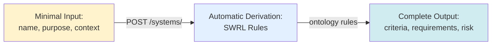
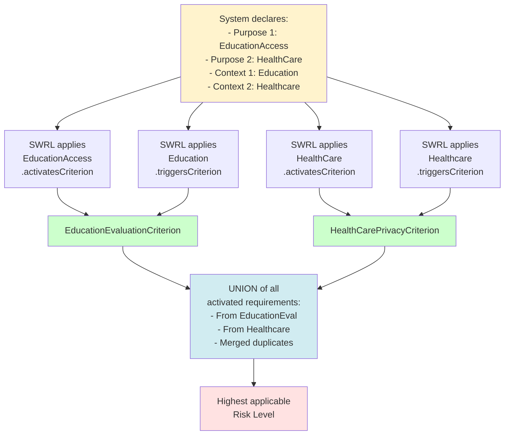
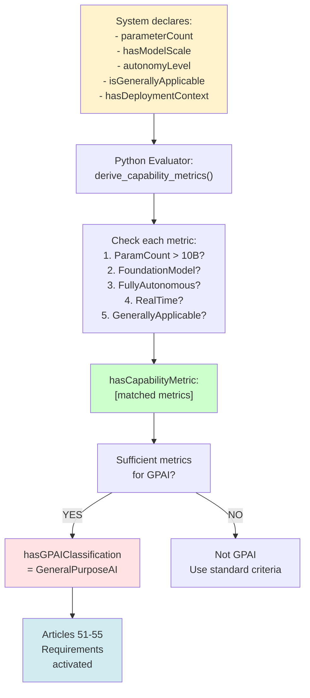
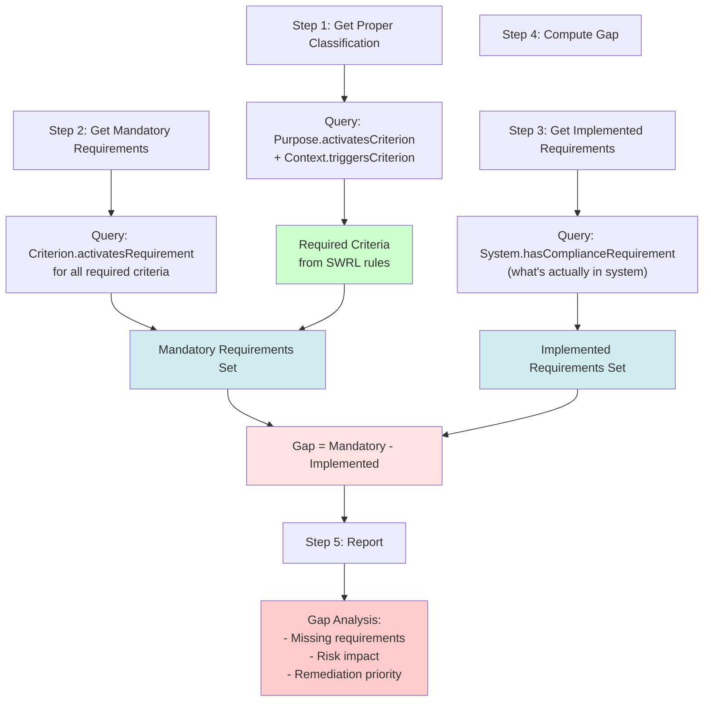
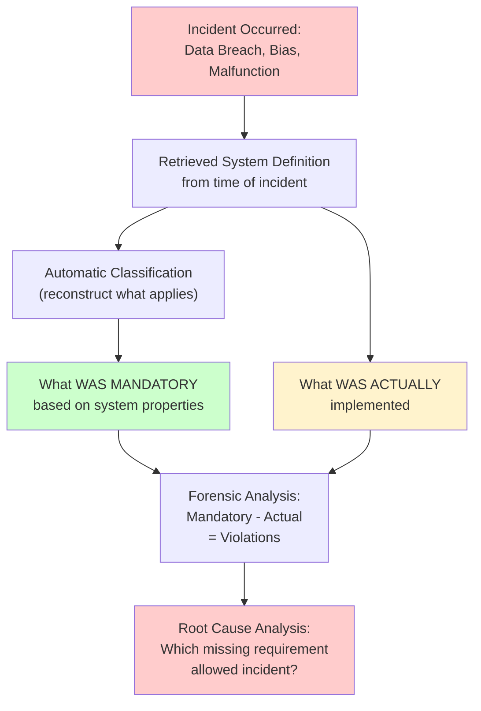
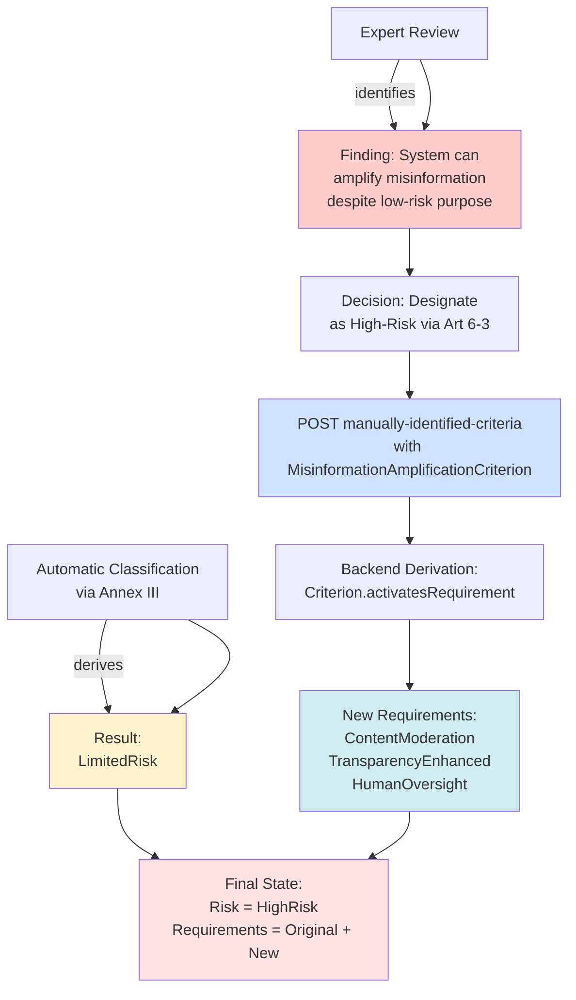
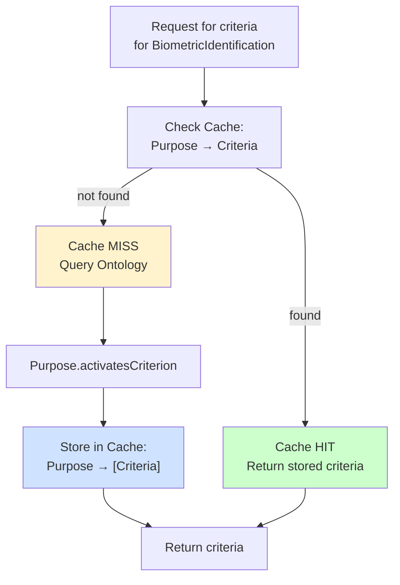
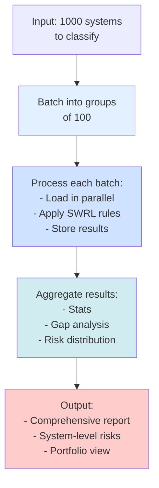

# EU AI Act Ontology - Usage Patterns & Best Practices

> Common patterns, integration examples, and best practices for working with the EU AI Act ontology

## Table of Contents

1. [System Creation Patterns](#system-creation-patterns)
2. [Compliance Gap Detection](#compliance-gap-detection)
3. [Risk Assessment Workflows](#risk-assessment-workflows)
4. [Integration Patterns](#integration-patterns)
5. [Performance Optimization](#performance-optimization)
6. [Troubleshooting](#troubleshooting)

---

## System Creation Patterns

### Pattern 1: Minimal System (Auto-Classification)

Declare only the minimum required information and let the system auto-derive everything.

**When to use**: Straightforward purpose-based classification



**Example:**
```bash
curl -X POST http://localhost:8000/systems/ \
  -H "Content-Type: application/json" \
  -d '{
    "hasName": "ResumeScreeningAI",
    "hasPurpose": ["ai:RecruitmentOrEmployment"],
    "hasDeploymentContext": ["ai:Employment"],
    "hasTrainingDataOrigin": ["ai:InternalDataset"],
    "hasVersion": "1.0"
  }'
```

**Automatic Result:**
- ✅ Criteria: RecruitmentEmploymentCriterion
- ✅ Requirements: NonDiscriminationRequirement, DataGovernanceRequirement, HumanOversightRequirement, AuditabilityRequirement, BiasDetectionRequirement
- ✅ Risk Level: HighRisk

---

### Pattern 2: Multi-Purpose System with Multiple Contexts

System that serves multiple purposes in different contexts.

**When to use**: Complex systems with multiple use cases



**Example:**
```json
{
  "hasName": "IntegratedStudentHealthPlatform",
  "hasPurpose": [
    "ai:EducationAccess",
    "ai:HealthCare"
  ],
  "hasDeploymentContext": [
    "ai:Education",
    "ai:Healthcare"
  ],
  "hasTrainingDataOrigin": [
    "ai:ExternalDataset",
    "ai:SpecializedDataset"
  ]
}
```

**Merged Result:**
- Criteria: EducationEvaluationCriterion ∪ HealthCarePrivacyCriterion
- Requirements: UNION of both criteria's requirements
- Risk: HighRisk (highest from both)

---

### Pattern 3: Capability-Based Classification (GPAI)

System classification based on technical capabilities rather than purpose.

**When to use**: Foundation models, LLMs, general-purpose systems



**Example:**
```json
{
  "hasName": "Claude-like-LLM",
  "hasPurpose": ["ai:GeneralPurposeLLM"],
  "parameterCount": 70000000000,
  "hasModelScale": "ai:FoundationModelScale",
  "autonomyLevel": "FullyAutonomous",
  "isGenerallyApplicable": true,
  "hasDeploymentContext": ["ai:RealTimeProcessing"]
}
```

**Automatic Result:**
- ✅ Capability Metrics: [HighParameterCount, FoundationModelCapability, FullyAutonomous, RealTimeProcessing, GenerallyApplicable]
- ✅ GPAI Classification: YES
- ✅ Requirements: GPAIProviderObligation, GPAITransparency, GPAIDataQuality, PostMarketMonitoring

---

## Compliance Gap Detection

### Pattern 1: Automated Gap Detection

Compare declared requirements against what should be required.

**When to use**: Compliance audits, system reviews



**Example SPARQL Query:**
```sparql
PREFIX ai: <http://ai-act.eu/ai#>
PREFIX rdf: <http://www.w3.org/1999/02/22-rdf-syntax-ns#>

# Find systems with high-risk classification
# but missing critical security requirements
SELECT ?system ?name ?missingRequirement
WHERE {
  ?system rdf:type ai:IntelligentSystem ;
          ai:hasName ?name ;
          ai:hasRiskLevel ai:HighRisk ;
          ai:hasPurpose ?purpose ;
          ai:hasDeploymentContext ?context .

  # What requirements SHOULD be activated
  ?purpose ai:activatesCriterion ?criterion .
  ?criterion ai:activatesRequirement ?missingRequirement .

  # What requirements ARE implemented
  MINUS {
    ?system ai:hasComplianceRequirement ?missingRequirement .
  }

  # Filter for security requirements only
  FILTER (
    CONTAINS(STR(?missingRequirement), "Security") OR
    CONTAINS(STR(?missingRequirement), "Encryption") OR
    CONTAINS(STR(?missingRequirement), "AccessControl")
  )
}
```

---

### Pattern 2: Post-Incident Forensics

Identify what requirements were missed when an incident occurred.

**When to use**: Incident analysis, regulatory investigation



---

## Risk Assessment Workflows

### Pattern 1: Escalation via Article 6(3)

Elevate system risk through expert judgment.

**Workflow:**



**API Call:**
```bash
curl -X PUT http://localhost:8000/systems/urn:uuid:recommendation-engine/manually-identified-criteria \
  -H "Content-Type: application/json" \
  -d '{
    "hasManuallyIdentifiedCriterion": [
      "ai:MisinformationAmplificationRiskCriterion"
    ],
    "rationale": "Expert assessment identifies unintended amplification of political misinformation"
  }'
```

---

### Pattern 2: Tiered Risk Assessment

Multi-level assessment for complex systems.

**When to use**: Large systems with multiple risk factors

```
Level 1: Automatic Classification
├─ Purpose + Context → Annex III criteria
├─ Risk assigned based on criteria
└─ Basic requirements activated

Level 2: Data & Capability Assessment
├─ Training data origin → data governance requirements
├─ Model scale & capability → GPAI classification
└─ Additional requirements activated

Level 3: Expert Review (Article 6(3))
├─ Manual criteria for unforeseen risks
├─ Emerging threat assessment
└─ Risk escalation if needed

Level 4: Compliance Coverage
├─ Gap analysis
├─ Missing control identification
└─ Remediation roadmap
```

---

## Integration Patterns

### Pattern 1: JSON-LD Response Processing

Use JSON-LD context for automated property resolution.

**Request:**
```json
{
  "hasName": "ComplianceSystem",
  "hasPurpose": ["ai:EducationAccess"],
  "hasDeploymentContext": ["ai:Education"],
  "hasVersion": "1.0"
}
```

**Response (with JSON-LD context):**
```json
{
  "@context": "http://localhost/json-ld-context.json",
  "@type": "ai:IntelligentSystem",
  "@id": "urn:uuid:compliance-system-12345",
  "hasName": "ComplianceSystem",
  "hasPurpose": {
    "@id": "ai:EducationAccess"
  },
  "hasDeploymentContext": {
    "@id": "ai:Education"
  },
  "hasActivatedCriterion": [
    {
      "@id": "ai:EducationEvaluationCriterion"
    }
  ],
  "hasComplianceRequirement": [
    {
      "@id": "ai:AccuracyEvaluationRequirement"
    },
    {
      "@id": "ai:HumanOversightRequirement"
    }
  ],
  "hasRiskLevel": {
    "@id": "ai:HighRisk"
  }
}
```

**Processing:**
```javascript
// Load context
const context = await fetch('http://localhost/json-ld-context.json').then(r => r.json());

// Process response
const jsonld = require('jsonld');
const expanded = await jsonld.expand(response.data, context);
const flattened = await jsonld.flatten(response.data, context);

// Resolved IRIs:
// "hasName" → "http://ai-act.eu/ai#hasName" (xsd:string)
// "hasPurpose" → "http://ai-act.eu/ai#hasPurpose" (@id)
// "hasComplianceRequirement" → "http://ai-act.eu/ai#hasComplianceRequirement" (@id)
```

---

### Pattern 2: SPARQL Endpoint Integration

Query the ontology directly for custom analysis.

**Example: Find All Systems Needing Bias Detection**

```sparql
PREFIX ai: <http://ai-act.eu/ai#>
PREFIX rdf: <http://www.w3.org/1999/02/22-rdf-syntax-ns#>

SELECT ?system ?name ?requirement
WHERE {
  # Any system
  ?system rdf:type ai:IntelligentSystem ;
          ai:hasName ?name .

  # That has employment-related purpose
  ?system ai:hasPurpose ai:RecruitmentOrEmployment .

  # Should have bias detection
  ?criterion ai:activatesRequirement ai:BiasDetectionRequirement ;
             rdf:type ai:Criterion .

  # Check if criterion applies
  { ?system ai:hasActivatedCriterion ?criterion }
  UNION
  { ?system ai:hasManuallyIdentifiedCriterion ?criterion }

  # But system doesn't have it
  MINUS {
    ?system ai:hasComplianceRequirement ai:BiasDetectionRequirement .
  }

  BIND(ai:BiasDetectionRequirement AS ?requirement)
}
```

---

## Performance Optimization

### Pattern 1: Caching Taxonomy

Cache derived information to reduce recomputation.



**Implementation:**
```python
from functools import lru_cache

class OntologyCache:
    @lru_cache(maxsize=1000)
    def get_criteria_for_purpose(self, purpose_uri: str) -> List[str]:
        """Get criteria activated by a purpose (cached)"""
        results = self.graph.query(f"""
            PREFIX ai: <http://ai-act.eu/ai#>
            SELECT ?criterion
            WHERE {{
                <{purpose_uri}> ai:activatesCriterion ?criterion .
            }}
        """)
        return [str(row[0]) for row in results]

    @lru_cache(maxsize=1000)
    def get_requirements_for_criterion(self, criterion_uri: str) -> List[str]:
        """Get requirements activated by a criterion (cached)"""
        results = self.graph.query(f"""
            PREFIX ai: <http://ai-act.eu/ai#>
            SELECT ?requirement
            WHERE {{
                <{criterion_uri}> ai:activatesRequirement ?requirement .
            }}
        """)
        return [str(row[0]) for row in results]
```

---

### Pattern 2: Batch Processing

Process multiple systems efficiently.



---

## Troubleshooting

### Common Issues

#### Issue 1: SHACL Validation Fails

**Symptom:** "System must declare at least one purpose"

**Solution:**
```json
{
  "hasName": "MySystem",
  "hasPurpose": ["ai:BiometricIdentification"],  // ← Required
  "hasDeploymentContext": ["ai:PublicSpaces"],
  "hasTrainingDataOrigin": ["ai:InternalDataset"]
}
```

---

#### Issue 2: Requirements Not Deriving

**Symptom:** `hasComplianceRequirement` is empty

**Causes & Solutions:**

1. **No matching criteria**
   - Check that `hasPurpose` matches an Annex III purpose
   - Check that `hasDeploymentContext` is recognized

2. **Criterion not defined in ontology**
   - Query Fuseki: Does criterion exist?
   - Check spelling against v0.37.2 definitions

3. **Backend derivation not running**
   - Check logs: `docker logs backend`
   - Verify derivation.py is being called
   - Check for Python exceptions

---

#### Issue 3: Risk Level Not Assigned

**Symptom:** `hasRiskLevel` is missing or incorrect

**Debugging:**

```sparql
PREFIX ai: <http://ai-act.eu/ai#>

# Check what criteria are activated
SELECT ?criterion ?risk
WHERE {
  <urn:uuid:your-system> ai:hasActivatedCriterion ?criterion .
  ?criterion ai:assignsRiskLevel ?risk .
}
```

If no results:
1. Verify criteria activation: Check `hasActivatedCriterion`
2. Verify criteria has riskLevel: Check criterion definition in ontology
3. Run SWRL rules manually: Check reasoner logs

---

#### Issue 4: Manual Criteria Not Merging Requirements

**Symptom:** Setting `hasManuallyIdentifiedCriterion` doesn't add new requirements

**Solution:**

1. Verify criterion exists in ontology:
```sparql
PREFIX ai: <http://ai-act.eu/ai#>

ASK {
  ai:MisinformationAmplificationRiskCriterion ?p ?o .
}
```

2. Check requirement activation:
```sparql
PREFIX ai: <http://ai-act.eu/ai#>

SELECT ?requirement
WHERE {
  ai:MisinformationAmplificationRiskCriterion ai:activatesRequirement ?requirement .
}
```

3. Verify backend derivation:
```bash
# Check logs
docker logs backend | grep "derive_requirements"
```

---

#### Issue 5: Fuseki Graph Empty

**Symptom:** SPARQL queries return no results

**Debugging:**

```bash
# Check Fuseki status
curl http://localhost:3030/ds/data

# Count triples
curl http://localhost:3030/ds/sparql?query=SELECT%20COUNT(%3Fs)%20WHERE%20%7B%3Fs%20%3Fp%20%3Fo%20%7D
```

**Solutions:**

1. Verify ontology loaded:
```bash
docker logs init_fuseki
```

2. Manually load ontology:
```bash
curl -X POST http://localhost:3030/ds/data?graph=http://ai-act.eu/ontology \
  -H "Content-Type: text/turtle" \
  --data-binary @/path/to/ontologia-v0.37.2.ttl
```

---

## Summary

These patterns cover the most common use cases for the EU AI Act ontology:

- ✅ **Simple systems**: Auto-classify with minimal input
- ✅ **Complex systems**: Multi-purpose, multi-context
- ✅ **Foundation models**: Capability-based classification
- ✅ **Risk escalation**: Expert judgment via Article 6(3)
- ✅ **Compliance audits**: Detect gaps systematically
- ✅ **Forensic analysis**: Post-incident violation identification
- ✅ **Integration**: JSON-LD and SPARQL endpoints
- ✅ **Performance**: Caching and batch processing

---

**Version**: 0.37.2 | **Last Updated**: 2025-11-24 | **Status**: Production Ready
