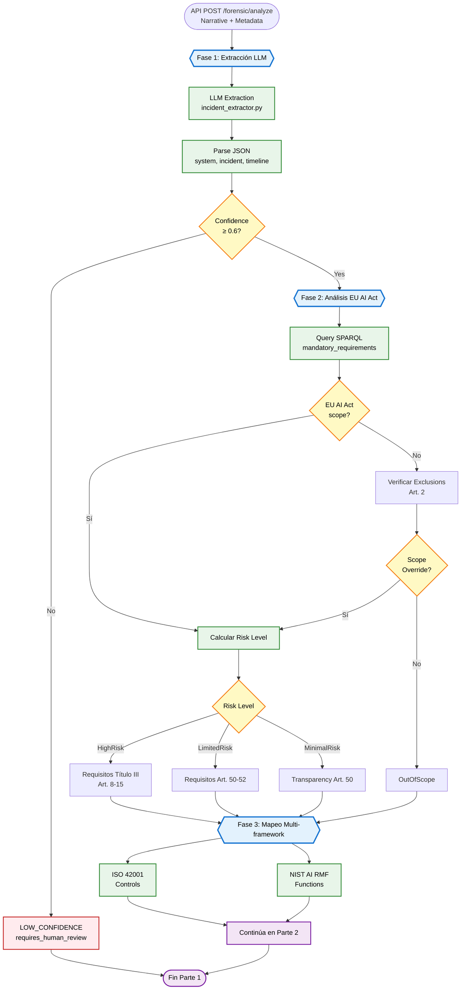
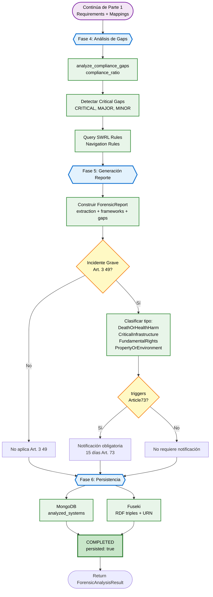

# Diagrama de Flujo - Agente Forense de Cumplimiento

## Parte 1: Extracción y Análisis Ontológico (Fases 1-3)

## Parte 2: Análisis de Gaps y Persistencia (Fases 4-6)

## Leyenda de Componentes

### Fases del Análisis

1. **Fase 1: Recepción y Extracción**
   - Entrada: Narrative (texto libre)
   - Procesador: LLM (llama3.2 via Ollama o Claude Sonnet)
   - Salida: ExtractedIncident (JSON estructurado)
   - Validación: Threshold de confianza ≥ 0.6

2. **Fase 2: Consulta Ontología EU AI Act**
   - Determina Risk Level usando clasificación ontológica
   - Verifica Scope Exclusions (Art. 2) y Scope Overrides (v0.39.0)
   - Identifica criterios activados y requisitos mandatorios
   - Consulta vía MCP SPARQL Service

3. **Fase 3: Mapeo Multi-framework**
   - ISO 42001: Controls de AIMS (AI Management System)
   - NIST AI RMF: Functions y Subcategories del Risk Management Framework
   - Mapeo semántico mediante propiedades `ai:mapsToISO42001` y `ai:mapsToNISTAIRMF`

4. **Fase 4: Análisis de Compliance Gaps**
   - Compara requisitos mandatorios vs. evidencia del incidente
   - Calcula `compliance_ratio` (0.0 - 1.0)
   - Clasifica gaps por severidad: CRITICAL, MAJOR, MINOR
   - Identifica reglas SWRL aplicables para inferencias

5. **Fase 5: Generación de Reporte Forense**
   - Construcción de `ForensicAnalysisResult`
   - Clasificación de Serious Incidents (Art. 3(49)) - v0.41.0
   - Determinación de obligaciones de notificación (Art. 73)
   - Validación de completitud del análisis

6. **Fase 6: Persistencia**
   - MongoDB: Almacenamiento de análisis completo en JSON
   - Fuseki: Persistencia en RDF con URN único
   - Integración con Knowledge Graph para consultas posteriores

### Decisiones Críticas

- **Confidence Threshold**: Si < 0.6, el análisis se detiene con `LOW_CONFIDENCE`
- **Scope Determination**: Art. 2 exclusions pueden ser overridden por contextos críticos
- **Risk Level**: Determina conjunto de requisitos aplicables (Título III vs. Art. 50-52)
- **Serious Incidents**: Activa obligaciones de notificación según Art. 73

### Nuevas Características (v0.41.0)

- **Taxonomía Art. 3(49)**: Clasificación de incidentes graves en 4 categorías
- **Article 73 Triggers**: Detección automática de obligación de reporte (15 días)
- **DPV-Risk Integration**: Mapeo a Data Privacy Vocabulary Risk concepts
- **SWRL Inference Rules**: Navegación semántica de requisitos relacionados

## Tecnologías Utilizadas

- **LLM**: Ollama (llama3.2) o Claude Sonnet 4.5
- **Ontología**: OWL 2 DL (v0.41.0)
- **Query Engine**: Apache Jena Fuseki + MCP SPARQL Service
- **Persistencia**: MongoDB + RDF triples
- **Framework**: FastAPI (async/await)
- **Inference**: SWRL rules + Pellet reasoner
