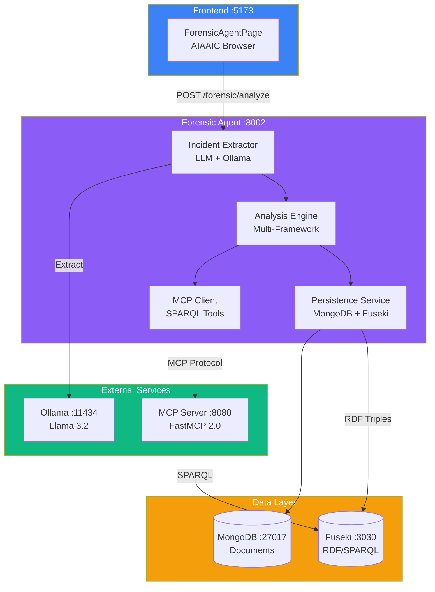
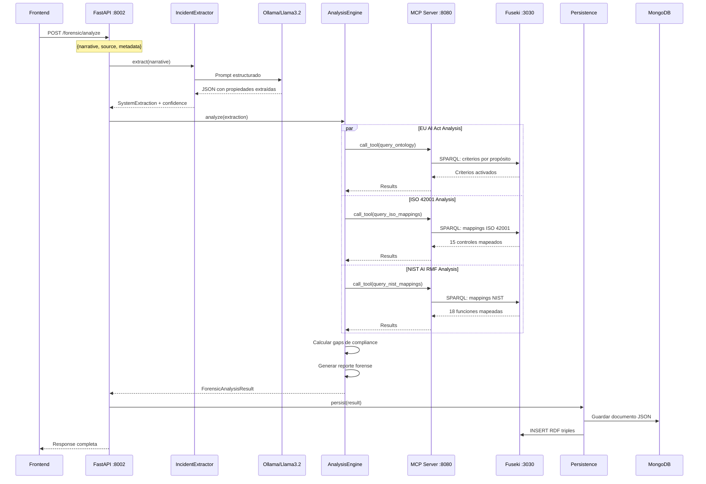
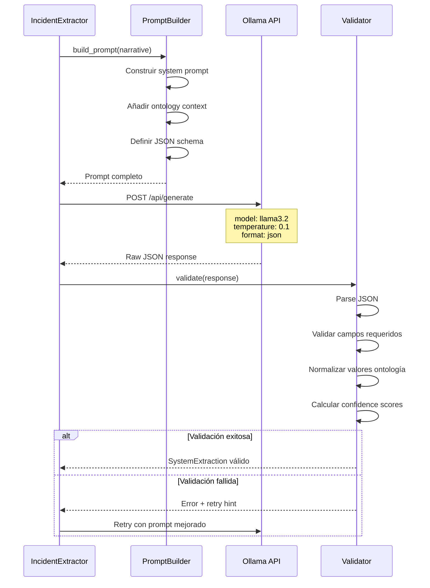
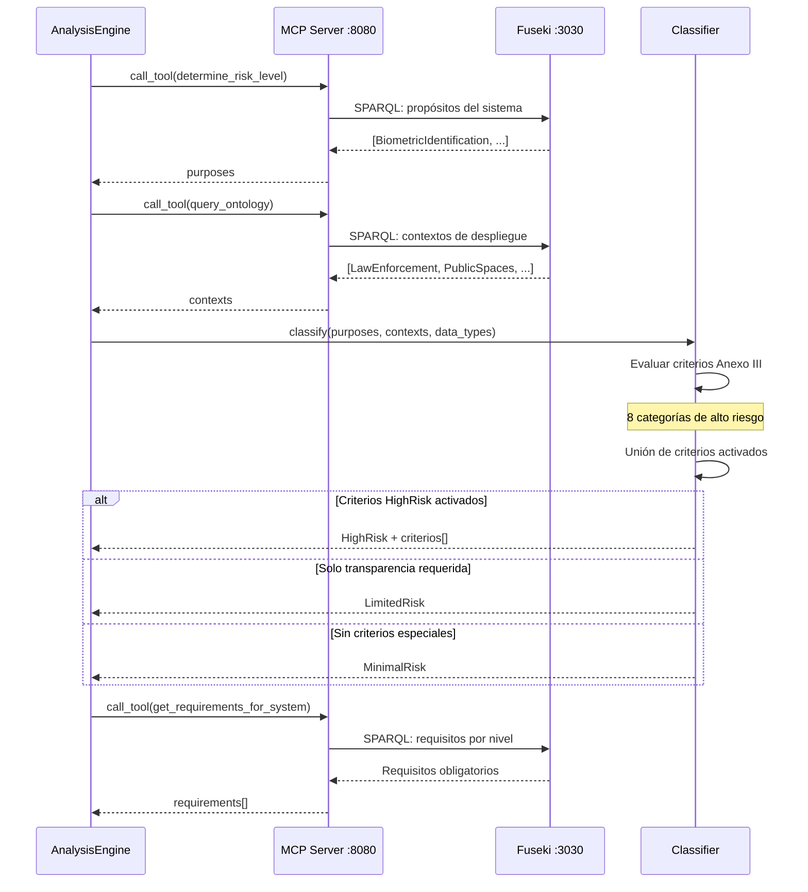
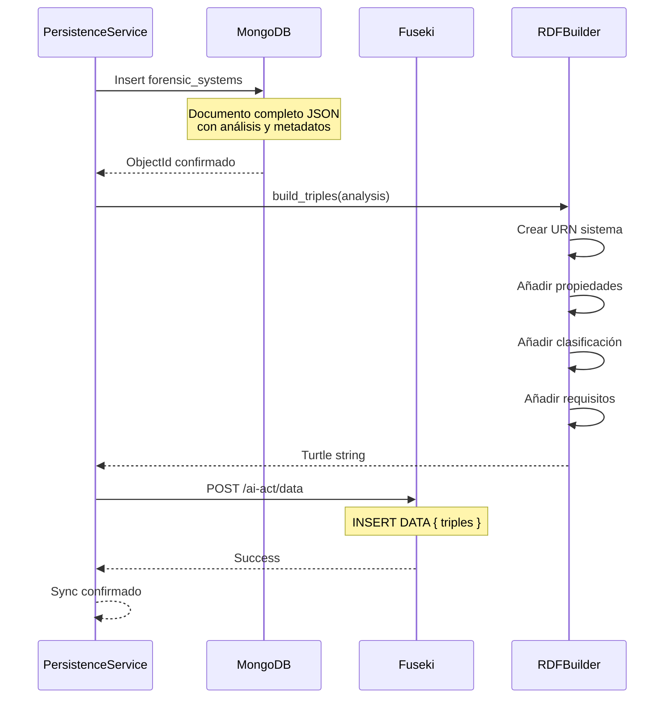

# Forensic Compliance Agent

> **Sistema de análisis forense post-incidente de sistemas de IA con múltiples frameworks regulatorios**

## Tabla de Contenidos

- [Overview](#overview)
- [Arquitectura](#arquitectura)
- [Flujo de Inferencia](#flujo-de-inferencia)
- [Quick Start](#quick-start)
- [Instalación](#instalación)
- [Uso de la API](#uso-de-la-api)
- [Configuración](#configuración)
- [Features](#features)
- [Testing](#testing)
- [Performance](#performance)
- [Troubleshooting](#troubleshooting)
- [Desarrollo](#desarrollo)

---

## Overview

El **Forensic Compliance Agent** realiza análisis automatizado post-incidente de sistemas de IA utilizando:

- **Extracción estructurada con LLM** (Ollama + Llama 3.2)
- **Razonamiento semántico** (SPARQL) sobre la ontología del EU AI Act v0.37.2
- **Análisis multi-framework** (EU AI Act + ISO 42001 + NIST AI RMF)
- **Detección automática de gaps** de cumplimiento
- **Persistencia dual** (MongoDB + Apache Jena Fuseki)

### Capacidades Principales

| Capacidad | Descripción |
|-----------|-------------|
| **Extracción LLM** | Extrae propiedades estructuradas de narrativas de incidentes |
| **Clasificación de Riesgo** | Determina nivel de riesgo según EU AI Act (HighRisk, LimitedRisk, MinimalRisk) |
| **Requisitos Obligatorios** | Identifica requisitos basados en propósito, contexto y datos procesados |
| **ISO 42001** | Mapea a 15 controles de certificación |
| **NIST AI RMF** | Mapea a 18 funciones del framework |
| **Gap Detection** | Detecta gaps críticos de compliance |
| **Reportes Forenses** | Genera reportes completos en markdown |
| **Persistencia** | Guarda análisis en MongoDB y RDF en Fuseki |

---

## Arquitectura



### Componentes

| Componente | Puerto | Descripción |
|------------|--------|-------------|
| **Forensic Agent** | 8002 | API REST FastAPI |
| **MCP Server** | 8080 | Model Context Protocol (SPARQL tools) |
| **Ollama** | 11434 | Runtime LLM local |
| **MongoDB** | 27017 | Persistencia de documentos |
| **Fuseki** | 3030 | Almacenamiento RDF/SPARQL |

---

## Flujo de Inferencia

### Secuencia de Análisis Completo



### Flujo de Extracción LLM



### Flujo de Clasificación de Riesgo



### Flujo de Persistencia Dual



---

## Quick Start

### Requisitos

- Docker y Docker Compose
- 8GB RAM disponible
- ~2GB espacio en disco para el modelo LLM

### Paso 1: Levantar servicios

```bash
# Levantar Fuseki, Ollama y Forensic Agent
docker-compose up -d fuseki ollama forensic_agent

# Ver logs
docker-compose logs -f forensic_agent
```

### Paso 2: Inicializar Ollama

Espera ~30 segundos a que Ollama esté listo, luego descarga el modelo:

```bash
# Hacer el script ejecutable (solo primera vez)
chmod +x forensic_agent/init_ollama.sh

# Descargar modelo Llama 3.2 (~2GB)
bash forensic_agent/init_ollama.sh
```

### Paso 3: Verificar instalación

```bash
curl http://localhost:8002/health
```

**Respuesta esperada:**
```json
{
  "status": "healthy",
  "llm_provider": "ollama",
  "llm_model": "llama3.2",
  "fuseki_connected": true,
  "mongodb_connected": true
}
```

### Paso 4: Analizar incidente de prueba

```bash
curl -X POST http://localhost:8002/forensic/analyze \
  -H "Content-Type: application/json" \
  -d '{
    "narrative": "Amazon Rekognition facial recognition system exhibited racial bias. The system misidentified women and people of color at higher rates. System marketed to law enforcement agencies.",
    "source": "AIAAIC Repository",
    "metadata": {"aiaaic_id": "AIAAIC0042"}
  }'
```

---

## Instalación

### Docker Compose (Recomendado)

```bash
# Build y run
docker-compose up -d fuseki ollama forensic_agent

# Inicializar modelo LLM
bash forensic_agent/init_ollama.sh
```

### Desarrollo Local

```bash
cd forensic_agent
python -m venv venv
source venv/bin/activate
pip install -r requirements.txt

# Asegúrate de tener Fuseki y Ollama corriendo
uvicorn app.main:app --host 0.0.0.0 --port 8002 --reload
```

---

## Uso de la API

### Endpoints

| Método | Endpoint | Descripción |
|--------|----------|-------------|
| GET | `/health` | Estado del servicio |
| POST | `/forensic/analyze` | Analizar incidente |
| GET | `/forensic/systems` | Listar sistemas analizados |
| GET | `/forensic/systems/{urn}` | Obtener análisis específico |
| DELETE | `/forensic/systems/{urn}` | Eliminar análisis |

### POST /forensic/analyze

**Request:**
```json
{
  "narrative": "Descripción del incidente de IA...",
  "source": "AIAAIC Repository",
  "metadata": {
    "aiaaic_id": "AIAAIC0042",
    "headline": "Título del incidente"
  }
}
```

**Response:**
```json
{
  "status": "COMPLETED",
  "urn": "urn:forensic:uuid-here",
  "extraction": {
    "system_name": "Amazon Rekognition",
    "system_type": "vision",
    "primary_purpose": "BiometricIdentification",
    "deployment_context": ["LawEnforcement"],
    "processes_data_types": ["BiometricData"],
    "confidence": {
      "overall": 0.87
    }
  },
  "eu_ai_act": {
    "risk_level": "HighRisk",
    "criteria": ["BiometricIdentificationCriterion"],
    "requirements": [...]
  },
  "iso_42001": {
    "total_mapped": 15,
    "mappings": [...]
  },
  "nist_ai_rmf": {
    "total_mapped": 18,
    "mappings": [...]
  },
  "compliance_gaps": {
    "total_required": 7,
    "implemented": 2,
    "missing": 5,
    "compliance_ratio": 0.29,
    "severity": "CRITICAL"
  }
}
```

---

## Configuración

### Variables de Entorno

```bash
# Puerto del servicio
FORENSIC_PORT=8002

# LLM Provider
LLM_PROVIDER=ollama
OLLAMA_ENDPOINT=http://ollama:11434
OLLAMA_MODEL=llama3.2

# Persistencia
MONGODB_URI=mongodb://mongodb:27017
FUSEKI_ENDPOINT=http://fuseki:3030

# Ontología
ONTOLOGY_PATH=/ontologias/versions/0.37.2/ontologia-v0.37.2.ttl
MAPPINGS_PATH=/ontologias/mappings
```

### Modelos Ollama Disponibles

| Modelo | Parámetros | RAM | Velocidad | Calidad |
|--------|------------|-----|-----------|---------|
| **llama3.2** | 3B | 6-8GB | 15-25s | Recomendado |
| llama3.2:1b | 1B | 4-6GB | 8-15s | Básica |
| mistral | 7B | 10-12GB | 30-60s | Alta |

---

## Features

### 1. Extracción Estructurada

- Propiedades del sistema (tipo, propósito, datos, contexto)
- Clasificación del incidente (tipo, severidad, poblaciones afectadas)
- Timeline (descubrimiento, impacto, resolución)
- Respuesta organizacional (acciones, mejoras)
- Confidence scoring en 6 dimensiones

### 2. Análisis EU AI Act

- Clasificación de riesgo automática
- Identificación de criterios Anexo III
- Requisitos obligatorios por nivel de riesgo
- Detección de gaps de compliance

### 3. Cross-Framework Analysis

**ISO 42001 (15 mappings):**
- Secciones 5.1, 8.1-8.7, 9.1-9.2, 10.1
- Confidence levels: High, Medium, Partial

**NIST AI RMF (18 mappings):**
- Funciones: GOVERN, MAP, MEASURE, MANAGE
- Jurisdiction-aware (US/Global/EU)

### 4. Persistencia Dual

- **MongoDB:** Documentos JSON completos
- **Fuseki:** Triples RDF para consultas SPARQL
- Sincronización automática

---

## Performance

### Métricas

| Métrica | Valor |
|---------|-------|
| Tiempo de análisis | 15-30s |
| Confidence extracción | 70-85% |
| Throughput | 3-4 incidentes/min |
| API Availability | >99% |

### Costos

- **Ollama (local):** $0 por incidente
- Único costo: Hardware (8GB RAM recomendado)

---

## Troubleshooting

### Ollama no conecta

```bash
# Verificar estado
docker-compose ps ollama
docker-compose logs ollama

# Reiniciar
docker-compose restart ollama
```

### Modelo no encontrado

```bash
# Listar modelos
curl http://localhost:11434/api/tags

# Reinstalar
bash forensic_agent/init_ollama.sh
```

### Fuseki no responde

```bash
docker-compose restart fuseki
docker-compose logs fuseki
```

---

## Desarrollo

### Estructura del Proyecto

```
forensic_agent/
├── app/
│   ├── main.py                 # FastAPI application
│   ├── models/
│   │   ├── incident.py         # Modelos de extracción
│   │   └── forensic_report.py  # Modelos de análisis
│   └── services/
│       ├── incident_extractor.py  # Extracción LLM
│       ├── analysis_engine.py     # Análisis multi-framework
│       └── persistence.py         # MongoDB + Fuseki
├── tests/
├── init_ollama.sh              # Script inicialización
├── Dockerfile
├── requirements.txt
└── README.md
```

### Testing

```bash
# Tests unitarios
pytest tests/ -v

# Con coverage
pytest tests/ -v --cov=app --cov-report=html
```

---

## Recursos

- **Ontología EU AI Act:** `/ontologias/versions/0.37.2/`
- **ISO 42001 Mappings:** `/ontologias/mappings/iso-42001-mappings.ttl`
- **NIST AI RMF Mappings:** `/ontologias/mappings/nist-ai-rmf-mappings.ttl`
- **Ollama Documentation:** https://ollama.ai/

---

## Agradecimientos

Este proyecto utiliza datos del **AI, Algorithmic, and Automation Incidents and Controversies (AIAAIC) Repository**, una base de datos independiente y de acceso abierto que documenta incidentes relacionados con sistemas de IA a nivel mundial.

Agradecemos a **Charlie Pownall** y al equipo de AIAAIC por su trabajo en la recopilación y mantenimiento de este recurso invaluable para la investigación y el análisis de incidentes de IA.

- **AIAAIC Repository:** https://www.aiaaic.org/aiaaic-repository
- **GitHub:** https://github.com/AIAAIC/AIAAIC-Repository

Este proyecto ha sido desarrollado con la asistencia de **Claude Sonnet** (Anthropic), utilizado como herramienta de desarrollo para la generación de código, documentación y diseño de arquitectura.

---

## License

Part of the SERAMIS project - EU AI Act Unified Ontology.
Licensed under **Creative Commons Attribution 4.0 International (CC BY 4.0)**.

---

**Version:** 1.0.0
**Status:** Operacional
**Last Updated:** Diciembre 2025
