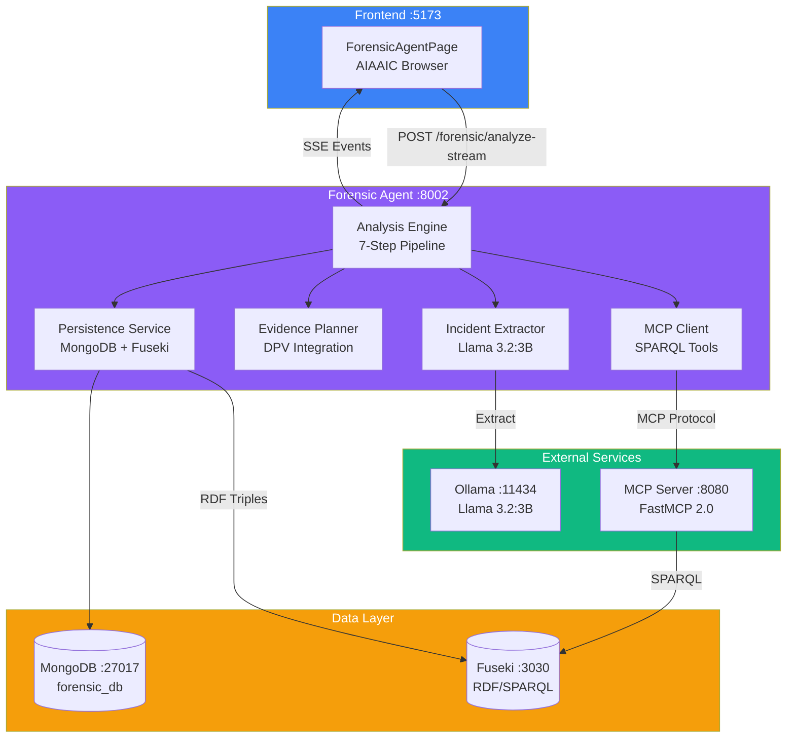
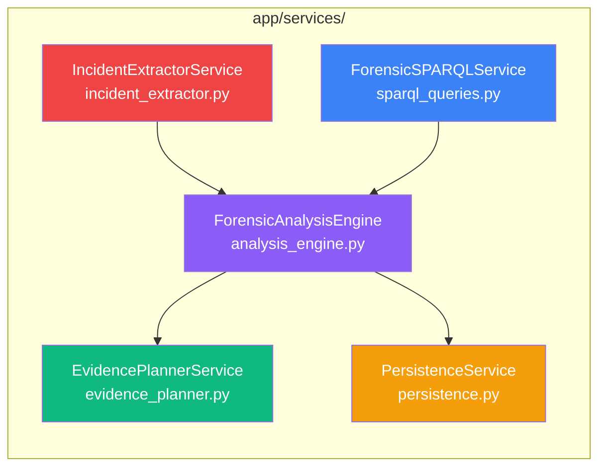
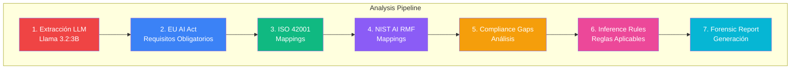
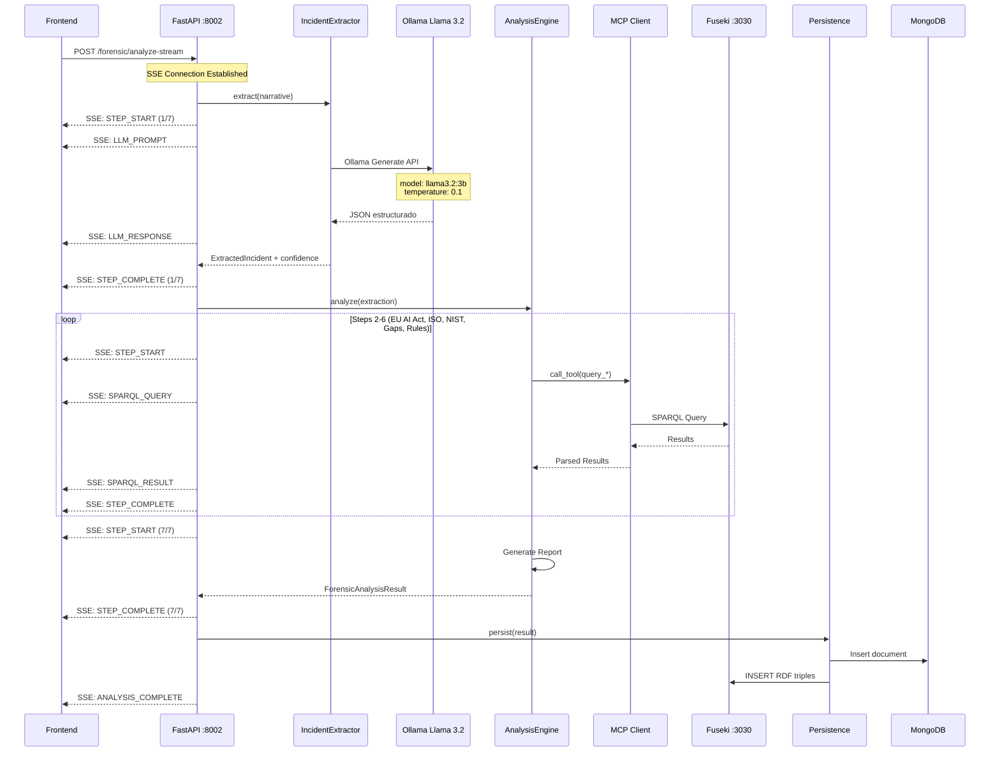
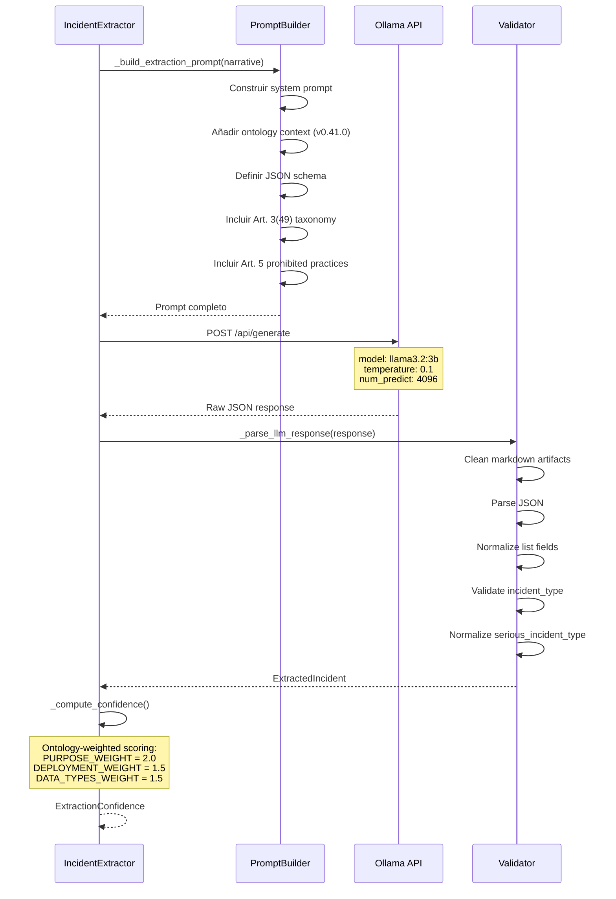
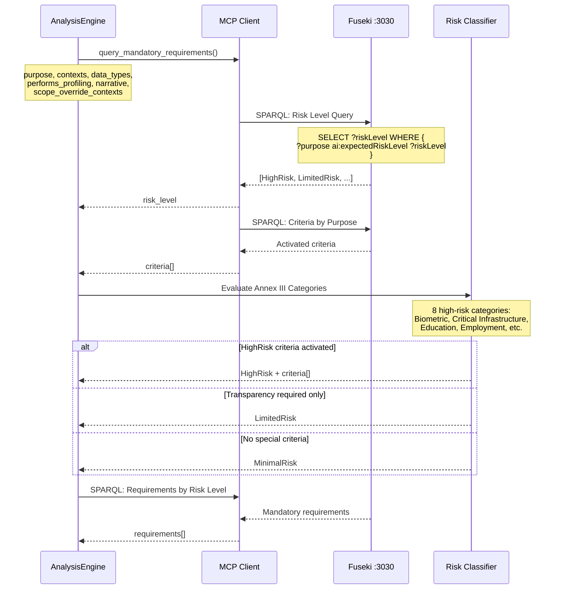
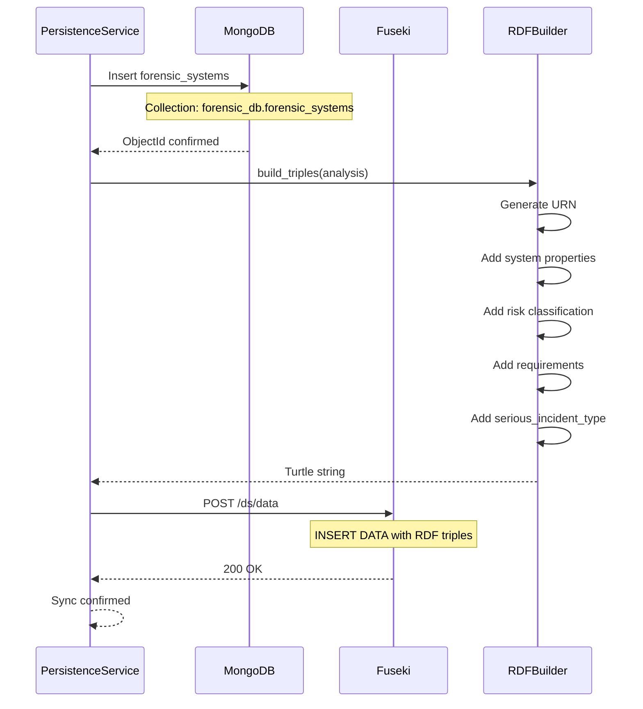

# Forensic Compliance Agent

> **Sistema de análisis forense post-incidente de sistemas de IA con múltiples frameworks regulatorios**

<p align="center">
  
  
  
  
</p>

## Tabla de Contenidos

- [Overview](#overview)
- [Arquitectura](#arquitectura)
- [Evidence Planner](#evidence-planner)
- [Flujo de Inferencia](#flujo-de-inferencia)
- [Quick Start](#quick-start)
- [Instalación](#instalación)
- [Uso de la API](#uso-de-la-api)
- [Configuración](#configuración)
- [Features](#features)
- [Performance](#performance)
- [Troubleshooting](#troubleshooting)
- [Desarrollo](#desarrollo)

---

## Overview

El **Forensic Compliance Agent** realiza análisis automatizado post-incidente de sistemas de IA utilizando:

- **Extracción estructurada con LLM** (Llama 3.2:3B vía Ollama)
- **Razonamiento semántico** (SPARQL vía MCP) sobre la ontología EU AI Act v0.41.0
- **Análisis multi-framework** (EU AI Act + ISO 42001 + NIST AI RMF + DPV 2.2)
- **Detección automática de gaps** de cumplimiento
- **Evidence Planner** con integración W3C DPV para generación de planes de evidencia
- **Streaming SSE** para análisis en tiempo real con visibilidad de cada paso
- **Persistencia dual** (MongoDB + Apache Jena Fuseki)

### Capacidades Principales

| Capacidad | Descripción |
|-----------|-------------|
| **Extracción LLM** | Extrae propiedades estructuradas de narrativas con Llama 3.2:3B |
| **Clasificación de Riesgo** | Determina nivel de riesgo según EU AI Act (HighRisk, LimitedRisk, MinimalRisk) |
| **Incidentes Graves Art. 3(49)** | Clasifica incidentes según taxonomía: DeathOrHealthHarm, CriticalInfrastructureDisruption, FundamentalRightsInfringement, PropertyOrEnvironmentHarm |
| **Requisitos Obligatorios** | Identifica requisitos basados en propósito, contexto y datos procesados |
| **ISO 42001** | Mapea a 15 controles de certificación |
| **NIST AI RMF** | Mapea a 16 funciones del framework |
| **DPV 2.2** | Integración con W3C Data Privacy Vocabulary (14 mappings) |
| **Evidence Planner** | Genera planes de evidencia con 14 requisitos y ~40 items de evidencia |
| **Streaming SSE** | Visibilidad en tiempo real del proceso de análisis |
| **Gap Detection** | Detecta gaps críticos de compliance |
| **Reportes Forenses** | Genera reportes completos en markdown |
| **Persistencia** | Guarda análisis en MongoDB y RDF en Fuseki |

---

## Arquitectura



### Componentes

| Componente | Puerto | Descripción |
|------------|--------|-------------|
| **Forensic Agent** | 8002 | API REST FastAPI con streaming SSE |
| **MCP Server** | 8080 | Model Context Protocol (SPARQL tools) |
| **Ollama** | 11434 | Llama 3.2:3B para extracción LLM |
| **MongoDB** | 27017 | Persistencia de documentos (forensic_db) |
| **Fuseki** | 3030 | Almacenamiento RDF/SPARQL |

### Servicios Internos



---

## Evidence Planner

El **Evidence Planner** genera planes de evidencia para remediar gaps de compliance identificados durante el análisis forense. Utiliza mappings basados en el **W3C Data Privacy Vocabulary (DPV) 2.2**.

### ¿Qué es DPV?

El [Data Privacy Vocabulary (DPV)](https://w3c.github.io/dpv/) es una especificación W3C que proporciona términos para describir:
- Actividades de procesamiento de datos personales
- Medidas técnicas y organizativas
- Bases legales y propósitos
- Riesgos y evaluaciones de impacto

### Extensiones DPV Utilizadas

| Extensión | Propósito | Uso en SERAMIS |
|-----------|-----------|----------------|
| **dpv:core** | Medidas técnicas y organizativas | Mapeo de requisitos a medidas |
| **dpv:ai** | Sistemas de IA, capacidades, riesgos | Clasificación de sistemas |
| **dpv:risk** | Gestión de riesgos | Evaluación de gaps |
| **dpv:legal/eu/aiact** | Conceptos específicos AI Act | Equivalencias semánticas |

### Tipos de Evidencia

El Evidence Planner define 6 tipos de evidencia:

| Tipo | Descripción | Ejemplo |
|------|-------------|---------|
| `PolicyEvidence` | Políticas y procedimientos | Human Oversight Policy |
| `TechnicalEvidence` | Documentación técnica | Model Card, System Architecture |
| `AuditEvidence` | Logs, tests, auditorías | Bias Audit Report |
| `TrainingEvidence` | Registros de formación | Operator Training Records |
| `AssessmentEvidence` | Evaluaciones de impacto | FRIA Report, DPIA |
| `ContractualEvidence` | Contratos y acuerdos | Data Processing Agreement |

### Catálogo de Requisitos

El servicio mapea **14 requisitos del EU AI Act** a **~40 items de evidencia**:

| Requisito | Artículo | Items de Evidencia |
|-----------|----------|-------------------|
| HumanOversightRequirement | Art. 14 | 4 items |
| TransparencyRequirement | Art. 13 | 3 items |
| DataGovernanceRequirement | Art. 10 | 3 items |
| TechnicalDocumentationRequirement | Art. 11 | 4 items |
| BiasAssessmentRequirement | Art. 10 | 3 items |
| FundamentalRightsAssessmentRequirement | Art. 27 | 3 items |
| RiskManagementRequirement | Art. 9 | 4 items |
| ... | ... | ... |

### Ejemplo de Uso

```bash
# Generar plan de evidencia desde gaps
curl -X POST http://localhost:8002/forensic/evidence-plan \
  -H "Content-Type: application/json" \
  -d '{
    "system_name": "Facial Recognition System",
    "risk_level": "HighRisk",
    "missing_requirements": [
      "http://ai-act.eu/ai#HumanOversightRequirement",
      "http://ai-act.eu/ai#FundamentalRightsAssessmentRequirement"
    ],
    "critical_gaps": []
  }'
```

---

## Flujo de Inferencia

### Pipeline de 7 Pasos

El análisis forense sigue un pipeline estructurado de 7 pasos:



### Secuencia de Análisis con Streaming



### Flujo de Extracción LLM



### Flujo de Clasificación de Riesgo



### Flujo de Persistencia Dual



---

## Quick Start

### Requisitos

- Docker y Docker Compose
- 8GB RAM disponible (para Ollama + Llama 3.2:3B)

### Paso 1: Levantar servicios

```bash
# Levantar Fuseki, MongoDB, Ollama y Forensic Agent
docker-compose up -d fuseki mongo ollama forensic_agent

# Ver logs
docker-compose logs -f forensic_agent
```

### Paso 2: Inicializar modelo Llama

```bash
# Descargar modelo Llama 3.2:3B (~2GB)
bash forensic_agent/init_ollama.sh
```

### Paso 3: Verificar instalación

```bash
curl http://localhost:8002/health
```

**Respuesta esperada:**
```json
{
  "status": "healthy",
  "services": {
    "extractor": "operational",
    "sparql": "operational",
    "analysis_engine": "operational"
  },
  "llm": {
    "provider": "ollama",
    "model": "llama3.2:3b"
  },
  "mcp": {
    "connected": true,
    "stats": {...}
  }
}
```

### Paso 4: Analizar incidente de prueba

```bash
curl -X POST http://localhost:8002/forensic/analyze \
  -H "Content-Type: application/json" \
  -d '{
    "narrative": "Amazon Rekognition facial recognition system exhibited racial bias. The system misidentified women and people of color at higher rates. System marketed to law enforcement agencies.",
    "source": "AIAAIC Repository",
    "metadata": {"aiaaic_id": "AIAAIC0042"}
  }'
```

---

## Instalación

### Docker Compose (Recomendado)

```bash
# Build y run
docker-compose up -d fuseki mongo ollama forensic_agent

# Inicializar modelo Llama
bash forensic_agent/init_ollama.sh
```

### Desarrollo Local

```bash
cd forensic_agent
python -m venv venv
source venv/bin/activate
pip install -r requirements.txt

# Asegurar que Ollama está corriendo con el modelo
ollama pull llama3.2:3b

# Ejecutar
uvicorn app.main:app --host 0.0.0.0 --port 8002 --reload
```

---

## Uso de la API

### Endpoints

| Método | Endpoint | Descripción |
|--------|----------|-------------|
| GET | `/` | Info del servicio |
| GET | `/health` | Estado del servicio |
| POST | `/forensic/analyze` | Analizar incidente (sync) |
| POST | `/forensic/analyze-stream` | Analizar incidente (SSE streaming) |
| POST | `/forensic/analyze-with-evidence-plan` | Analizar + generar plan de evidencias |
| POST | `/forensic/analyze-stream-with-evidence-plan` | Analizar + plan (SSE streaming) |
| POST | `/forensic/evidence-plan` | Generar plan de evidencias desde gaps |
| GET | `/forensic/systems` | Listar sistemas analizados |
| GET | `/forensic/systems/{urn}` | Obtener análisis específico |
| DELETE | `/forensic/systems/{urn}` | Eliminar análisis |
| GET | `/forensic/stats` | Estadísticas del servicio |

### POST /forensic/analyze-stream

Endpoint recomendado con streaming SSE para visibilidad en tiempo real.

**Request:**
```json
{
  "narrative": "Descripción del incidente de IA...",
  "source": "AIAAIC Repository",
  "metadata": {
    "aiaaic_id": "AIAAIC0042",
    "headline": "Título del incidente"
  }
}
```

**SSE Events:**
```
data: {"event_type": "STEP_START", "step_number": 1, "step_name": "Extracting incident properties", ...}
data: {"event_type": "LLM_PROMPT", "step_number": 1, "message": {...}, ...}
data: {"event_type": "LLM_RESPONSE", "step_number": 1, "message": {...}, ...}
data: {"event_type": "STEP_COMPLETE", "step_number": 1, "progress_percent": 14.3, ...}
...
data: {"event_type": "ANALYSIS_COMPLETE", "step_name": "Complete", "data": {...}, "progress_percent": 100.0}
```

### POST /forensic/analyze

**Response:**
```json
{
  "status": "COMPLETED",
  "analysis_timestamp": "2026-01-10T12:00:00Z",
  "extraction": {
    "system": {
      "system_name": "Amazon Rekognition",
      "system_type": "vision",
      "primary_purpose": "BiometricIdentification",
      "deployment_context": ["LawEnforcementContext"],
      "processes_data_types": ["BiometricData"]
    },
    "incident": {
      "incident_type": "bias",
      "serious_incident_type": ["FundamentalRightsInfringement"],
      "severity": "high"
    },
    "confidence": {
      "overall": 0.87
    }
  },
  "eu_ai_act": {
    "risk_level": "HighRisk",
    "criteria": ["BiometricIdentificationCriterion", "LawEnforcementCriterion"],
    "requirements": [...],
    "total_requirements": 7
  },
  "iso_42001": {
    "total_mapped": 15,
    "mappings": [...]
  },
  "nist_ai_rmf": {
    "total_mapped": 16,
    "mappings": [...]
  },
  "compliance_gaps": {
    "total_required": 7,
    "implemented": 2,
    "missing": 5,
    "compliance_ratio": 0.29,
    "severity": "CRITICAL",
    "critical_gaps": [...]
  },
  "persisted": {
    "success": true,
    "urn": "urn:forensic:uuid-here"
  }
}
```

---

## Configuración

### Variables de Entorno

```bash
# LLM Provider
LLM_PROVIDER=ollama
OLLAMA_ENDPOINT=http://ollama:11434
OLLAMA_MODEL=llama3.2:3b

# MCP Server (SPARQL)
MCP_SERVER_URL=http://mcp_sparql:8080

# Persistencia
MONGODB_URI=mongodb://mongo:27017
FUSEKI_ENDPOINT=http://fuseki:3030

# Ontología
ONTOLOGY_PATH=/ontologias/versions/0.41.0/ontologia-v0.41.0.ttl
MAPPINGS_PATH=/ontologias/mappings
```

### Modelo LLM

| Proveedor | Modelo | Uso | Notas |
|-----------|--------|-----|-------|
| **Ollama** | llama3.2:3b | Extracción LLM | Local, sin costo API, ~2GB |

---

## Features

### 1. Extracción Estructurada

- Propiedades del sistema (tipo, propósito, datos, contexto)
- Clasificación del incidente (tipo, severidad, poblaciones afectadas)
- **Incidentes Graves Art. 3(49):** DeathOrHealthHarm, CriticalInfrastructureDisruption, FundamentalRightsInfringement, PropertyOrEnvironmentHarm
- **Prácticas Prohibidas Art. 5:** SubliminalManipulation, VulnerabilityExploitation, SocialScoring, PredictivePolicing, RealTimeBiometricIdentification
- **Excepciones Legales Art. 5.2:** VictimSearchException, TerroristThreatException, SeriousCrimeException
- Timeline (descubrimiento, impacto, resolución)
- Respuesta organizacional (acciones, mejoras)
- Confidence scoring ontology-weighted (6 dimensiones)

### 2. Análisis EU AI Act

- Clasificación de riesgo automática (v0.41.0)
- Identificación de criterios Anexo III
- Requisitos obligatorios por nivel de riesgo
- Detección de gaps de compliance
- Análisis de stakeholders (AIRO-aligned)

### 3. Cross-Framework Analysis

**ISO 42001 (15 mappings):**
- Secciones 5.1, 8.1-8.7, 9.1-9.2, 10.1
- Confidence levels: High, Medium, Partial

**NIST AI RMF (16 mappings):**
- Funciones: GOVERN, MAP, MEASURE, MANAGE
- Jurisdiction-aware (US/Global/EU)

**DPV 2.2 (14 mappings):**
- Medidas técnicas y organizativas
- 6 tipos de evidencia estandarizados
- Integración con dpv:ai y dpv:legal/eu/aiact

### 4. Evidence Planner

- Genera planes de evidencia basados en gaps de compliance
- 14 requisitos mapeados a ~40 items de evidencia
- Priorización automática (critical/high/medium/low)
- Recomendaciones contextuales por nivel de riesgo
- Output en JSON o Markdown

### 5. Streaming SSE

- Visibilidad en tiempo real de cada paso
- Eventos: STEP_START, LLM_PROMPT, LLM_RESPONSE, SPARQL_QUERY, SPARQL_RESULT, STEP_COMPLETE, ANALYSIS_COMPLETE, ERROR
- Progress tracking (0-100%)

### 6. Persistencia Dual

- **MongoDB:** Documentos JSON completos (forensic_db.forensic_systems)
- **Fuseki:** Triples RDF para consultas SPARQL
- Sincronización automática

---

## Performance

### Métricas

| Métrica | Valor |
|---------|-------|
| Tiempo de análisis | 15-30s |
| Confidence extracción | 70-85% |
| Throughput | 2-4 incidentes/min |
| API Availability | >99% |

### Costos

| Proveedor | Costo por análisis |
|-----------|-------------------|
| **Ollama (local)** | $0 |

---

## Troubleshooting

### Ollama no conecta

```bash
# Verificar estado
docker-compose ps ollama
docker-compose logs ollama

# Reiniciar
docker-compose restart ollama

# Verificar modelo disponible
curl http://localhost:11434/api/tags

# Probar generación
curl http://localhost:11434/api/generate \
  -d '{"model": "llama3.2:3b", "prompt": "Hello", "stream": false}'
```

### MCP Server no conecta

```bash
# Verificar estado
docker-compose ps mcp_sparql
docker-compose logs mcp_sparql

# Reiniciar
docker-compose restart mcp_sparql
```

### Fuseki no responde

```bash
docker-compose restart fuseki
docker-compose logs fuseki
```

---

## Desarrollo

### Estructura del Proyecto

```
forensic_agent/
├── app/
│   ├── __init__.py
│   ├── main.py                    # FastAPI application + endpoints
│   ├── models/
│   │   ├── __init__.py
│   │   ├── incident.py            # ExtractedIncident, SystemProperties
│   │   └── forensic_report.py     # StreamEvent, ForensicAnalysisResult
│   └── services/
│       ├── __init__.py            # Service exports
│       ├── incident_extractor.py  # Llama LLM extraction
│       ├── analysis_engine.py     # 7-step analysis pipeline
│       ├── evidence_planner.py    # DPV evidence planning
│       ├── sparql_queries.py      # MCP SPARQL client
│       └── persistence.py         # MongoDB + Fuseki
├── benchmark/                     # Benchmark scripts
├── tests/
│   ├── __init__.py
│   ├── sample_incidents.py
│   ├── test_extraction.py
│   ├── test_analysis.py
│   └── test_sparql.py
├── Dockerfile
├── requirements.txt
└── README.md
```

### Testing

```bash
# Tests unitarios
pytest tests/ -v

# Con coverage
pytest tests/ -v --cov=app --cov-report=html
```

---

## Recursos

- **Ontología EU AI Act:** `/ontologias/versions/0.41.0/`
- **ISO 42001 Mappings:** `/ontologias/mappings/iso-42001-mappings.ttl`
- **NIST AI RMF Mappings:** `/ontologias/mappings/nist-ai-rmf-mappings.ttl`
- **DPV Integration:** `/ontologias/mappings/dpv-integration.ttl`
- **W3C DPV 2.2:** https://w3c.github.io/dpv/
- **Ollama Documentation:** https://ollama.ai/

---

## Agradecimientos

Este proyecto utiliza datos del **AI, Algorithmic, and Automation Incidents and Controversies (AIAAIC) Repository**, una base de datos independiente y de acceso abierto que documenta incidentes relacionados con sistemas de IA a nivel mundial.

Agradecemos a **Charlie Pownall** y al equipo de AIAAIC por su trabajo en la recopilación y mantenimiento de este recurso invaluable para la investigación y el análisis de incidentes de IA.

- **AIAAIC Repository:** https://www.aiaaic.org/aiaaic-repository
- **GitHub:** https://github.com/AIAAIC/AIAAIC-Repository

Este proyecto ha sido desarrollado con la asistencia de **Claude** (Anthropic), utilizado como herramienta de desarrollo para la generación de código y documentación.

---

## License

Part of the SERAMIS project - EU AI Act Unified Ontology.
Licensed under **Creative Commons Attribution 4.0 International (CC BY 4.0)**.

---

**Version:** 1.2.0
**Status:** Operacional
**Last Updated:** Enero 2026

---

*Authors: David Fernández González and Mariano Ortega de Mues* | *Directors: Xiomara Patricia Blanco Valencia and Sergio Castillo* | *Universidad Internacional de La Rioja (UNIR)*
