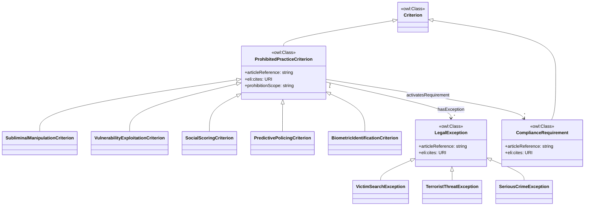
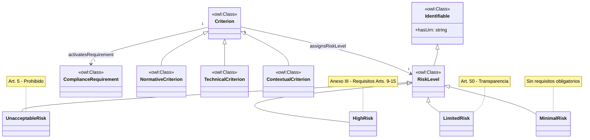
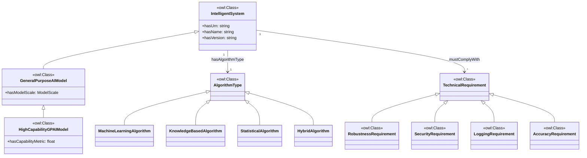
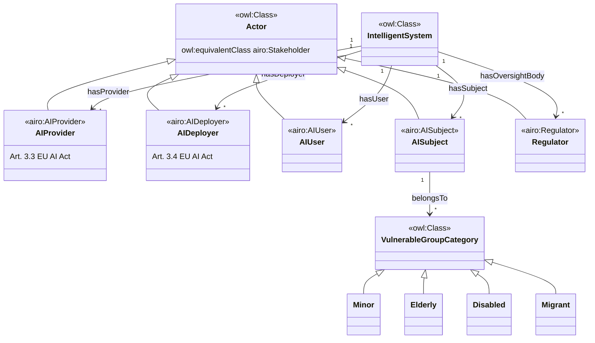
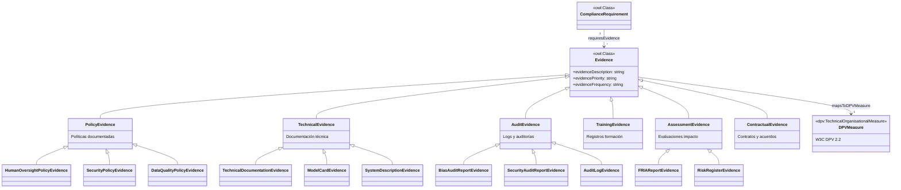
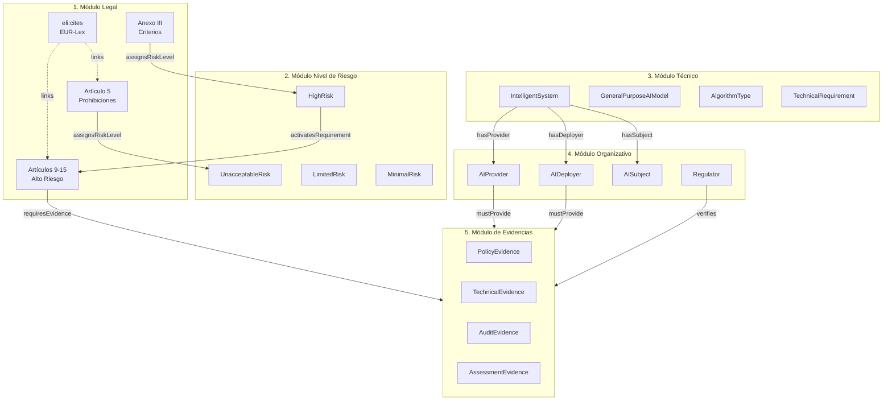

# Diagramas de la Ontología AI Act

Este documento contiene los diagramas Mermaid de los cinco módulos principales de la ontología.

---

## 1. Módulo Legal

Representa artículos, anexos, obligaciones y definiciones del AI Act.

---

## 2. Módulo de Nivel de Riesgo

Describe nivel de riesgo, impacto en poblaciones, medidas obligatorias y planes de mitigación.

---

## 3. Módulo Técnico

Modela documentación técnica, procedimientos de conformidad y características de sistemas.

---

## 4. Módulo Organizativo

Representa roles, responsables, registros y procesos de supervisión.

---

## 5. Módulo de Evidencias

Permite vincular documentos, certificados, informes y artefactos de verificación.

---

## Diagrama General de Integración

Muestra cómo los cinco módulos se relacionan entre sí.

---

## Leyenda

| Símbolo | Significado |
|---------|-------------|
| `<<owl:Class>>` | Clase OWL definida en nuestra ontología |
| `<<airo:*>>` | Clase reutilizada de AIRO (AI Risk Ontology) |
| `<<dpv:*>>` | Clase referenciada de W3C DPV 2.2 |
| `-->` | Propiedad de objeto (ObjectProperty) |
| `--|>` | Herencia (rdfs:subClassOf) |
| `-.->` | Referencia externa (rdfs:seeAlso, eli:cites) |

---

**Versión:** 0.37.5
**Fecha:** 2025-12-23
**Namespace:** `http://ai-act.eu/ai#`
