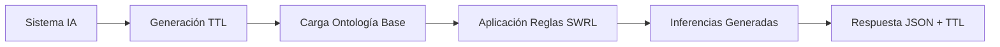

# 🧠 AI Act SWRL Reasoner Service

## Descripción General

Este servicio implementa un **motor de razonamiento semántico híbrido** que combina **RDFLib** para el parsing de ontologías con **inferencia manual de reglas SWRL** para evaluar el cumplimiento del EU AI Act en sistemas de inteligencia artificial.

## 🎯 Arquitectura del Reasoner

### Componentes Principales

1. **Parser RDFLib**: Carga y procesa archivos TTL (ontologías + datos del sistema)
2. **Motor SWRL Manual**: Aplica reglas de inferencia basadas en el EU AI Act
3. **Generador de Inferencias**: Produce nuevos triples RDF basados en las reglas
4. **Serializador**: Convierte el grafo resultante a TTL y JSON estructurado

### Flujo de Procesamiento



## 📋 Reglas SWRL Implementadas

### 1. **Reglas por Propósito (Purpose-based Rules)**

#### 1.1 Regla de Protección Educativa
```swrl
hasPurpose(system, EducationAccess) → hasNormativeCriterion(system, ProtectionOfMinors)
```
**Justificación**: Anexo III, punto 3 del EU AI Act - Sistemas de evaluación educativa requieren protección especial de menores.

**Implementación**:
```python
if (system, AI.hasPurpose, AI.EducationAccess) in combined_graph:
    combined_graph.add((system, AI.hasNormativeCriterion, AI.ProtectionOfMinors))
```

#### 1.2 Regla de No Discriminación en Empleo
```swrl
hasPurpose(system, Employment) → hasNormativeCriterion(system, NonDiscrimination)
```
**Justificación**: Anexo III, punto 4 del EU AI Act - Sistemas de reclutamiento y empleo deben prevenir discriminación.

#### 1.3 Regla de Seguridad Biométrica
```swrl
hasPurpose(system, BiometricIdentification) → hasContextualCriterion(system, BiometricSecurity)
```
**Justificación**: Anexo III, punto 1 del EU AI Act - Identificación biométrica requiere medidas de seguridad específicas.

### 2. **Reglas por Contexto de Despliegue (Context-based Rules)**

#### 2.1 Regla de Contexto Educativo
```swrl
hasDeploymentContext(system, Education) → hasNormativeCriterion(system, ProtectionOfMinors)
```
**Justificación**: Cualquier sistema desplegado en entorno educativo requiere protección de menores independientemente del propósito.

#### 2.2 Regla de Servicios de Salud
```swrl
hasDeploymentContext(system, Healthcare) → hasNormativeCriterion(system, EssentialServicesAccessCriterion)
```
**Justificación**: Sistemas en entornos sanitarios afectan el acceso a servicios esenciales.

#### 2.3 Regla de Servicios Públicos
```swrl
hasDeploymentContext(system, PublicServices) → hasNormativeCriterion(system, EssentialServicesAccessCriterion)
```
**Justificación**: Sistemas en servicios públicos pueden limitar el acceso ciudadano a servicios fundamentales.

#### 2.4 Regla de Procesamiento en Tiempo Real
```swrl
hasDeploymentContext(system, RealTimeProcessing) → hasTechnicalCriterion(system, PerformanceRequirements)
```
**Justificación**: Sistemas de tiempo real requieren garantías de rendimiento específicas.

#### 2.5 Regla de Alto Volumen
```swrl
hasDeploymentContext(system, HighVolumeProcessing) → hasTechnicalCriterion(system, ScalabilityRequirements)
```
**Justificación**: Sistemas de alto volumen necesitan requisitos de escalabilidad.

### 3. **Reglas en Cadena (Chain Rules)**

#### 3.1 Cadena de Protección de Menores
```swrl
hasNormativeCriterion(system, ProtectionOfMinors) → hasRequirement(system, ParentalConsent)
```
**Justificación**: Artículo 29 del EU AI Act - Protección de menores requiere consentimiento parental.

#### 3.2 Cadena de No Discriminación
```swrl
hasNormativeCriterion(system, NonDiscrimination) → hasRequirement(system, Auditability)
```
**Justificación**: Sistemas anti-discriminación deben ser auditables para verificar cumplimiento.

#### 3.3 Cadena de Seguridad Biométrica
```swrl
hasContextualCriterion(system, BiometricSecurity) → hasTechnicalRequirement(system, DataEncryption)
```
**Justificación**: Datos biométricos requieren cifrado por su naturaleza sensible.

#### 3.4 Cadena de Servicios Esenciales
```swrl
hasNormativeCriterion(system, EssentialServicesAccessCriterion) →
    hasRequirement(system, HumanOversightRequirement) ∧
    hasRequirement(system, DataGovernanceRequirement) ∧
    hasRequirement(system, FundamentalRightsAssessmentRequirement)
```
**Justificación**: Servicios esenciales requieren supervisión humana, gobernanza de datos y evaluación de derechos fundamentales.

### 4. **Reglas de Ámbito de Aplicación (Art. 2)**

#### 4.1 Regla de Exclusión de Scope
```swrl
hasPurpose(system, ?purpose) ∧ mayBeExcludedBy(?purpose, ?exclusion) →
    hasPotentialScopeExclusion(system, ?exclusion)
```
**Justificación**: Artículo 2 del EU AI Act - Ciertos propósitos pueden estar excluidos del ámbito de aplicación.

#### 4.2 Regla de Override de Exclusión
```swrl
hasPotentialScopeExclusion(system, ?exclusion) ∧
hasDeploymentContext(system, ?context) ∧
overridesExclusion(?context, ?exclusion) →
    isInEUAIActScope(system, true)
```
**Justificación**: Contextos con impacto real (víctimas, consecuencias legales, derechos fundamentales) anulan las exclusiones y traen el sistema de vuelta al ámbito del reglamento.

**Contextos Override definidos:**
- `ai:CausesRealWorldHarmContext` - Daño real a personas
- `ai:VictimImpactContext` - Víctimas identificables
- `ai:AffectsFundamentalRightsContext` - Afecta derechos fundamentales
- `ai:LegalConsequencesContext` - Consecuencias legales
- `ai:MinorsAffectedContext` - Menores afectados

### 5. **Reglas de Incidentes Graves (Art. 3(49))**

#### 5.1 Regla de Clasificación de Incidente Grave
```swrl
hasIncidentType(system, ?type) ∧ SeriousIncident(?type) →
    hasSeriousIncidentType(system, ?type)
```
**Justificación**: Artículo 3(49) del EU AI Act - Clasificación de incidentes graves según taxonomía.

#### 5.2 Regla de Notificación Obligatoria (Art. 73)
```swrl
hasSeriousIncidentType(system, ?type) ∧ triggersArticle73(?type, true) →
    requiresIncidentNotification(system, true) ∧
    notificationDeadlineDays(system, 15)
```
**Justificación**: Artículo 73 del EU AI Act - Incidentes graves requieren notificación a la autoridad competente en 15 días.

**Tipos de incidente grave (Art. 3(49)):**
| Tipo | Artículo | Trigger Art. 73 |
|------|----------|-----------------|
| `ai:DeathOrHealthHarm` | Art. 3(49)(a) | ✓ |
| `ai:CriticalInfrastructureDisruption` | Art. 3(49)(b) | ✓ |
| `ai:FundamentalRightsInfringement` | Art. 3(49)(c) | ✓ |
| `ai:PropertyOrEnvironmentHarm` | Art. 3(49)(d) | ✓ |

### 6. **Reglas de Affected Persons (Art. 86)**

#### 6.1 Regla de Explicabilidad
```swrl
hasSubject(system, ?person) ∧ hasRiskLevel(system, HighRisk) →
    requiresExplainability(system, true)
```
**Justificación**: Artículo 86 del EU AI Act - Sistemas de alto riesgo con personas afectadas requieren explicabilidad.

#### 6.2 Regla de FRIA para Grupos Vulnerables
```swrl
hasSubject(system, ?person) ∧ VulnerableGroup(?person) →
    requiresFundamentalRightsAssessment(system, true)
```
**Justificación**: Artículo 27 del EU AI Act - Sistemas que afectan a grupos vulnerables requieren evaluación de impacto en derechos fundamentales (FRIA).

**Grupos vulnerables detectados:**
- Menores (Minor/Child)
- Personas mayores (Elderly)
- Personas con discapacidad (Disabled)
- Migrantes y solicitantes de asilo (Migrant/Asylum)

## 🔧 Modo de Evaluación

### Endpoint Principal
```
POST http://localhost:8001/reason
```

### Estructura de Entrada
```json
{
    "system_ttl": "...",     // TTL del sistema a evaluar
    "rules_ttl": "..."       // Reglas SWRL en formato TTL
}
```

### Estructura de Salida
```json
{
    "system_id": "urn:uuid:...",
    "system_name": "Ejemplo_1",
    "reasoning_completed": true,
    "inferred_relationships": {
        "hasNormativeCriterion": ["http://ai-act.eu/ai#EssentialServicesAccessCriterion"],
        "hasTechnicalCriterion": [],
        "hasContextualCriterion": ["http://ai-act.eu/ai#BiometricSecurity"],
        "hasRequirement": [
            "http://ai-act.eu/ai#DataGovernanceRequirement",
            "http://ai-act.eu/ai#FundamentalRightsAssessmentRequirement",
            "http://ai-act.eu/ai#HumanOversightRequirement"
        ],
        "hasTechnicalRequirement": ["http://ai-act.eu/ai#DataEncryption"]
    },
    "raw_ttl": "..."  // Grafo completo con inferencias
}
```

## 🧪 Casos de Prueba

### Caso 1: Sistema Educativo
**Input**:
```ttl
<urn:uuid:system1> a ai:IntelligentSystem ;
    ai:hasPurpose ai:EducationAccess ;
    ai:hasDeploymentContext ai:Education .
```

**Inferencias Esperadas**:
- `hasNormativeCriterion: ProtectionOfMinors` (por propósito + contexto)
- `hasRequirement: ParentalConsent` (regla en cadena)

### Caso 2: Sistema Biométrico en Servicios Públicos
**Input**:
```ttl
<urn:uuid:system2> a ai:IntelligentSystem ;
    ai:hasPurpose ai:BiometricIdentification ;
    ai:hasDeploymentContext ai:PublicServices .
```

**Inferencias Esperadas**:
- `hasContextualCriterion: BiometricSecurity` (por propósito)
- `hasTechnicalRequirement: DataEncryption` (regla en cadena)
- `hasNormativeCriterion: EssentialServicesAccessCriterion` (por contexto)
- `hasRequirement: HumanOversightRequirement, DataGovernanceRequirement, FundamentalRightsAssessmentRequirement` (regla en cadena)

### Caso 3: Sistema con Incidente Grave (Art. 3(49))
**Input**:
```ttl
<urn:uuid:system3> a ai:IntelligentSystem ;
    ai:hasPurpose ai:LawEnforcementSupport ;
    ai:hasIncidentType ai:FundamentalRightsInfringement .
```

**Inferencias Esperadas**:
- `hasSeriousIncidentType: FundamentalRightsInfringement` (Art. 3(49)(c))
- `requiresIncidentNotification: true` (Art. 73)
- `notificationDeadlineDays: 15` (Art. 73)

### Caso 4: Sistema Excluido con Override (Art. 2)
**Input**:
```ttl
<urn:uuid:system4> a ai:IntelligentSystem ;
    ai:hasPurpose ai:Entertainment ;
    ai:hasDeploymentContext ai:VictimImpactContext .
```

**Inferencias Esperadas**:
- `hasPotentialScopeExclusion: EntertainmentWithoutRightsImpact` (Art. 2)
- `isInEUAIActScope: true` (override por VictimImpactContext)
- `requiresFRIA: true` (Art. 27)

## 🔍 Debugging y Logs

### Activación de Logs Detallados
Los logs están habilitados por defecto y muestran:
```
DEBUG: Procesando sistema: urn:uuid:...
DEBUG: Verificando BiometricIdentification para urn:uuid:...
DEBUG: ¿Tiene propósito BiometricIdentification? True
DEBUG: ✅ Inferencia aplicada: urn:uuid:... -> hasContextualCriterion -> BiometricSecurity (por propósito)
DEBUG: *** RAZONAMIENTO COMPLETADO: 6 inferencias aplicadas ***
```

### Verificación de Reglas
Para verificar qué reglas se están aplicando:
1. Revisar logs del container: `docker-compose logs reasoner`
2. Contar inferencias aplicadas en la respuesta
3. Validar coherencia con la ontología base

## 🚀 Extensión del Sistema

### Agregar Nueva Regla SWRL

1. **Definir la regla** en `backend/swrl_rules.py`:
```ttl
ai:NewRule rdf:type swrl:Rule ;
    swrl:body [ /* condición */ ] ;
    swrl:head [ /* inferencia */ ] .
```

2. **Implementar lógica** en `reasoner_service/app/main.py`:
```python
# NUEVA REGLA: Condición -> Inferencia
if (system, AI.hasProperty, AI.Value) in combined_graph:
    combined_graph.add((system, AI.hasNewProperty, AI.NewValue))
    print(f"DEBUG: ✅ Inferencia aplicada: {system} -> hasNewProperty -> NewValue")
    inferences_count += 1
```

3. **Reconstruir container**:
```bash
docker-compose up -d --build reasoner
```

### Consideraciones de Rendimiento
- Las reglas se evalúan secuencialmente
- El grafo combinado se mantiene en memoria
- Para sistemas complejos, considerar optimización de consultas SPARQL

## 📚 Referencias

- **EU AI Act**: Regulation (EU) 2024/1689
- **SWRL Specification**: https://www.w3.org/Submission/SWRL/
- **RDFLib Documentation**: https://rdflib.readthedocs.io/
- **Ontología AI Act**: `/ontologias/versions/0.41.0/ontologia-v0.41.0.ttl`

## 🤝 Contribución

Para contribuir nuevas reglas SWRL:
1. Identificar el artículo/anexo del EU AI Act aplicable
2. Definir la regla en sintaxis SWRL formal
3. Implementar la lógica de inferencia
4. Agregar casos de prueba
5. Documentar la justificación legal

---

**Versión**: 1.0
**Última Actualización**: Enero 2026
**Compatibilidad**: EU AI Act Ontology v0.41.0